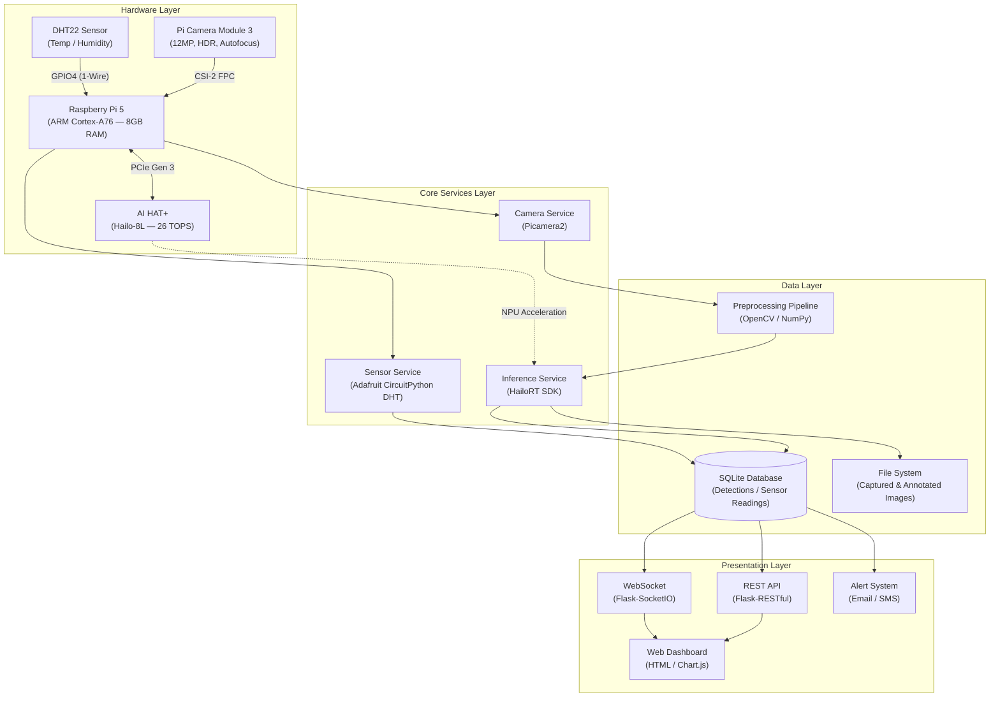
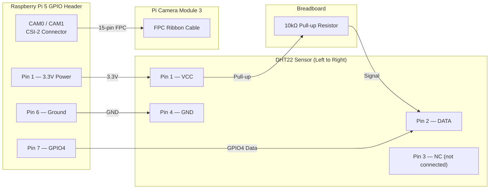
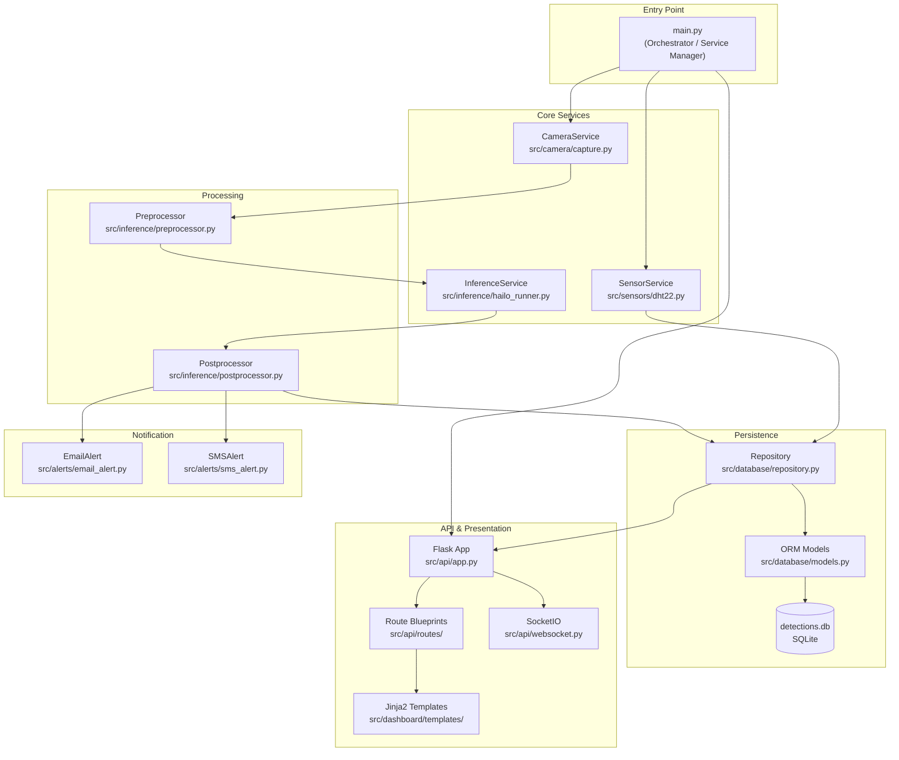
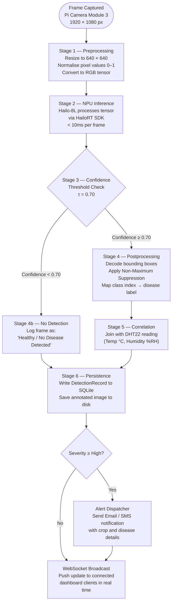
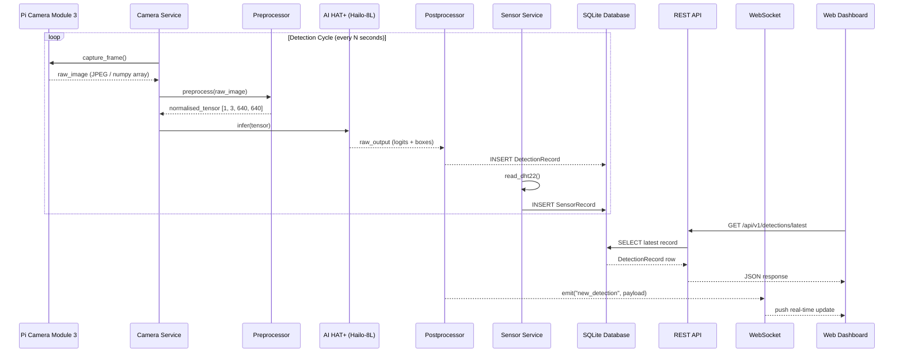
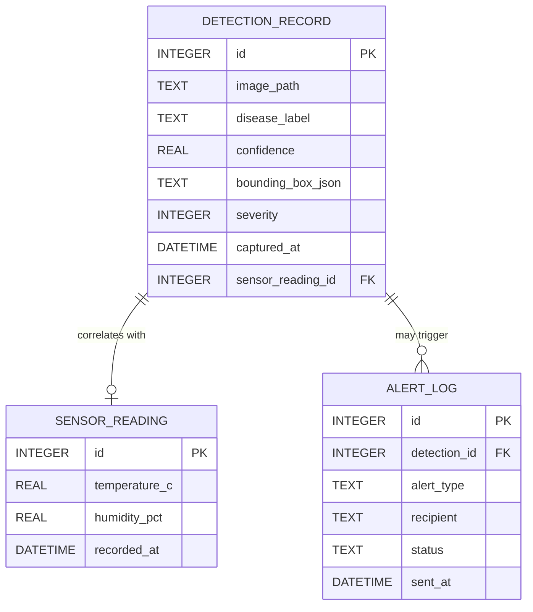
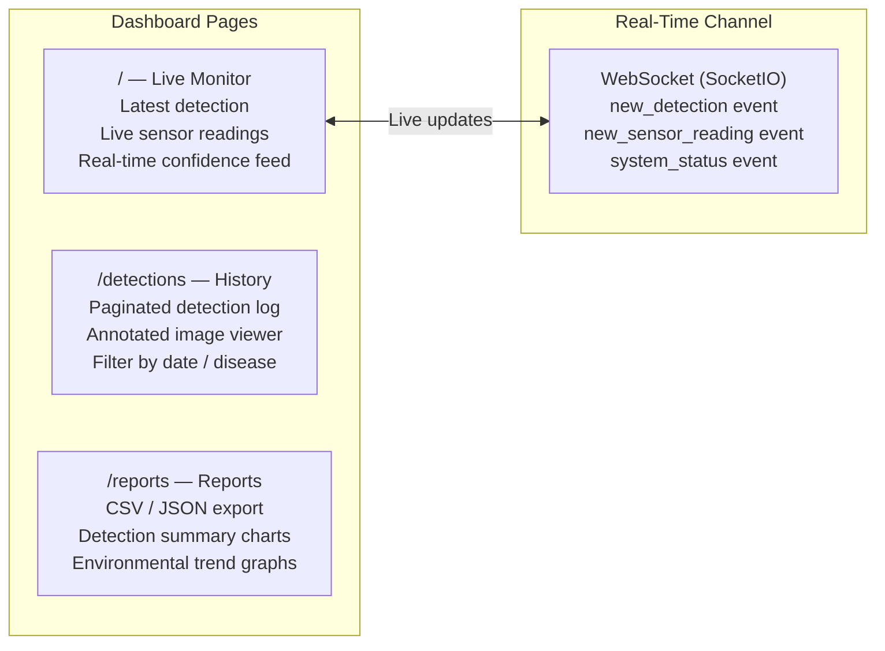
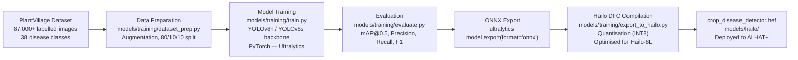
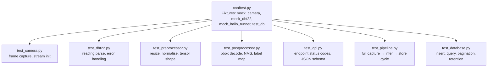
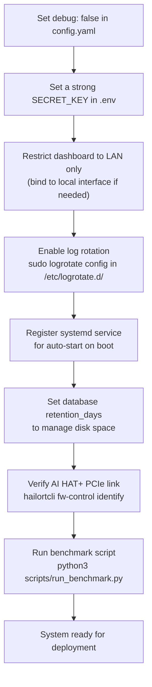

# IoT System for Disease Detection in Crops

**Final Year Project — Bachelor of Science in Software Engineering**

| Field | Details |
|-------|---------|
| Institution | [Your Institution Name] |
| Academic Year | 2025 / 2026 |
| Student | [Your Full Name] |
| Student ID | [Your Student ID] |
| Supervisor | [Supervisor Name] |
| Submission Date | [Submission Date] |

---

## Table of Contents

1. [Project Overview](#1-project-overview)
2. [System Architecture](#2-system-architecture)
3. [Hardware Components](#3-hardware-components)
4. [Hardware Wiring](#4-hardware-wiring)
5. [Software Architecture](#5-software-architecture)
6. [Project File Structure](#6-project-file-structure)
7. [Disease Detection Pipeline](#7-disease-detection-pipeline)
8. [Data Flow](#8-data-flow)
9. [Database Schema](#9-database-schema)
10. [Getting Started](#10-getting-started)
11. [Installation](#11-installation)
12. [Configuration](#12-configuration)
13. [Usage](#13-usage)
14. [API Reference](#14-api-reference)
15. [Web Dashboard](#15-web-dashboard)
16. [Model Training](#16-model-training)
17. [Testing](#17-testing)
18. [Deployment](#18-deployment)
19. [Known Limitations](#19-known-limitations)
20. [License](#20-license)

---

## 1. Project Overview

This project presents the design and full-stack implementation of an Internet of Things (IoT) system for the automated detection of diseases in crops. The system uses a **Raspberry Pi 5** as its central computing unit, paired with the **Raspberry Pi AI HAT+** (powered by the Hailo-8L NPU at 26 TOPS) to perform real-time, on-device neural network inference without dependency on cloud services.

Crop imagery is captured continuously using the **Pi Camera Module 3**. Each frame is pre-processed and fed into a custom-trained deep learning model running directly on the AI HAT+. Environmental readings — temperature and relative humidity — are simultaneously collected via a **DHT22 sensor** and correlated with detection events to build a richer picture of disease conditions.

Results are persisted in a local SQLite database and made accessible through a REST API and a browser-based monitoring dashboard reachable over the local network. When a high-severity disease is detected, the system triggers automated alerts.

### Objectives

- Detect common crop diseases from leaf images in real time using edge AI inference
- Monitor environmental conditions (temperature and humidity) relevant to disease spread
- Provide farmers with a simple, low-cost, internet-independent monitoring tool
- Log and export timestamped detection history for analysis and reporting
- Evaluate the performance of the Hailo-8L NPU for agricultural computer vision tasks

### Target Diseases

The initial model targets diseases from the **PlantVillage** dataset, including but not limited to:

| Crop | Disease |
|------|---------|
| Tomato | Late Blight, Early Blight, Leaf Mould, Septoria Leaf Spot |
| Potato | Late Blight, Early Blight |
| Maize | Common Rust, Northern Leaf Blight, Grey Leaf Spot |
| Pepper | Bacterial Spot |
| Apple | Scab, Black Rot, Cedar Apple Rust |

---

## 2. System Architecture

The system is structured in four horizontal layers: hardware, core services, data, and presentation. The Hailo-8L accelerator communicates with the Raspberry Pi over a dedicated **PCIe Gen 3** interface, providing high-bandwidth, low-latency tensor offloading.



---

## 3. Hardware Components

| # | Component | Specification | Role in System |
|---|-----------|---------------|----------------|
| 1 | Raspberry Pi 5 | 8GB LPDDR4X RAM, quad-core ARM Cortex-A76 @ 2.4GHz | Central processing unit, runs all software services |
| 2 | Raspberry Pi AI HAT+ | Hailo-8L NPU, 26 TOPS, PCIe Gen 3 | Hardware accelerator for neural network inference |
| 3 | Pi Camera Module 3 | Sony IMX708, 12MP, HDR, phase-detect autofocus, 120° FoV | Primary image capture for disease detection |
| 4 | DHT22 Sensor | ±0.5°C temperature, ±2–5% relative humidity, 0.5Hz sampling | Environmental monitoring |
| 5 | MicroSD Card | 64GB, UHS Speed Class 3 (V30), Application Class A2 | Operating system, application storage, image archive |
| 6 | Official 27W USB-C Power Supply | 5V / 5A output | Stable power delivery for Pi 5 + AI HAT+ combined load |
| 7 | Breadboards | 2× 400 tie-point solderless | Sensor circuit prototyping |
| 8 | Jumper Wires | 40-piece assortment (M-M, M-F, F-F) | Component interconnects |

> **Power Budget Note:** The Raspberry Pi 5 alone can draw up to 12W under load. The AI HAT+ adds further demand during inference. The official 27W supply (5V/5A) is the minimum recommended for stable operation of the combined system.

---

## 4. Hardware Wiring

### DHT22 Sensor Circuit

The DHT22 uses a single-wire protocol. A **10 kΩ pull-up resistor** is mandatory between the VCC and DATA lines to ensure reliable communication.



### GPIO Pin Mapping

| GPIO Header Pin | Signal | Connected To |
|-----------------|--------|-------------|
| Pin 1 (3.3V) | Power | DHT22 VCC |
| Pin 6 (GND) | Ground | DHT22 GND |
| Pin 7 (GPIO4) | Data | DHT22 DATA (via 10kΩ pull-up) |
| CAM0 CSI-2 | Camera data | Pi Camera Module 3 FPC |
| Hat connector (40-pin) | PCIe / Power | AI HAT+ bottom connector |

---

## 5. Software Architecture

The software follows a **layered service-oriented** design. Each service is independently runnable, communicates via internal Python interfaces, and can be tested in isolation.



---

## 6. Project File Structure

```
iot-crop-disease-detection/
│
├── src/                                   # All application source code
│   │
│   ├── camera/                            # Camera capture and streaming
│   │   ├── __init__.py
│   │   ├── capture.py                     # Single-shot image capture via Picamera2
│   │   └── stream.py                      # Continuous frame generator for inference loop
│   │
│   ├── sensors/                           # Environmental sensor interfaces
│   │   ├── __init__.py
│   │   └── dht22.py                       # DHT22 driver — temperature & humidity polling
│   │
│   ├── inference/                         # AI inference pipeline
│   │   ├── __init__.py
│   │   ├── hailo_runner.py                # HailoRT SDK wrapper — loads .hef, runs inference
│   │   ├── preprocessor.py                # Frame resize, normalise, tensor conversion
│   │   └── postprocessor.py               # Bounding box decode, NMS, confidence filtering
│   │
│   ├── database/                          # Data persistence layer
│   │   ├── __init__.py
│   │   ├── models.py                      # SQLAlchemy ORM table definitions
│   │   ├── schema.sql                     # Raw SQL schema (for reference / migration)
│   │   └── repository.py                  # CRUD operations — detections and sensor records
│   │
│   ├── api/                               # REST API and WebSocket server
│   │   ├── __init__.py
│   │   ├── app.py                         # Flask application factory (create_app)
│   │   ├── websocket.py                   # Flask-SocketIO real-time event handlers
│   │   └── routes/
│   │       ├── __init__.py
│   │       ├── detections.py              # GET /api/v1/detections endpoints
│   │       ├── sensors.py                 # GET /api/v1/sensors endpoints
│   │       ├── inference.py               # POST /api/v1/inference/trigger endpoint
│   │       └── system.py                  # GET /api/v1/system/health endpoint
│   │
│   ├── dashboard/                         # Browser-based monitoring UI
│   │   ├── static/
│   │   │   ├── css/
│   │   │   │   └── styles.css             # Dashboard stylesheet
│   │   │   └── js/
│   │   │       ├── dashboard.js           # Main UI logic, WebSocket client
│   │   │       └── charts.js              # Chart.js detection and sensor graphs
│   │   └── templates/
│   │       ├── base.html                  # Shared layout template
│   │       ├── index.html                 # Live monitoring dashboard view
│   │       ├── detections.html            # Detection history and image viewer
│   │       └── reports.html               # Data export and reporting view
│   │
│   ├── alerts/                            # Notification services
│   │   ├── __init__.py
│   │   ├── email_alert.py                 # SMTP email notification
│   │   └── sms_alert.py                   # SMS notification (via Twilio or similar)
│   │
│   └── utils/                             # Shared utilities
│       ├── __init__.py
│       ├── config.py                      # YAML configuration loader
│       ├── logger.py                      # Centralised logging setup
│       └── helpers.py                     # Image annotation, timestamp formatting, etc.
│
├── models/                                # AI model files
│   ├── hailo/
│   │   └── crop_disease_detector.hef      # Compiled Hailo Executable Format model
│   └── training/
│       ├── dataset_prep.py                # Dataset download, split, and augmentation
│       ├── train.py                       # YOLOv8 / EfficientDet training script
│       ├── evaluate.py                    # mAP, precision, recall evaluation
│       └── export_to_hailo.py             # ONNX → Hailo DFC compilation pipeline
│
├── data/                                  # Runtime data storage (git-ignored)
│   ├── captures/                          # Raw images from Pi Camera
│   ├── processed/                         # Preprocessed inference-ready images
│   ├── detections/                        # Annotated output images with bounding boxes
│   ├── exports/                           # CSV and JSON report exports
│   └── detections.db                      # SQLite database file
│
├── tests/                                 # Full test suite
│   ├── unit/
│   │   ├── test_camera.py                 # Unit tests — CameraService
│   │   ├── test_dht22.py                  # Unit tests — SensorService
│   │   ├── test_preprocessor.py           # Unit tests — image preprocessing
│   │   ├── test_postprocessor.py          # Unit tests — output decoding
│   │   └── test_api.py                    # Unit tests — API endpoints
│   ├── integration/
│   │   ├── test_pipeline.py               # End-to-end capture → inference → store
│   │   └── test_database.py               # Database read/write integration tests
│   └── conftest.py                        # Pytest fixtures and shared test config
│
├── scripts/                               # Operational and setup scripts
│   ├── setup_system.sh                    # One-command system setup (apt, pip, config)
│   ├── install_hailo_sdk.sh               # Hailo PCIe driver + HailoRT installation
│   ├── start_services.sh                  # Launch all services via systemd or directly
│   ├── crop_disease_detection.service     # systemd unit file for auto-start on boot
│   └── run_benchmark.py                   # Inference throughput and latency benchmark
│
├── config/                                # Configuration files
│   ├── config.yaml                        # Main application configuration
│   ├── logging.yaml                       # Logging levels and handlers
│   └── diseases.yaml                      # Disease class labels, severity, and metadata
│
├── docs/                                  # Project documentation
│   ├── hardware_setup.md                  # Step-by-step hardware assembly guide
│   ├── software_setup.md                  # Detailed software installation guide
│   ├── api_reference.md                   # Full API endpoint documentation
│   ├── model_training.md                  # Dataset preparation and training guide
│   └── wiring_diagram.png                 # Exported wiring schematic
│
├── .env.example                           # Environment variable template
├── .gitignore                             # Git ignore rules
├── requirements.txt                       # Production Python dependencies
├── requirements-dev.txt                   # Development and testing dependencies
├── setup.py                               # Package installation configuration
├── main.py                                # Application entry point
└── README.md                              # This file
```

---

## 7. Disease Detection Pipeline

Each captured frame passes through a five-stage pipeline before a result is committed to the database.



---

## 8. Data Flow

The following sequence diagram shows the interaction between all system components during a standard detection cycle, and a separate dashboard polling cycle.



---

## 9. Database Schema



---

## 10. Getting Started

### Prerequisites

| Requirement | Minimum Version |
|-------------|----------------|
| Raspberry Pi OS (64-bit) | Bookworm (Debian 12) |
| Python | 3.11 |
| HailoRT SDK | 4.18.0 |
| Git | 2.x |

The AI HAT+ must be installed on the Raspberry Pi 5 before powering on. Hailo PCIe drivers are installed separately — see [docs/hardware_setup.md](docs/hardware_setup.md).

### Hardware Assembly Order

1. With the Pi powered **off**, attach the AI HAT+ to the 40-pin GPIO header of the Raspberry Pi 5. Secure it using the included standoffs and screws. The AI HAT+ communicates via the PCIe Gen 3 interface routed through the HAT connector.
2. Connect the Pi Camera Module 3 to the **CAM0** CSI-2 connector using the supplied 15-pin FPC ribbon cable. Ensure the cable is seated fully and the locking tab is closed.
3. On the breadboard, insert the DHT22 sensor. Wire the circuit as follows:

    | DHT22 Pin | Connection |
    |-----------|-----------|
    | Pin 1 (VCC) | Raspberry Pi Pin 1 (3.3V) |
    | Pin 2 (DATA) | Raspberry Pi Pin 7 (GPIO4) |
    | Pin 4 (GND) | Raspberry Pi Pin 6 (GND) |

    Place a **10 kΩ resistor** between DHT22 Pin 1 (VCC) and Pin 2 (DATA) on the breadboard.

4. Connect the Official 27W USB-C power supply to the Raspberry Pi 5 USB-C port last, after all components are secured.

---

## 11. Installation

### Step 1 — Clone the Repository

```bash
git clone https://github.com/<your-username>/iot-crop-disease-detection.git
cd iot-crop-disease-detection
```

### Step 2 — System Dependencies

```bash
chmod +x scripts/setup_system.sh
./scripts/setup_system.sh
```

This script installs required system packages (`libcamera`, `libopencv`, `libatlas-base-dev`, etc.) and enables the camera interface.

### Step 3 — Install the Hailo SDK

```bash
chmod +x scripts/install_hailo_sdk.sh
./scripts/install_hailo_sdk.sh
```

Refer to [docs/software_setup.md](docs/software_setup.md) for manual Hailo SDK installation steps if the script fails.

### Step 4 — Python Virtual Environment

```bash
python3 -m venv .venv
source .venv/bin/activate
pip install --upgrade pip
pip install -r requirements.txt
```

### Step 5 — Environment Variables

```bash
cp .env.example .env
nano .env          # Fill in SMTP credentials, alert recipients, etc.
```

### Step 6 — Initialise Database

```bash
python3 main.py --init-db
```

### Step 7 — Place the Model File

Copy your compiled `.hef` model file to:

```
models/hailo/crop_disease_detector.hef
```

See [Section 16 — Model Training](#16-model-training) for how to build the model, or download a pre-trained release from the repository's Releases page.

---

## 12. Configuration

All tunable parameters are in `config/config.yaml`:

```yaml
camera:
  resolution: [1920, 1080]       # Capture resolution (width x height)
  capture_interval_s: 5          # Seconds between detection cycles
  rotation: 0                    # Camera rotation: 0, 90, 180, or 270
  save_raw_frames: false         # Store every raw frame to data/captures/

sensor:
  gpio_pin: 4                    # BCM GPIO pin number for DHT22 DATA line
  read_interval_s: 30            # Seconds between sensor polls
  temperature_unit: "celsius"    # "celsius" or "fahrenheit"

inference:
  model_path: "models/hailo/crop_disease_detector.hef"
  confidence_threshold: 0.70     # Minimum confidence to accept a detection
  iou_threshold: 0.45            # IoU threshold for Non-Maximum Suppression
  input_size: [640, 640]         # Model input dimensions (must match training)
  device_id: 0                   # Hailo PCIe device index

database:
  path: "data/detections.db"
  retention_days: 90             # Auto-delete records older than this

api:
  host: "0.0.0.0"
  port: 5000
  debug: false
  cors_enabled: true

alerts:
  enabled: true
  severity_threshold: "high"     # "low", "medium", or "high"
  cooldown_minutes: 10           # Minimum gap between repeated alerts
  email:
    smtp_host: "smtp.example.com"
    smtp_port: 587
    smtp_user: ""
    recipient: "farmer@example.com"
  sms:
    enabled: false
    provider: "twilio"
    to_number: "+2348000000000"
```

Disease class labels and their severity ratings are defined separately in `config/diseases.yaml`.

---

## 13. Usage

### Start All Services

```bash
chmod +x scripts/start_services.sh
./scripts/start_services.sh
```

### Start Manually

```bash
source .venv/bin/activate
python3 main.py
```

### Available Command-Line Flags

| Flag | Description |
|------|-------------|
| `--init-db` | Initialise or reset the SQLite database |
| `--config path/to/config.yaml` | Use an alternative config file |
| `--no-alerts` | Disable alert dispatching for this session |
| `--benchmark` | Run inference benchmark and exit |
| `--capture-only` | Run camera capture without inference |

### Access the Dashboard

From any device on the same local network, open a browser and navigate to:

```
http://<raspberry-pi-ip-address>:5000
```

Find the Pi's IP address by running `hostname -I` on the device.

---

## 14. API Reference

All endpoints are prefixed with `/api/v1`. Responses are JSON. Timestamps follow ISO 8601 format.

### Detections

| Method | Endpoint | Description |
|--------|----------|-------------|
| `GET` | `/detections` | Paginated list of all detection records |
| `GET` | `/detections/latest` | The most recent detection result |
| `GET` | `/detections/<int:id>` | Fetch a single detection record by ID |
| `GET` | `/detections/<int:id>/image` | Serve the annotated detection image |
| `DELETE` | `/detections/<int:id>` | Delete a detection record |

**Query Parameters for `/detections`:**

| Parameter | Type | Description |
|-----------|------|-------------|
| `page` | int | Page number (default: 1) |
| `per_page` | int | Records per page (default: 20, max: 100) |
| `disease` | string | Filter by disease label |
| `from` | ISO date | Filter records from this date |
| `to` | ISO date | Filter records up to this date |

### Sensors

| Method | Endpoint | Description |
|--------|----------|-------------|
| `GET` | `/sensors/latest` | Most recent DHT22 reading |
| `GET` | `/sensors/history` | Historical readings (supports `from` / `to` params) |

### Inference

| Method | Endpoint | Description |
|--------|----------|-------------|
| `POST` | `/inference/trigger` | Manually trigger a single detection cycle |

### Reports

| Method | Endpoint | Description |
|--------|----------|-------------|
| `GET` | `/reports/export?format=csv` | Export all detections as CSV |
| `GET` | `/reports/export?format=json` | Export all detections as JSON |

### System

| Method | Endpoint | Description |
|--------|----------|-------------|
| `GET` | `/system/health` | System health: CPU, memory, temperature, disk |
| `GET` | `/system/info` | Software versions, model info, uptime |

---

## 15. Web Dashboard

The dashboard is a server-rendered web interface built with Jinja2 templates, plain JavaScript, and Chart.js. It updates in real time using WebSocket connections.



---

## 16. Model Training

The detection model is trained using the **PlantVillage** dataset and a **YOLOv8** base architecture, then compiled to Hailo's `.hef` format using the **Hailo Dataflow Compiler (DFC)**.



### Training Requirements

Training is performed on a separate machine (not the Raspberry Pi) with a CUDA-capable GPU:

```bash
# Install training dependencies (on training machine)
pip install -r requirements-dev.txt

# Prepare dataset
python3 models/training/dataset_prep.py --dataset plantvillage --output data/

# Train the model
python3 models/training/train.py --model yolov8n --epochs 100 --batch 32

# Evaluate
python3 models/training/evaluate.py --weights runs/train/weights/best.pt

# Export to ONNX
python3 models/training/train.py --export

# Compile to Hailo HEF (requires Hailo DFC installed)
python3 models/training/export_to_hailo.py --onnx best.onnx --output models/hailo/
```

Refer to [docs/model_training.md](docs/model_training.md) for the complete guide, including Hailo DFC installation and quantisation calibration.

---

## 17. Testing

The project uses **pytest** for unit and integration testing. Hardware-dependent tests (camera, GPIO) use mocking via `unittest.mock`.

### Run All Tests

```bash
source .venv/bin/activate
pytest tests/ -v
```

### Run by Category

```bash
# Unit tests only
pytest tests/unit/ -v

# Integration tests only
pytest tests/integration/ -v

# Single test file
pytest tests/unit/test_inference.py -v
```

### Generate Coverage Report

```bash
pytest tests/ --cov=src --cov-report=html
# Open htmlcov/index.html in a browser
```

### Test Structure



---

## 18. Deployment

The system is designed for **standalone edge deployment** on the Raspberry Pi 5 at the point of use (farm, greenhouse, field station). No internet connection is required during operation.

### Register as a systemd Service

To start the application automatically on boot:

```bash
sudo cp scripts/crop_disease_detection.service /etc/systemd/system/
sudo systemctl daemon-reload
sudo systemctl enable crop_disease_detection.service
sudo systemctl start crop_disease_detection.service
```

Check status:

```bash
sudo systemctl status crop_disease_detection.service
```

### Deployment Checklist



---

## 19. Known Limitations

| Limitation | Detail |
|------------|--------|
| Single camera field of view | The Pi Camera Module 3 covers a fixed field of view. Multiple cameras would require a USB hub or second Pi. |
| DHT22 sampling rate | The DHT22 has a maximum sampling rate of 0.5 Hz (one reading every 2 seconds). Rapid environmental changes may not be captured immediately. |
| Model generalisation | The initial model is trained on PlantVillage, which uses controlled lab images. Performance may degrade on images taken in natural outdoor lighting conditions without re-training or fine-tuning. |
| SQLite concurrency | SQLite is suitable for single-node use. If concurrent write load increases significantly, migration to PostgreSQL should be considered. |
| Alert delivery | Email and SMS alerts require at least periodic network access. They will queue locally and retry if the network is temporarily unavailable. |
| MicroSD card longevity | Continuous high-frequency writes (raw image captures) can wear flash storage. V30/A2 rated cards are recommended, and raw frame saving should be disabled in production unless required. |

---

## 20. License

This project is submitted as a final year project for the degree of Bachelor of Science in Software Engineering.

```
MIT License

Copyright (c) 2026 [Your Full Name]

Permission is hereby granted, free of charge, to any person obtaining a copy
of this software and associated documentation files (the "Software"), to deal
in the Software without restriction, including without limitation the rights
to use, copy, modify, merge, publish, distribute, sublicense, and/or sell
copies of the Software, and to permit persons to whom the Software is
furnished to do so, subject to the following conditions:

The above copyright notice and this permission notice shall be included in
all copies or substantial portions of the Software.

THE SOFTWARE IS PROVIDED "AS IS", WITHOUT WARRANTY OF ANY KIND, EXPRESS OR
IMPLIED, INCLUDING BUT NOT LIMITED TO THE WARRANTIES OF MERCHANTABILITY,
FITNESS FOR A PARTICULAR PURPOSE AND NONINFRINGEMENT. IN NO EVENT SHALL THE
AUTHORS OR COPYRIGHT HOLDERS BE LIABLE FOR ANY CLAIM, DAMAGES OR OTHER
LIABILITY, WHETHER IN AN ACTION OF CONTRACT, TORT OR OTHERWISE, ARISING FROM,
OUT OF OR IN CONNECTION WITH THE SOFTWARE OR THE USE OR OTHER DEALINGS IN
THE SOFTWARE.
```
