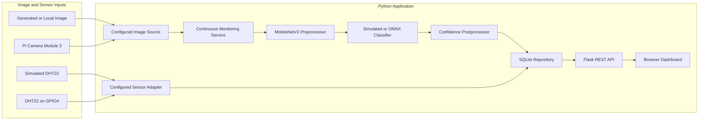

# Kaizen Model for Tomato Disease Detection

An edge-oriented IoT application for whole-image tomato leaf classification. It records temperature and humidity, stores each result locally, and presents monitoring data through a REST API and browser dashboard. The released six-class model recognizes five diseases and healthy tomato leaves.

The project targets a Raspberry Pi 5 with a Pi Camera Module 3 and DHT22 sensor. It can also run on a desktop with simulated camera, sensor, and inference components. The six-class MobileNetV2 model runs through ONNX Runtime and is published in [GitHub release v2.0.0](https://github.com/thetruesammyjay/IoT-System-for-Disease-Detection-in-Crops/releases/tag/v2.0.0). Hailo AI HAT+ acceleration remains unimplemented.

## Contents

1. [Project scope](#project-scope)
2. [Current implementation status](#current-implementation-status)
3. [Model results](#model-results)
4. [System architecture](#system-architecture)
5. [Repository structure](#repository-structure)
6. [Development setup](#development-setup)
7. [Running the application](#running-the-application)
8. [Configuration](#configuration)
9. [REST API](#rest-api)
10. [Web dashboard](#web-dashboard)
11. [Model training and evaluation](#model-training-and-evaluation)
12. [Raspberry Pi hardware setup](#raspberry-pi-hardware-setup)
13. [Testing](#testing)
14. [Documentation](#documentation)
15. [Known limitations and remaining work](#known-limitations-and-remaining-work)

## Project scope

The current six-class model performs whole-image classification for these PlantVillage tomato classes:

| Class index | Class | Dataset folder | Configured priority |
|---:|---|---|---|
| 0 | Bacterial Spot | `Tomato___Bacterial_spot` | High |
| 1 | Early Blight | `Tomato___Early_blight` | Medium |
| 2 | Late Blight | `Tomato___Late_blight` | High |
| 3 | Leaf Mould | `Tomato___Leaf_Mold` | Medium |
| 4 | Septoria Leaf Spot | `Tomato___Septoria_leaf_spot` | Medium |
| 5 | Healthy Tomato Leaf | `Tomato___healthy` | None |

The five-class model remains available as release [v1.0.0](https://github.com/thetruesammyjay/IoT-System-for-Disease-Detection-in-Crops/releases/tag/v1.0.0). The default `config/config.yaml` uses simulated five-class inference; `config/config-six-class.yaml` selects the released six-class ONNX model.

The configured severity is an alert priority, not a measurement of lesion area, biological disease stage, or crop loss. The classifier has no leaf-versus-non-leaf detector or dedicated unknown class. A low-confidence result is marked `uncertain`, but other unfamiliar images—including non-leaf objects—may still be assigned one of the six classes. Use clear tomato-leaf images and treat predictions as decision support rather than expert diagnosis.

## Current implementation status

| Component | Status | Notes |
|---|---|---|
| Five-class MobileNetV2 baseline | Implemented and released | v1.0.0; five disease classes |
| Six-class MobileNetV2 model | Implemented and released | v2.0.0; five diseases plus Healthy Tomato Leaf |
| Training and test-set evaluation | Implemented | Reproducible manifests, per-class metrics, predictions, and confusion matrices |
| ONNX export and runtime validation | Implemented | Model metadata, SHA-256 contract checks, and PyTorch/ONNX parity check |
| ONNX Runtime inference | Implemented | Five- and six-class configurations are supported |
| Simulated inference | Implemented | Class count follows the selected configuration |
| Generated and local-image sources | Implemented | Support desktop simulation and labelled-image testing |
| Pi Camera Module 3 adapter | Implemented, physical test pending | Uses Picamera2 and supports rotation, warm-up, saving, and cleanup |
| Simulated DHT22 | Implemented | Repeatable temperature and humidity values |
| Physical DHT22 adapter | Implemented, physical test pending | Includes retries, range checks, rounding, and GPIO cleanup |
| SQLite persistence | Implemented | Saves classification and sensor records in one transaction |
| Continuous monitoring | Implemented | Supports start, stop, manual trigger, counters, and overlap prevention |
| REST API | Implemented | Detection, upload inference, sensor, monitoring, system, and export endpoints |
| Web dashboard | Implemented | Includes leaf-image upload and uses REST polling every three seconds |
| CSV and JSON reports | Implemented | Supports the same disease, status, and date filters as detection queries |
| Hailo HEF model and runtime backend | Not implemented | ONNX-to-HEF compilation and HailoRT adapter remain pending |
| Email or SMS alerts | Not implemented | No alert dispatcher or alert-log table exists yet |
| Authentication and HTTPS | Not implemented | The current server is for a trusted local network only |

## Model results

The current six-class dataset was validated, deduplicated by SHA-256 content hash, and split with seed 42. The class-stratified split contains 7,472 training images, 932 validation images, and 932 held-out test images.

| Class | Training | Validation | Test |
|---|---:|---:|---:|
| Bacterial Spot | 1,703 | 212 | 212 |
| Early Blight | 800 | 100 | 100 |
| Late Blight | 1,521 | 190 | 190 |
| Leaf Mould | 762 | 95 | 95 |
| Septoria Leaf Spot | 1,417 | 177 | 177 |
| Healthy Tomato Leaf | 1,269 | 158 | 158 |
| **Total** | **7,472** | **932** | **932** |

The selected six-class checkpoint is from epoch 6. Its held-out test results are:

| Metric | Result |
|---|---:|
| Accuracy | 99.14% |
| Macro precision | 99.20% |
| Macro recall | 98.96% |
| Macro F1-score | 99.07% |
| Healthy Tomato Leaf precision | 98.75% |
| Healthy Tomato Leaf recall | 100.00% |

The model correctly recognized all 158 healthy leaves in the test split; two diseased leaves were also predicted as healthy. The earlier five-class baseline scored 97.93% accuracy and 97.97% macro F1 on its separate 774-image PlantVillage test split. Both results come from controlled PlantVillage images and do not establish performance on field photographs. The v2.0.0 release notes include the six-class test summary.

## System architecture


```mermaid
flowchart LR
    subgraph Inputs[Image and Sensor Inputs]
        SIMCAM[Generated or Local Image]
        PICAM[Pi Camera Module 3]
        SIMSENSOR[Simulated DHT22]
        DHT[DHT22 on GPIO4]
    end

    subgraph Application[Python Application]
        SOURCE[Configured Image Source]
        MONITOR[Continuous Monitoring Service]
        PRE[MobileNetV2 Preprocessor]
        CLASSIFIER[Simulated or ONNX Classifier]
        POST[Confidence Postprocessor]
        SENSOR[Configured Sensor Adapter]
        REPO[SQLite Repository]
        API[Flask REST API]
        DASH[Browser Dashboard]
    end

    SIMCAM --> SOURCE
    PICAM --> SOURCE
    SOURCE --> MONITOR
    MONITOR --> PRE
    PRE --> CLASSIFIER
    CLASSIFIER --> POST
    SIMSENSOR --> SENSOR
    DHT --> SENSOR
    POST --> REPO
    SENSOR --> REPO
    REPO --> API
    API --> DASH
```

One monitoring cycle performs the following operations:

1. Capture or load an RGB image.
2. Convert it to RGB, resize it to 224 by 224 pixels, and apply ImageNet normalisation.
3. Run the selected inference backend with the configured five- or six-class model.
4. Apply softmax and compare the highest probability with the 0.70 confidence threshold.
5. Read and validate temperature and humidity.
6. Save the classification and sensor reading in one SQLite transaction.
7. Expose the stored result through the API and dashboard.

## Repository structure

```text
.
├── config/
│   ├── config.yaml                 # Default simulated five-class settings
│   ├── config-six-class.yaml       # Six-class ONNX runtime settings
│   ├── diseases.yaml               # Five disease classes
│   ├── diseases-six-class.yaml     # Five diseases and Healthy Tomato Leaf
│   └── logging.yaml
├── docs/
│   ├── api_reference.md
│   ├── hardware_setup.md
│   ├── model_training.md
│   └── software_setup.md
├── documentation/
│   ├── CHAPTER-ONE.md
│   ├── CHAPTER-TWO.md
│   ├── CHAPTER-THREE(NEW).md
│   ├── CHAPTER-FOUR.md
│   ├── CHAPTER-FIVE.md
│   ├── FULL.md
│   ├── APPENDIX.md
│   ├── diagrams/                   # Editable draw.io sources
│   └── figures/                    # Chapter Four PNG figures
├── models/
│   ├── evaluation/baseline/        # Five-class baseline metrics and predictions
│   ├── onnx/                       # Downloaded ONNX model and metadata; git-ignored
│   └── training/                   # Dataset, training, evaluation, and export code
├── src/
│   ├── api/                        # Flask API, dashboard template, CSS, and JavaScript
│   ├── camera/                     # Generated, local-image, and Picamera2 sources
│   ├── database/                   # SQLAlchemy models and repository
│   ├── inference/                  # Preprocessing, inference, metadata, and postprocessing
│   ├── monitoring/                 # Continuous monitoring service
│   ├── sensors/                    # Simulated and physical DHT22 adapters
│   ├── utils/                      # YAML configuration loading and validation
│   ├── domain.py                   # Shared domain records
│   └── pipeline.py                 # End-to-end classification pipeline
├── tests/
│   ├── integration/
│   ├── unit/
│   └── conftest.py
├── main.py                         # Command-line entry point
├── pyproject.toml                  # Project metadata and dependency groups
└── uv.lock                         # Reproducible dependency lockfile
```

Runtime data, downloaded datasets, training checkpoints, ONNX files, and HEF files are intentionally excluded from Git. Copy or regenerate those artefacts on each target machine.

## Development setup

### Requirements

- Python 3.11
- [`uv`](https://docs.astral.sh/uv/)
- Git

The project declares `>=3.11,<3.12`, so Python 3.12 should not be used for this environment.

### Install dependencies

```powershell
git clone <repository-url>
Set-Location IoT-System-for-Disease-Detection-in-Crops

uv python install 3.11
uv sync --extra simulation --extra training
```

`uv` creates and manages `.venv` automatically. Activating it is optional because every project command can be run through `uv run`.

### Verify the environment

```powershell
uv run python --version
uv lock --check
uv run ruff check main.py src tests
uv run pytest -v
```

The repository includes unit and integration tests. Run them with the commands below after installing the development dependencies.

## Running the application

### Initialise the database

```powershell
uv run python main.py --init-db
```

### Run one complete simulation

```powershell
uv run python main.py --simulate
```

This uses a generated image, deterministic simulated inference, simulated temperature and humidity, and the configured SQLite database.

### Download and run the six-class model

The ONNX files are distributed through [GitHub release v2.0.0](https://github.com/thetruesammyjay/IoT-System-for-Disease-Detection-in-Crops/releases/tag/v2.0.0) and are not stored in Git. Download both release assets into `models/onnx/`:

- `kaizen-model-tomato_mobilenet_v2_six_class.onnx`
- `kaizen-model-tomato_mobilenet_v2_six_class.metadata.json`

PowerShell download commands:

```powershell
New-Item -ItemType Directory -Force models/onnx | Out-Null
$releaseUrl = "https://github.com/thetruesammyjay/IoT-System-for-Disease-Detection-in-Crops/releases/download/v2.0.0"
Invoke-WebRequest -Uri "$releaseUrl/kaizen-model-tomato_mobilenet_v2_six_class.onnx" -OutFile "models/onnx/kaizen-model-tomato_mobilenet_v2_six_class.onnx"
Invoke-WebRequest -Uri "$releaseUrl/kaizen-model-tomato_mobilenet_v2_six_class.metadata.json" -OutFile "models/onnx/kaizen-model-tomato_mobilenet_v2_six_class.metadata.json"
```

The metadata sidecar is required. The application checks the model hash, class order, input dimensions, and tensor names before inference.

Start the six-class API and dashboard from PowerShell:

```powershell
.\.venv\Scripts\python.exe main.py --config config/config-six-class.yaml --serve
```

Open <http://127.0.0.1:5000/>. The server uses ONNX inference for image uploads and monitoring. Continuous monitoring does not start automatically; start it from the dashboard or the API unless `monitoring.auto_start` is enabled in the config.

To classify a local image with the six-class model:

```powershell
.\.venv\Scripts\python.exe main.py --config config/config-six-class.yaml --classify --image "C:\path\to\tomato-leaf.jpg"
```

### Run the default simulation

The default `config/config.yaml` uses simulated five-class inference, camera input, and sensor readings. It does not require an ONNX model:

```powershell
uv run python main.py --serve
```

Open <http://127.0.0.1:5000/> to use the dashboard. You can also run one generated-image simulation with `uv run python main.py --simulate`.

### Command-line options

| Option | Purpose |
|---|---|
| `--config PATH` | Load an alternative YAML configuration |
| `--init-db` | Create any missing SQLite tables |
| `--simulate` | Run one classification with the simulated classifier |
| `--classify` | Run one classification using the configured or selected backend |
| `--backend simulation` | Select deterministic simulated inference |
| `--backend onnx` | Select the trained ONNX Runtime model |
| `--backend hailo` | Reserved option; currently returns a not-implemented error |
| `--image PATH` | Supply a local image to `--simulate` or `--classify` |
| `--serve` | Start the Flask API and dashboard |
| `--check-hardware` | Capture one Pi Camera frame and read one physical DHT22 measurement |

## Configuration

Select the configuration that matches the model and input backends you want to run:

| Configuration | Inference | Classes | Class metadata |
|---|---|---:|---|
| [`config/config.yaml`](config/config.yaml) | Simulated | 5 disease classes | [`config/diseases.yaml`](config/diseases.yaml) |
| [`config/config-six-class.yaml`](config/config-six-class.yaml) | ONNX Runtime | 5 diseases and Healthy Tomato Leaf | [`config/diseases-six-class.yaml`](config/diseases-six-class.yaml) |

Both configurations use simulated sensors and image sources by default. The six-class config expects the v2.0.0 ONNX model and its metadata sidecar under `models/onnx/`. Runtime settings include the confidence threshold, model input size, database path, camera settings, sensor backend, API address, and monitoring interval.

Supported values are:

- `inference.backend`: `simulation`, `onnx`, or reserved `hailo`
- `sensor.backend`: `simulation` or `dht22`
- `monitoring.source`: `simulation` or `picamera2`

## REST API

All JSON endpoints use the `/api/v1` prefix.

| Method | Endpoint | Description |
|---|---|---|
| GET | `/api/v1/system/health` | Database health and monitoring status when configured |
| GET | `/api/v1/system/info` | Application, Python, platform, record count, and monitoring information |
| GET | `/api/v1/detections/latest` | Latest stored classification |
| GET | `/api/v1/detections/{id}` | One classification by identifier |
| GET | `/api/v1/detections` | Filtered and paginated classifications |
| GET | `/api/v1/sensors/latest` | Latest environmental reading |
| GET | `/api/v1/sensors/history` | Paginated environmental history |
| POST | `/api/v1/inference/trigger` | Run one capture and classification cycle |
| POST | `/api/v1/inference/upload` | Validate, store, and classify an uploaded leaf image |
| GET | `/api/v1/monitoring/status` | Monitoring state, counters, timestamps, and latest error |
| POST | `/api/v1/monitoring/start` | Start continuous monitoring |
| POST | `/api/v1/monitoring/stop` | Stop continuous monitoring |
| GET | `/api/v1/reports/export` | Download matching classifications as JSON or CSV |

Detection and report queries support:

- `disease`: exact configured display label
- `status`: `accepted` or `uncertain`
- `from`: ISO 8601 start timestamp
- `to`: ISO 8601 end timestamp

Detection listing also supports `limit` from 1 to 100 and a non-negative `offset`. Sensor history supports `limit` from 1 to 500, `offset`, `from`, and `to`. Report export accepts `format=json` or `format=csv`.

Examples:

```powershell
Invoke-RestMethod http://127.0.0.1:5000/api/v1/system/health

Invoke-RestMethod `
  -Method Post `
  http://127.0.0.1:5000/api/v1/inference/trigger

Invoke-RestMethod `
  -Method Post `
  http://127.0.0.1:5000/api/v1/monitoring/start
```

See [`docs/api_reference.md`](docs/api_reference.md) for response examples and further query details.

## Web dashboard

The dashboard is served at `/` by Flask. It uses local HTML, CSS, and plain JavaScript and does not require an internet connection or Chart.js.

The interface displays:

- API connection status
- monitoring state and cycle counters
- latest disease label, confidence, status, severity, and model version
- configured class-probability distribution (five or six classes)
- recent detection history
- temperature and humidity trend lines
- latest monitoring error
- JPEG, PNG, or WebP leaf-image selection, preview, and model analysis
- buttons to start or stop monitoring and run one immediate cycle
- CSV and JSON report links

The page polls the REST API every three seconds. Flask-SocketIO remains in the dependency list but is not used by the current dashboard.

## Model training and evaluation

Install the training dependencies:

```powershell
uv sync --extra simulation --extra training
```

The current released model uses six PlantVillage classes. The five-class workflow remains available for reproducing the v1.0.0 baseline; see [`docs/model_training.md`](docs/model_training.md) for that workflow.

### Prepare the six-class dataset

```powershell
uv run python -m models.training.dataset_prep `
  --dataset-root data/raw/PlantVillage `
  --output-dir data/processed/tomato_6class `
  --config config/config-six-class.yaml `
  --seed 42
```

The source dataset is not included in Git. The preparation command validates images, removes duplicate content, and writes train, validation, and test manifests without copying the source images. Keep the source dataset at the same path while using those manifests.

### Train MobileNetV2

```powershell
uv run python -m models.training.train `
  --data-dir data/processed/tomato_6class `
  --output-dir models/training/runs/six_class `
  --epochs 30 `
  --batch-size 8 `
  --workers 0 `
  --device cpu `
  --seed 42 `
  --model-version tomato-mobilenetv2-v2-six-class
```

The released v2.0.0 checkpoint was selected at epoch 6 by validation macro F1. Training writes the best checkpoint and history under the run directory. Training checkpoints and run history are local artifacts and are git-ignored.

### Evaluate the held-out test split

```powershell
uv run python -m models.training.evaluate `
  --checkpoint models/training/runs/six_class/best_model.pt `
  --data-dir data/processed/tomato_6class `
  --output-dir models/evaluation/six_class `
  --batch-size 8 `
  --workers 0 `
  --device cpu
```

Evaluation produces `metrics.json`, `predictions.csv`, `confusion_matrix.csv`, and `confusion_matrix.png`. The held-out six-class split contains 932 images and yielded 99.14% accuracy and 99.07% macro F1. Do not use the test split for checkpoint selection.

### Export the selected checkpoint to ONNX

```powershell
uv run python -m models.training.export_onnx `
  --checkpoint models/training/runs/six_class/best_model.pt `
  --output models/onnx/kaizen-model-tomato_mobilenet_v2_six_class.onnx `
  --opset 17
```

The exporter writes a metadata sidecar beside the ONNX file, checks the graph, and compares ONNX Runtime output with the PyTorch checkpoint by default. The ONNX model and metadata sidecar are the two assets in [GitHub release v2.0.0](https://github.com/thetruesammyjay/IoT-System-for-Disease-Detection-in-Crops/releases/tag/v2.0.0).

See [`docs/model_training.md`](docs/model_training.md) for additional dataset and training details for the five-class baseline.

## Raspberry Pi hardware setup

The physical adapters target Raspberry Pi OS 64-bit on a Raspberry Pi 5 with a Camera Module 3 and DHT22. Physical validation has not yet been recorded, so the first test should isolate the peripherals from model deployment.

### Wiring

Power off the Raspberry Pi before connecting or moving hardware.

| Component | Raspberry Pi connection |
|---|---|
| Camera Module 3 | CAM/DISP CSI connector using the correct Pi 5 camera cable |
| DHT22 VCC, pin 1 | 3.3 V, physical pin 1 |
| DHT22 DATA, pin 2 | BCM GPIO4, physical pin 7 |
| DHT22 GND, pin 4 | Ground, physical pin 6 |

Place the required pull-up resistor between DHT22 VCC and DATA.

### Install Raspberry Pi packages and dependencies

```bash
sudo apt update
sudo apt install -y python3-picamera2 libgpiod2
rpicam-hello --list-cameras

uv venv --python /usr/bin/python3 --system-site-packages
source .venv/bin/activate
uv sync --extra hardware --extra simulation
```

Picamera2 is installed through Raspberry Pi OS rather than PyPI. The `--system-site-packages` option allows the `uv` environment to access the operating-system camera packages.

### First physical diagnostic

Use the following settings initially:

```yaml
inference:
  backend: simulation

sensor:
  backend: dht22
  gpio_pin: 4

monitoring:
  source: picamera2
```

Then run:

```bash
uv run python main.py --check-hardware
```

After the camera and DHT22 work reliably, copy the ONNX model and metadata to `models/onnx/` and start the server with the matching configuration. For the six-class release, use:

```bash
uv run python main.py --config config/config-six-class.yaml --serve
```

To access the dashboard from another device on the same trusted network, change `api.host` to `0.0.0.0`, restart the server, and open `http://<raspberry-pi-address>:5000/`.

See [`docs/hardware_setup.md`](docs/hardware_setup.md) for troubleshooting details.

## Testing

The repository includes unit and integration tests for the application and its adapters.

```powershell
# Complete suite
uv run pytest -v

# Unit tests
uv run pytest tests/unit -v

# Integration tests
uv run pytest tests/integration -v

# Lint checks
uv run ruff check main.py src tests

# Coverage report
uv run pytest --cov=src --cov-report=html
```

The test suite covers:

- reproducible dataset splitting
- MobileNetV2 preprocessing
- confidence and uncertainty handling
- ONNX input and output contracts
- model metadata and hash validation
- generated and local image sources
- mocked Pi Camera configuration, rotation, capture, and cleanup
- simulated DHT22 values
- mocked physical DHT22 retries, validation, and cleanup
- SQLite transactional persistence
- monitoring state, idempotency, and overlap prevention
- API validation, pagination, filtering, export, and controls
- dashboard and static-asset delivery
- leaf-image upload validation, size enforcement, classification, and storage
- end-to-end simulated classification and storage
- classification metrics and confusion-matrix calculation

Mocked adapter tests verify software behaviour but do not replace physical electrical, image-quality, sensor-accuracy, or sustained-operation testing on the Raspberry Pi.

## Documentation

Academic chapters:

- [`documentation/CHAPTER-ONE.md`](documentation/CHAPTER-ONE.md)
- [`documentation/CHAPTER-TWO.md`](documentation/CHAPTER-TWO.md)
- [`documentation/CHAPTER-THREE(NEW).md`](<documentation/CHAPTER-THREE(NEW).md>)
- [`documentation/CHAPTER-FOUR.md`](documentation/CHAPTER-FOUR.md)
- [`documentation/CHAPTER-FIVE.md`](documentation/CHAPTER-FIVE.md)
- [`documentation/FULL.md`](documentation/FULL.md)
- [`documentation/APPENDIX.md`](documentation/APPENDIX.md)

Technical guides:

- [`docs/software_setup.md`](docs/software_setup.md)
- [`docs/hardware_setup.md`](docs/hardware_setup.md)
- [`docs/model_training.md`](docs/model_training.md)
- [`docs/api_reference.md`](docs/api_reference.md)

Editable Chapter Four diagrams are stored under `documentation/diagrams`, with PNG outputs under `documentation/figures`.

## Known limitations and remaining work

- The six-class model includes healthy tomato leaves but has no dedicated unknown or non-leaf class. Non-leaf inputs can still receive one of the six labels.
- PlantVillage images use controlled backgrounds and lighting; the reported test results do not establish field generalisation.
- The model performs whole-image classification and does not produce bounding boxes, lesion counts, or lesion-area severity. Configured severity is an alert priority, not a visual estimate of disease severity.
- Physical Pi Camera and DHT22 validation is still pending.
- Raspberry Pi CPU latency, resource use, thermal behaviour, and sustained monitoring have not been measured.
- ONNX-to-HEF compilation and the HailoRT inference backend are not implemented.
- Email and SMS alerts, alert cooldown rules, and alert persistence are not implemented.
- The dashboard uses three-second REST polling rather than WebSocket push events.
- Authentication, HTTPS, service supervision, backup, retention control, and production hardening remain future work.
- SQLite is appropriate for this single-node prototype but may not suit a future multi-device write workload.

The next model milestone is to add a leaf-versus-non-leaf rejection step and evaluate it with representative non-leaf images. For hardware deployment, validate the Camera Module 3 and DHT22, measure ONNX inference on the Pi CPU, and consider Hailo acceleration after confirming the target AI HAT+ hardware and software stack.
