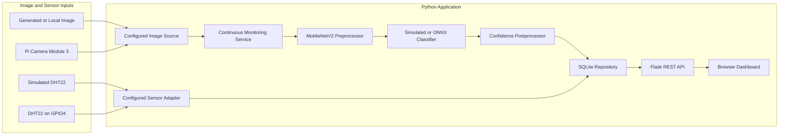

# Kaizen Model for Tomato Disease Detection

An edge-oriented IoT application that classifies five tomato leaf diseases, records temperature and humidity, stores each result locally, and presents monitoring data through a REST API and browser dashboard.

The project is designed for a Raspberry Pi 5 with a Pi Camera Module 3 and DHT22 sensor. Development can be completed on a normal computer because the application also provides simulated camera, sensor, and inference components. A trained MobileNetV2 model is available locally through ONNX Runtime, while Hailo AI HAT+ acceleration remains a planned deployment stage.

## Contents

1. [Project scope](#project-scope)
2. [Current implementation status](#current-implementation-status)
3. [Model results](#model-results)
4. [System architecture](#system-architecture)
5. [Repository structure](#repository-structure)
6. [Development setup](#development-setup)
7. [Running the application](#running-the-application)
8. [Configuration](#configuration)
9. [REST API](#rest-api)
10. [Web dashboard](#web-dashboard)
11. [Model training and evaluation](#model-training-and-evaluation)
12. [Raspberry Pi hardware setup](#raspberry-pi-hardware-setup)
13. [Testing](#testing)
14. [Documentation](#documentation)
15. [Known limitations and remaining work](#known-limitations-and-remaining-work)

## Project scope

The system performs whole-image classification for five PlantVillage tomato disease classes:

| Class index | Disease | Dataset folder | Configured priority |
|---:|---|---|---|
| 0 | Bacterial Spot | `Tomato___Bacterial_spot` | High |
| 1 | Early Blight | `Tomato___Early_blight` | Medium |
| 2 | Late Blight | `Tomato___Late_blight` | High |
| 3 | Leaf Mould | `Tomato___Leaf_Mold` | Medium |
| 4 | Septoria Leaf Spot | `Tomato___Septoria_leaf_spot` | Medium |

The configured priority is intended for future alert handling. It is not a measurement of lesion area, biological disease stage, or crop loss.

The classifier does not currently include a healthy-tomato class. A low-confidence result is stored as `uncertain`, but an unfamiliar image may still be assigned to one of the five disease classes. Inputs should therefore contain one clear, predominant tomato leaf, and predictions should be treated as decision support rather than a replacement for expert diagnosis.

## Current implementation status

| Component | Status | Notes |
|---|---|---|
| Five-class MobileNetV2 training | Implemented | Reproducible PlantVillage manifests and transfer-learning workflow |
| Test-set evaluation | Implemented | Accuracy, macro metrics, per-class metrics, predictions, and confusion matrix |
| ONNX export and validation | Implemented | Model metadata and SHA-256 contract validation included |
| ONNX Runtime inference | Implemented | Tested with labelled local images on the development computer |
| Simulated inference | Implemented | Deterministic five-class logits for software-only testing |
| Generated and local-image sources | Implemented | Support desktop simulation and labelled-image testing |
| Pi Camera Module 3 adapter | Implemented, physical test pending | Uses Picamera2 and supports rotation, warm-up, saving, and cleanup |
| Simulated DHT22 | Implemented | Repeatable temperature and humidity values |
| Physical DHT22 adapter | Implemented, physical test pending | Includes retries, range checks, rounding, and GPIO cleanup |
| SQLite persistence | Implemented | Saves classification and sensor records in one transaction |
| Continuous monitoring | Implemented | Supports start, stop, manual trigger, counters, and overlap prevention |
| REST API | Implemented | Detection, sensor, monitoring, system, and export endpoints |
| Web dashboard | Implemented | Uses REST polling every three seconds; no WebSocket transport is implemented |
| CSV and JSON reports | Implemented | Supports the same disease, status, and date filters as detection queries |
| Hailo HEF model and runtime backend | Not implemented | ONNX-to-HEF compilation and HailoRT adapter remain pending |
| Email or SMS alerts | Not implemented | No alert dispatcher or alert-log table exists yet |
| Authentication and HTTPS | Not implemented | The current server is for a trusted local network only |

## Model results

The five-class dataset was validated, deduplicated by SHA-256 content hash, and split with seed 42. Eight duplicate Late Blight files were removed before the split, leaving 7,751 valid unique images.

| Disease | Training | Validation | Test |
|---|---:|---:|---:|
| Bacterial Spot | 1,703 | 212 | 212 |
| Early Blight | 800 | 100 | 100 |
| Late Blight | 1,521 | 190 | 190 |
| Leaf Mould | 762 | 95 | 95 |
| Septoria Leaf Spot | 1,417 | 177 | 177 |
| **Total** | **6,203** | **774** | **774** |

The selected baseline checkpoint was produced at epoch 5 and evaluated on the held-out 774-image test set.

| Metric | Result |
|---|---:|
| Accuracy | 97.93% |
| Macro precision | 98.09% |
| Macro recall | 97.90% |
| Macro F1-score | 97.97% |

Evaluation artefacts are committed under [`models/evaluation/baseline`](models/evaluation/baseline). These results apply to the controlled PlantVillage test set and do not yet establish performance on field photographs.

## System architecture


```mermaid
flowchart LR
    subgraph Inputs[Image and Sensor Inputs]
        SIMCAM[Generated or Local Image]
        PICAM[Pi Camera Module 3]
        SIMSENSOR[Simulated DHT22]
        DHT[DHT22 on GPIO4]
    end

    subgraph Application[Python Application]
        SOURCE[Configured Image Source]
        MONITOR[Continuous Monitoring Service]
        PRE[MobileNetV2 Preprocessor]
        CLASSIFIER[Simulated or ONNX Classifier]
        POST[Confidence Postprocessor]
        SENSOR[Configured Sensor Adapter]
        REPO[SQLite Repository]
        API[Flask REST API]
        DASH[Browser Dashboard]
    end

    SIMCAM --> SOURCE
    PICAM --> SOURCE
    SOURCE --> MONITOR
    MONITOR --> PRE
    PRE --> CLASSIFIER
    CLASSIFIER --> POST
    SIMSENSOR --> SENSOR
    DHT --> SENSOR
    POST --> REPO
    SENSOR --> REPO
    REPO --> API
    API --> DASH
```

One monitoring cycle performs the following operations:

1. Capture or load an RGB image.
2. Convert it to RGB, resize it to 224 by 224 pixels, and apply ImageNet normalisation.
3. Run the selected five-class inference backend.
4. Apply softmax and compare the highest probability with the 0.70 confidence threshold.
5. Read and validate temperature and humidity.
6. Save the classification and sensor reading in one SQLite transaction.
7. Expose the stored result through the API and dashboard.

## Repository structure

```text
.
├── config/
│   ├── config.yaml                 # Runtime application settings
│   ├── diseases.yaml               # Five classes and configured priorities
│   └── logging.yaml
├── docs/
│   ├── api_reference.md
│   ├── hardware_setup.md
│   ├── model_training.md
│   └── software_setup.md
├── documentation/
│   ├── CHAPTER-ONE.md
│   ├── CHAPTER-TWO.md
│   ├── CHAPTER-THREE(NEW).md
│   ├── CHAPTER-FOUR.md
│   ├── diagrams/                   # Editable draw.io sources
│   └── figures/                    # Chapter Four PNG figures
├── models/
│   ├── evaluation/baseline/        # Metrics, predictions, and confusion matrix
│   ├── onnx/                       # Local ONNX model and metadata; git-ignored
│   └── training/                   # Dataset, training, evaluation, and export code
├── src/
│   ├── api/                        # Flask API, dashboard template, CSS, and JavaScript
│   ├── camera/                     # Generated, local-image, and Picamera2 sources
│   ├── database/                   # SQLAlchemy models and repository
│   ├── inference/                  # Preprocessing, inference, metadata, and postprocessing
│   ├── monitoring/                 # Continuous monitoring service
│   ├── sensors/                    # Simulated and physical DHT22 adapters
│   ├── utils/                      # YAML configuration loading and validation
│   ├── domain.py                   # Shared domain records
│   └── pipeline.py                 # End-to-end classification pipeline
├── tests/
│   ├── integration/
│   ├── unit/
│   └── conftest.py
├── main.py                         # Command-line entry point
├── pyproject.toml                  # Project metadata and dependency groups
└── uv.lock                         # Reproducible dependency lockfile
```

Runtime data, downloaded datasets, training checkpoints, ONNX files, and HEF files are intentionally excluded from Git. Copy or regenerate those artefacts on each target machine.

## Development setup

### Requirements

- Python 3.11
- [`uv`](https://docs.astral.sh/uv/)
- Git

The project declares `>=3.11,<3.12`, so Python 3.12 should not be used for this environment.

### Install dependencies

```powershell
git clone <repository-url>
Set-Location IoT-System-for-Disease-Detection-in-Crops

uv python install 3.11
uv sync --extra simulation --extra training
```

`uv` creates and manages `.venv` automatically. Activating it is optional because every project command can be run through `uv run`.

### Verify the environment

```powershell
uv run python --version
uv lock --check
uv run ruff check main.py src tests
uv run pytest -v
```

The most recently recorded complete test run collected 32 tests and passed all 32.

## Running the application

### Initialise the database

```powershell
uv run python main.py --init-db
```

### Run one complete simulation

```powershell
uv run python main.py --simulate
```

This uses a generated image, deterministic simulated inference, simulated temperature and humidity, and the configured SQLite database.

### Classify a local image with the trained ONNX model

The following files must exist locally because `models/onnx/` is git-ignored:

```text
models/onnx/tomato_mobilenet_v2.onnx
models/onnx/tomato_mobilenet_v2.metadata.json
```

Run classification with:

```powershell
uv run python main.py --classify `
  --backend onnx `
  --image "C:\path\to\tomato-leaf.jpg"
```

The metadata contract verifies the model hash, class order, input dimensions, input name, and output name before inference.

### Start the API and dashboard

```powershell
uv run python main.py --serve
```

Open <http://127.0.0.1:5000/>. Continuous monitoring is configured but does not start automatically unless `monitoring.auto_start` is changed to `true` or the start endpoint is called.

### Command-line options

| Option | Purpose |
|---|---|
| `--config PATH` | Load an alternative YAML configuration |
| `--init-db` | Create any missing SQLite tables |
| `--simulate` | Run one classification with the simulated classifier |
| `--classify` | Run one classification using the configured or selected backend |
| `--backend simulation` | Select deterministic simulated inference |
| `--backend onnx` | Select the trained ONNX Runtime model |
| `--backend hailo` | Reserved option; currently returns a not-implemented error |
| `--image PATH` | Supply a local image to `--simulate` or `--classify` |
| `--serve` | Start the Flask API and dashboard |
| `--check-hardware` | Capture one Pi Camera frame and read one physical DHT22 measurement |

## Configuration

Runtime settings are loaded from [`config/config.yaml`](config/config.yaml), while class metadata is loaded from [`config/diseases.yaml`](config/diseases.yaml).

The committed configuration defaults to full desktop simulation:

```yaml
inference:
  backend: simulation
  onnx_model_path: models/onnx/tomato_mobilenet_v2.onnx
  hailo_model_path: models/hailo/tomato_classifier.hef
  confidence_threshold: 0.70
  input_size: [224, 224]
  class_count: 5
  model_version: simulation-v1

camera:
  resolution: [1920, 1080]
  rotation: 0
  warmup_seconds: 2.0
  save_captures: false
  capture_dir: data/captures

sensor:
  backend: simulation
  gpio_pin: 4
  use_pulseio: false
  retries: 3
  retry_delay_s: 2.0

api:
  host: 127.0.0.1
  port: 5000
  debug: false

monitoring:
  enabled: true
  source: simulation
  capture_interval_s: 5.0
  auto_start: false
  stop_timeout_s: 5.0
```

Supported values are:

- `inference.backend`: `simulation`, `onnx`, or reserved `hailo`
- `sensor.backend`: `simulation` or `dht22`
- `monitoring.source`: `simulation` or `picamera2`

## REST API

All JSON endpoints use the `/api/v1` prefix.

| Method | Endpoint | Description |
|---|---|---|
| GET | `/api/v1/system/health` | Database health and monitoring status when configured |
| GET | `/api/v1/system/info` | Application, Python, platform, record count, and monitoring information |
| GET | `/api/v1/detections/latest` | Latest stored classification |
| GET | `/api/v1/detections/{id}` | One classification by identifier |
| GET | `/api/v1/detections` | Filtered and paginated classifications |
| GET | `/api/v1/sensors/latest` | Latest environmental reading |
| GET | `/api/v1/sensors/history` | Paginated environmental history |
| POST | `/api/v1/inference/trigger` | Run one capture and classification cycle |
| GET | `/api/v1/monitoring/status` | Monitoring state, counters, timestamps, and latest error |
| POST | `/api/v1/monitoring/start` | Start continuous monitoring |
| POST | `/api/v1/monitoring/stop` | Stop continuous monitoring |
| GET | `/api/v1/reports/export` | Download matching classifications as JSON or CSV |

Detection and report queries support:

- `disease`: exact configured display label
- `status`: `accepted` or `uncertain`
- `from`: ISO 8601 start timestamp
- `to`: ISO 8601 end timestamp

Detection listing also supports `limit` from 1 to 100 and a non-negative `offset`. Sensor history supports `limit` from 1 to 500, `offset`, `from`, and `to`. Report export accepts `format=json` or `format=csv`.

Examples:

```powershell
Invoke-RestMethod http://127.0.0.1:5000/api/v1/system/health

Invoke-RestMethod `
  -Method Post `
  http://127.0.0.1:5000/api/v1/inference/trigger

Invoke-RestMethod `
  -Method Post `
  http://127.0.0.1:5000/api/v1/monitoring/start
```

See [`docs/api_reference.md`](docs/api_reference.md) for response examples and further query details.

## Web dashboard

The dashboard is served at `/` by Flask. It uses local HTML, CSS, and plain JavaScript and does not require an internet connection or Chart.js.

The interface displays:

- API connection status
- monitoring state and cycle counters
- latest disease label, confidence, status, severity, and model version
- five-class probability distribution
- recent detection history
- temperature and humidity trend lines
- latest monitoring error
- buttons to start or stop monitoring and run one immediate cycle
- CSV and JSON report links

The page polls the REST API every three seconds. Flask-SocketIO remains in the dependency list but is not used by the current dashboard.

## Model training and evaluation

Install the training dependencies:

```powershell
uv sync --extra simulation --extra training
```

### Prepare the five PlantVillage classes

```powershell
uv run python -m models.training.dataset_prep `
  --dataset-root data/raw/PlantVillage `
  --output-dir data/processed/tomato_5class `
  --seed 42
```

The command validates images, removes duplicate content, and creates `train.csv`, `validation.csv`, `test.csv`, `class_to_index.json`, and `metadata.json` without copying the source image files.

### Train MobileNetV2 on CPU

```powershell
uv run python -m models.training.train `
  --data-dir data/processed/tomato_5class `
  --output-dir models/training/runs/baseline `
  --epochs 30 `
  --batch-size 8 `
  --workers 0 `
  --device cpu `
  --seed 42
```

Training writes the best checkpoint and history artefacts under the selected run directory. Training runs and `.pt` checkpoints are git-ignored.

### Evaluate the held-out test set

```powershell
uv run python -m models.training.evaluate `
  --checkpoint models/training/runs/baseline/best_model.pt `
  --data-dir data/processed/tomato_5class `
  --output-dir models/evaluation/baseline `
  --batch-size 8 `
  --workers 0 `
  --device cpu
```

Evaluation produces `metrics.json`, `predictions.csv`, `confusion_matrix.csv`, and `confusion_matrix.png`.

### Export the checkpoint to ONNX

```powershell
uv run python -m models.training.export_onnx `
  --checkpoint models/training/runs/baseline/best_model.pt `
  --output models/onnx/tomato_mobilenet_v2.onnx `
  --opset 17
```

The export command also writes `tomato_mobilenet_v2.metadata.json` and verifies the ONNX model through ONNX Runtime by default.

See [`docs/model_training.md`](docs/model_training.md) for the longer training guide.

## Raspberry Pi hardware setup

The physical adapters target Raspberry Pi OS 64-bit on a Raspberry Pi 5 with a Camera Module 3 and DHT22. Physical validation has not yet been recorded, so the first test should isolate the peripherals from model deployment.

### Wiring

Power off the Raspberry Pi before connecting or moving hardware.

| Component | Raspberry Pi connection |
|---|---|
| Camera Module 3 | CAM/DISP CSI connector using the correct Pi 5 camera cable |
| DHT22 VCC, pin 1 | 3.3 V, physical pin 1 |
| DHT22 DATA, pin 2 | BCM GPIO4, physical pin 7 |
| DHT22 GND, pin 4 | Ground, physical pin 6 |

Place the required pull-up resistor between DHT22 VCC and DATA.

### Install Raspberry Pi packages and dependencies

```bash
sudo apt update
sudo apt install -y python3-picamera2 libgpiod2
rpicam-hello --list-cameras

uv venv --python /usr/bin/python3 --system-site-packages
source .venv/bin/activate
uv sync --extra hardware --extra simulation
```

Picamera2 is installed through Raspberry Pi OS rather than PyPI. The `--system-site-packages` option allows the `uv` environment to access the operating-system camera packages.

### First physical diagnostic

Use the following settings initially:

```yaml
inference:
  backend: simulation

sensor:
  backend: dht22
  gpio_pin: 4

monitoring:
  source: picamera2
```

Then run:

```bash
uv run python main.py --check-hardware
```

After the camera and DHT22 work reliably, copy the ONNX model and metadata to `models/onnx/`, change `inference.backend` to `onnx`, and start the server:

```bash
uv run python main.py --serve
```

To access the dashboard from another device on the same trusted network, change `api.host` to `0.0.0.0`, restart the server, and open `http://<raspberry-pi-address>:5000/`.

See [`docs/hardware_setup.md`](docs/hardware_setup.md) for troubleshooting details.

## Testing

The repository currently contains 32 unit and integration tests.

```powershell
# Complete suite
uv run pytest -v

# Unit tests
uv run pytest tests/unit -v

# Integration tests
uv run pytest tests/integration -v

# Lint checks
uv run ruff check main.py src tests

# Coverage report
uv run pytest --cov=src --cov-report=html
```

The test suite covers:

- reproducible dataset splitting
- MobileNetV2 preprocessing
- confidence and uncertainty handling
- ONNX input and output contracts
- model metadata and hash validation
- generated and local image sources
- mocked Pi Camera configuration, rotation, capture, and cleanup
- simulated DHT22 values
- mocked physical DHT22 retries, validation, and cleanup
- SQLite transactional persistence
- monitoring state, idempotency, and overlap prevention
- API validation, pagination, filtering, export, and controls
- dashboard and static-asset delivery
- end-to-end simulated classification and storage
- classification metrics and confusion-matrix calculation

Mocked adapter tests verify software behaviour but do not replace physical electrical, image-quality, sensor-accuracy, or sustained-operation testing on the Raspberry Pi.

## Documentation

Academic chapters:

- [`documentation/CHAPTER-ONE.md`](documentation/CHAPTER-ONE.md)
- [`documentation/CHAPTER-TWO.md`](documentation/CHAPTER-TWO.md)
- [`documentation/CHAPTER-THREE(NEW).md`](<documentation/CHAPTER-THREE(NEW).md>)
- [`documentation/CHAPTER-FOUR.md`](documentation/CHAPTER-FOUR.md)

Technical guides:

- [`docs/software_setup.md`](docs/software_setup.md)
- [`docs/hardware_setup.md`](docs/hardware_setup.md)
- [`docs/model_training.md`](docs/model_training.md)
- [`docs/api_reference.md`](docs/api_reference.md)

Editable Chapter Four diagrams are stored under `documentation/diagrams`, with PNG outputs under `documentation/figures`.

## Known limitations and remaining work

- The classifier has five disease classes and no healthy or unknown class.
- PlantVillage images use controlled backgrounds and lighting; field generalisation has not been established.
- The model performs whole-image classification and does not produce bounding boxes, lesion counts, or lesion-area severity.
- Physical Pi Camera and DHT22 validation is still pending.
- Raspberry Pi CPU latency, resource use, thermal behaviour, and sustained monitoring have not been measured.
- ONNX-to-HEF compilation and the HailoRT inference backend are not implemented.
- Email and SMS alerts, alert cooldown rules, and alert persistence are not implemented.
- The dashboard uses three-second REST polling rather than WebSocket push events.
- Authentication, HTTPS, service supervision, backup, retention control, and production hardening remain future work.
- SQLite is appropriate for this single-node prototype but may not suit a future multi-device write workload.

The recommended next milestone is staged Raspberry Pi integration: validate the Camera Module 3 and DHT22 first, benchmark ONNX inference on the Pi CPU second, and add Hailo acceleration only after the exact AI HAT+ hardware and software stack are confirmed.
