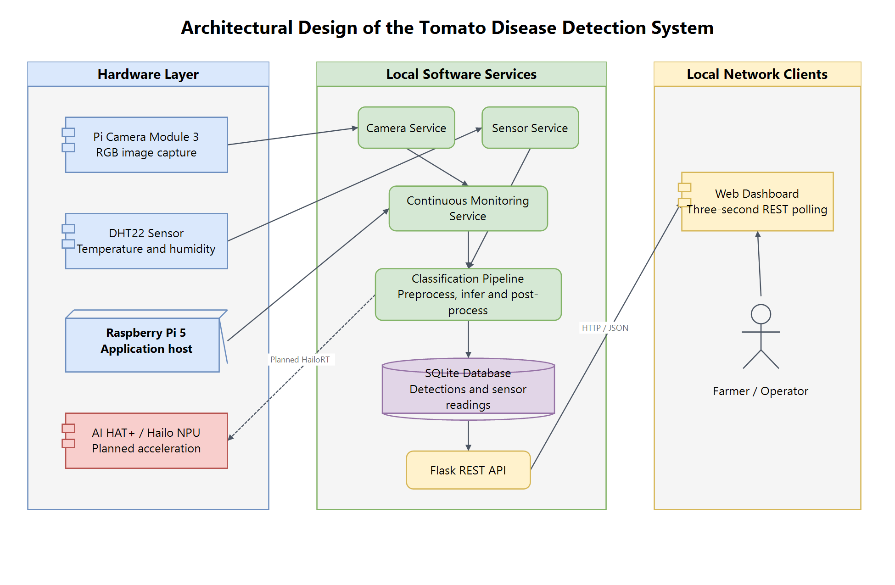
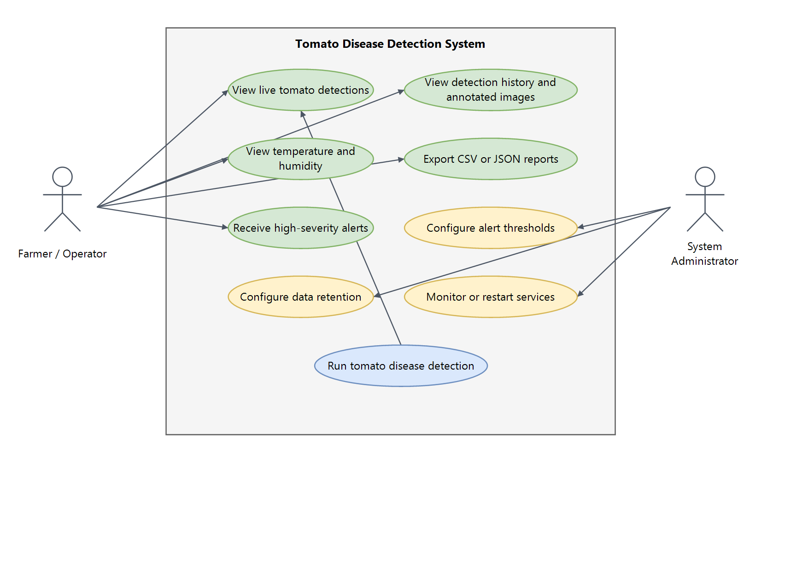
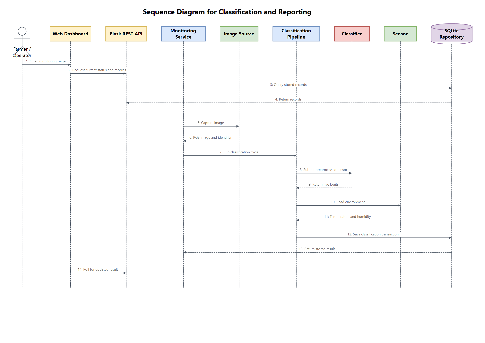
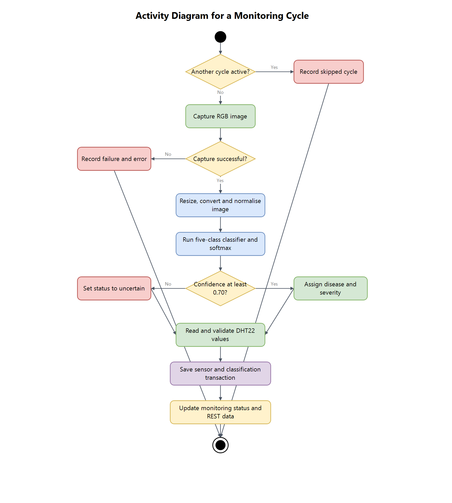
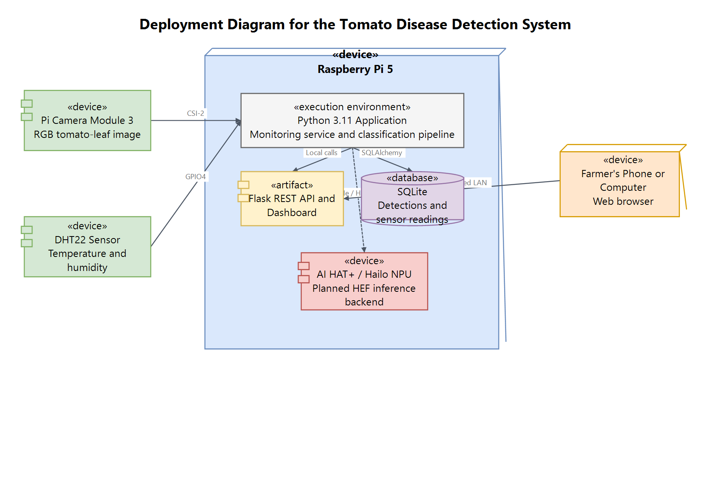
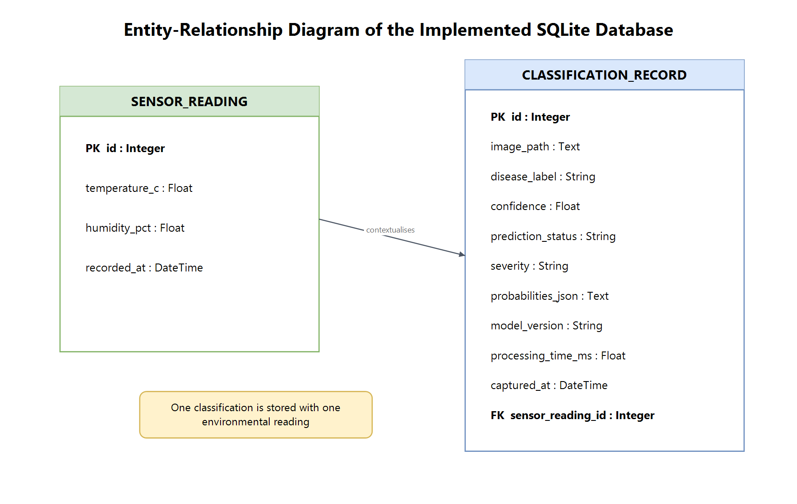
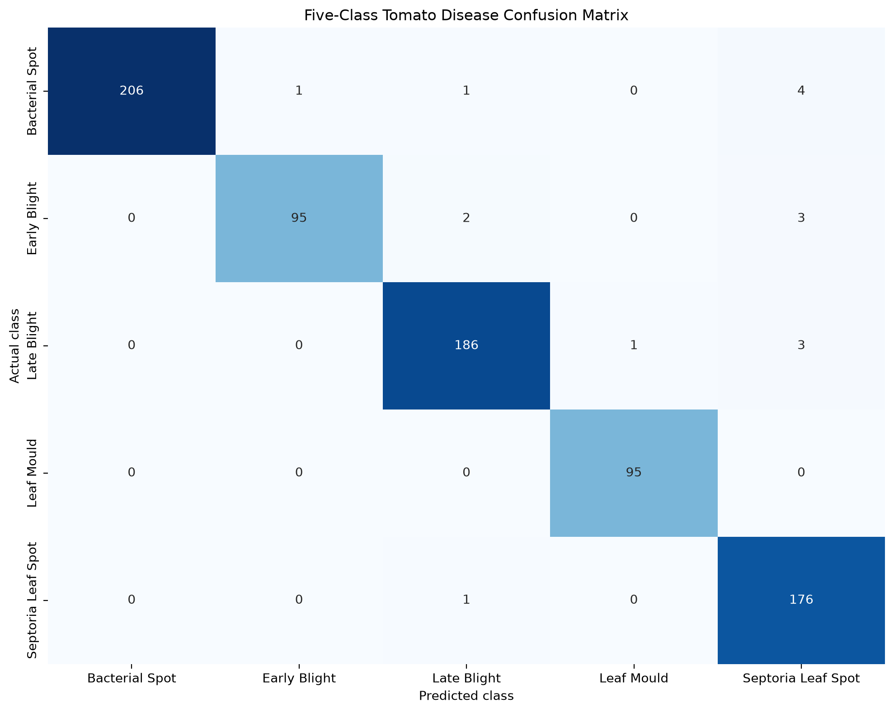

# APPENDIX

This appendix contains supporting source-code listings, diagrams, extended model results, and reproducibility commands for the study. It supplements Chapters Three and Four. Source-code links point to maintained implementation files and test directories so that the appendix and executable implementation remain aligned.

## Appendix A: Source-Code Listings

The source files below are the complete implementation listings for the prototype. The two extracts that follow show the main classification flow and the confidence decision. They are included to make the processing logic easy to locate; the linked files remain the authoritative source.

| Listing | Source files | Purpose |
|---|---|---|
| A.1 Application entry point | [`main.py`](../main.py) | Loads configuration, builds the selected adapters and pipeline, and runs simulation, classification, hardware checks, or the Flask server. |
| A.2 Shared domain and pipeline | [`src/domain.py`](../src/domain.py), [`src/pipeline.py`](../src/pipeline.py) | Defines shared records and connects preprocessing, inference, sensor reading, timing, and persistence. |
| A.3 Image acquisition | [`src/camera/simulation.py`](../src/camera/simulation.py), [`src/camera/picamera.py`](../src/camera/picamera.py) | Provides generated and local images and the Picamera2 adapter. |
| A.4 Inference | [`src/inference/preprocessor.py`](../src/inference/preprocessor.py), [`src/inference/postprocessor.py`](../src/inference/postprocessor.py), [`src/inference/onnx_runner.py`](../src/inference/onnx_runner.py), [`src/inference/simulated_runner.py`](../src/inference/simulated_runner.py), [`src/inference/model_metadata.py`](../src/inference/model_metadata.py) | Prepares images, runs the selected classifier, applies confidence handling, and validates model metadata. |
| A.5 Environmental sensing | [`src/sensors/simulated.py`](../src/sensors/simulated.py), [`src/sensors/dht22.py`](../src/sensors/dht22.py) | Implements repeatable simulated measurements and the physical DHT22 adapter. |
| A.6 Monitoring | [`src/monitoring/service.py`](../src/monitoring/service.py) | Schedules cycles, prevents overlap, and records monitoring status and errors. |
| A.7 Persistence | [`src/database/models.py`](../src/database/models.py), [`src/database/repository.py`](../src/database/repository.py) | Defines the SQLite schema and transactional repository operations. |
| A.8 API and dashboard | [`src/api/app.py`](../src/api/app.py), [`src/api/templates/dashboard.html`](../src/api/templates/dashboard.html), [`src/api/static/dashboard.js`](../src/api/static/dashboard.js), [`src/api/static/dashboard.css`](../src/api/static/dashboard.css) | Implements REST endpoints, image upload, the dashboard view, and browser-side updates. |
| A.9 Model preparation and training | [`models/training/dataset_prep.py`](../models/training/dataset_prep.py), [`models/training/dataset.py`](../models/training/dataset.py), [`models/training/modeling.py`](../models/training/modeling.py), [`models/training/train.py`](../models/training/train.py) | Validates and splits the dataset, loads manifests, defines MobileNetV2 transforms, and trains the classifier. |
| A.10 Model evaluation and export | [`models/training/evaluate.py`](../models/training/evaluate.py), [`models/training/metrics.py`](../models/training/metrics.py), [`models/training/export_onnx.py`](../models/training/export_onnx.py) | Evaluates the held-out test set, writes metrics and confusion matrices, and exports and verifies ONNX. |
| A.11 Runtime configuration | [`config/config.yaml`](../config/config.yaml), [`config/diseases.yaml`](../config/diseases.yaml), [`src/utils/config.py`](../src/utils/config.py) | Provides runtime settings, disease labels and priorities, and configuration validation. |
| A.12 Automated tests | [`tests/unit`](../tests/unit), [`tests/integration`](../tests/integration), [`tests/conftest.py`](../tests/conftest.py) | Contains unit and integration test listings for the implemented services and pipeline. |

### Listing A.1: End-to-End Classification Cycle

The pipeline preprocesses the supplied image, obtains model logits, applies the confidence postprocessor, reads the sensor, and submits both results to the repository for storage.

```python
def run(self, image: Image.Image, image_path: str) -> StoredClassification:
    started_at = perf_counter()
    captured_at = datetime.now(UTC)
    tensor = self.preprocessor.preprocess(image)
    logits = self.classifier.predict(tensor)
    outcome = self.postprocessor.process(logits)
    sensor_measurement = self.sensor.read()
    processing_time_ms = (perf_counter() - started_at) * 1000.0

    return self.repository.save_classification(
        outcome=outcome,
        sensor=sensor_measurement,
        image_path=image_path,
        processing_time_ms=round(processing_time_ms, 3),
        captured_at=captured_at,
    )
```

**Source:** [`src/pipeline.py`](../src/pipeline.py).

### Listing A.2: Confidence-Aware Classification

The postprocessor converts five finite model logits to probabilities. It accepts the highest-probability class at or above the configured threshold and stores a lower-confidence result as uncertain.

```python
shifted = values - np.max(values)
exponentials = np.exp(shifted)
probabilities = exponentials / np.sum(exponentials)
best_index = int(np.argmax(probabilities))
disease = self.diseases[best_index]
confidence = float(probabilities[best_index])
accepted = confidence >= self.confidence_threshold

return ClassificationOutcome(
    label=disease.label,
    confidence=confidence,
    status="accepted" if accepted else "uncertain",
    severity=disease.severity if accepted else "unassigned",
    probabilities={item.label: float(probabilities[item.index]) for item in self.diseases},
    model_version=self.model_version,
)
```

**Source:** [`src/inference/postprocessor.py`](../src/inference/postprocessor.py). The configured threshold is 0.70. The five-class model does not include a healthy class; `uncertain` describes low confidence among the configured outputs.

## Appendix B: System Diagrams

The full-size diagrams below reproduce the system models and implementation diagrams referenced in Chapters Three and Four. Editable draw.io sources are linked with each figure where available.

### Figure B.1: Agile Development Lifecycle


**Source:** Researcher-provided diagram referenced in Chapter Three. The original publication source was not supplied; identify it or replace the image with a researcher-created diagram before final academic submission if it was obtained externally.

### Figure B.2: System Architecture



**Editable source:** [`CHAPTER-FOUR-ARCHITECTURAL-DIAGRAM.drawio`](diagrams/CHAPTER-FOUR-ARCHITECTURAL-DIAGRAM.drawio).

### Figure B.3: Use Case Diagram



**Editable source:** [`CHAPTER-THREE-USE-CASE-DIAGRAM.drawio`](diagrams/CHAPTER-THREE-USE-CASE-DIAGRAM.drawio).

### Figure B.4: Classification and Reporting Sequence



**Editable source:** [`CHAPTER-FOUR-SEQUENCE-DIAGRAM.drawio`](diagrams/CHAPTER-FOUR-SEQUENCE-DIAGRAM.drawio).

### Figure B.5: Monitoring Activity Diagram



**Editable source:** [`CHAPTER-FOUR-ACTIVITY-DIAGRAM.drawio`](diagrams/CHAPTER-FOUR-ACTIVITY-DIAGRAM.drawio).

### Figure B.6: Deployment Diagram



**Editable source:** [`CHAPTER-FOUR-DEPLOYMENT-DIAGRAM.drawio`](diagrams/CHAPTER-FOUR-DEPLOYMENT-DIAGRAM.drawio).

### Figure B.7: Implemented Database Entity-Relationship Diagram



**Editable source:** [`CHAPTER-FOUR-ERD.drawio`](diagrams/CHAPTER-FOUR-ERD.drawio).

### Figure B.8: Five-Class Confusion Matrix



**Editable source:** [`CHAPTER-THREE-CONFUSION-MATRIX.drawio`](diagrams/CHAPTER-THREE-CONFUSION-MATRIX.drawio). The numerical values are reproduced in Table C.3.

## Appendix C: Extended Dataset and Evaluation Tables

### Table C.1: Dataset Split by Disease Class

| Disease class | Training | Validation | Test | Total |
|---|---:|---:|---:|---:|
| Bacterial Spot | 1,703 | 212 | 212 | 2,127 |
| Early Blight | 800 | 100 | 100 | 1,000 |
| Late Blight | 1,521 | 190 | 190 | 1,901 |
| Leaf Mould | 762 | 95 | 95 | 952 |
| Septoria Leaf Spot | 1,417 | 177 | 177 | 1,771 |
| **Total** | **6,203** | **774** | **774** | **7,751** |

The split used seed 42. Eight duplicate Late Blight images were removed before the split. The test subset was reserved for final evaluation.

### Table C.2: Per-Class Test Metrics

| Disease class | Precision | Recall | F1-score | Test support |
|---|---:|---:|---:|---:|
| Bacterial Spot | 100.00% | 97.17% | 98.56% | 212 |
| Early Blight | 98.96% | 95.00% | 96.94% | 100 |
| Late Blight | 97.89% | 97.89% | 97.89% | 190 |
| Leaf Mould | 98.96% | 100.00% | 99.48% | 95 |
| Septoria Leaf Spot | 94.62% | 99.44% | 96.97% | 177 |

Overall test accuracy was 97.93%. Macro precision was 98.09%, macro recall was 97.90%, and macro F1-score was 97.97% across 774 test images.

### Table C.3: Numerical Confusion Matrix

Rows represent actual classes. Columns represent predicted classes.

| Actual / Predicted | Bacterial Spot | Early Blight | Late Blight | Leaf Mould | Septoria Leaf Spot |
|---|---:|---:|---:|---:|---:|
| Bacterial Spot | 206 | 1 | 1 | 0 | 4 |
| Early Blight | 0 | 95 | 2 | 0 | 3 |
| Late Blight | 0 | 0 | 186 | 1 | 3 |
| Leaf Mould | 0 | 0 | 0 | 95 | 0 |
| Septoria Leaf Spot | 0 | 0 | 1 | 0 | 176 |

### Table C.4: Model and Inference Contract

| Item | Recorded value |
|---|---|
| Architecture | MobileNetV2 |
| Model version | `tomato-mobilenetv2-v1` |
| Class order | Bacterial Spot; Early Blight; Late Blight; Leaf Mould; Septoria Leaf Spot |
| Input | RGB image, 224 by 224 pixels |
| Tensor layout | NCHW, float32 |
| Normalisation mean | `[0.485, 0.456, 0.406]` |
| Normalisation standard deviation | `[0.229, 0.224, 0.225]` |
| Confidence threshold | 0.70 |
| ONNX opset | 17 |
| ONNX SHA-256 | `656459cc4b275a7e3c97ec003691e422f7bd6b39183797414246c36f0e8a8cb6` |
| Dataset split seed | 42 |
| Model selection | Best validation macro F1-score; validation loss breaks ties |

### Table C.5: Engineering Targets and Evidence Status

| Acceptance area | Chapter Three target | Evidence reported in Chapter Four |
|---|---|---|
| Test-set accuracy | At least 85% | 97.93% on the 774-image PlantVillage test set; target met for this test set. |
| Test-set macro F1-score | At least 85% | 97.97% on the held-out test set; target met for this test set. |
| Edge inference throughput | At least 10 frames per second | Raspberry Pi and Hailo measurements remain pending. |
| Capture-to-database cycle | No more than 500 milliseconds | Target-device measurement remains pending. A single desktop ONNX run was recorded at 17.398 milliseconds. |
| DHT22 successful-read rate | At least 95% | Physical sensor run and reference comparison remain pending. |
| CPU use and RAM use | CPU below 70%; RAM below 4 GB | Sustained Raspberry Pi measurements remain pending. |
| Local API response time | Within 200 milliseconds | Functional API tests were reported; timed response measurements remain pending. |
| High-severity alert delivery | Within 60 seconds when network access is available | Alert delivery is not implemented. |
| CSV and JSON exports | Include all records matching the query | Export endpoints are implemented and exercised in software tests; a large-volume export benchmark is not reported. |

The reported evidence covers software tests and evaluation on PlantVillage images. Raspberry Pi, Hailo, and field performance remain to be evaluated.

## Appendix D: Reproduction Commands

The commands below summarize the training and export workflow reported in Chapter Four. They assume that Python 3.11, `uv`, the project dependencies, and the PlantVillage images are available. Dataset manifests, checkpoints, and exported models are generated artifacts and are not committed as ordinary source files.

### D.1 Prepare the Dataset

```powershell
uv run python -m models.training.dataset_prep `
  --dataset-root data/raw/PlantVillage `
  --output-dir data/processed/tomato_5class `
  --seed 42
```

### D.2 Train the Model

```powershell
uv run python -m models.training.train `
  --data-dir data/processed/tomato_5class `
  --output-dir models/training/runs/baseline `
  --epochs 30 `
  --batch-size 8 `
  --workers 0 `
  --device cpu `
  --seed 42
```

### D.3 Evaluate the Held-Out Test Set

```powershell
uv run python -m models.training.evaluate `
  --checkpoint models/training/runs/baseline/best_model.pt `
  --data-dir data/processed/tomato_5class `
  --output-dir models/evaluation/baseline `
  --batch-size 8 `
  --workers 0 `
  --device cpu
```

### D.4 Export and Verify the ONNX Model

```powershell
uv run python -m models.training.export_onnx `
  --checkpoint models/training/runs/baseline/best_model.pt `
  --output models/onnx/tomato_mobilenet_v2.onnx `
  --opset 17
```

The export step writes a metadata JSON file beside the ONNX model. The metadata records the class order, input contract, model version, and hashes used by the runtime validation process.
