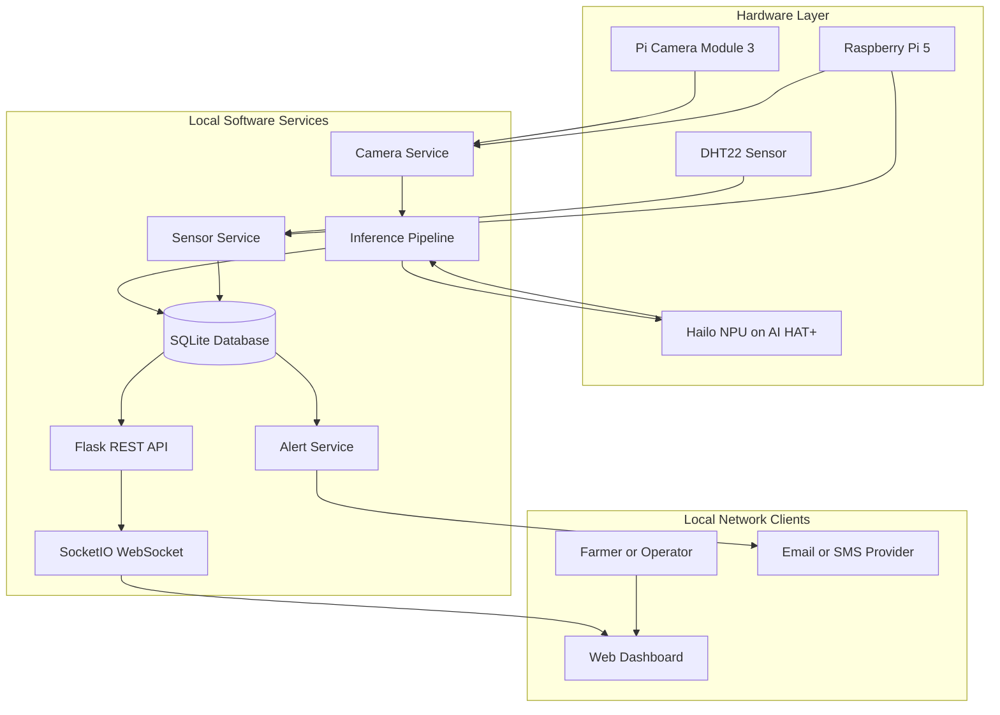
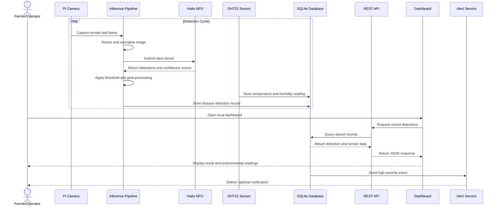
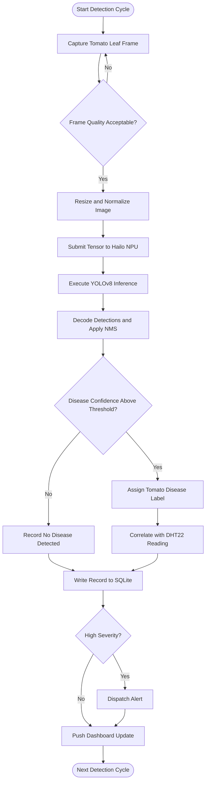
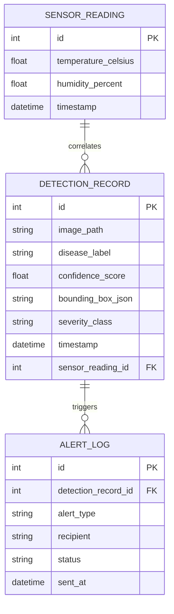

# CHAPTER THREE

# RESEARCH METHODOLOGY

## 3.1 Methodology Adopted

This study adopts an applied research and iterative Agile system-development methodology to design, implement, test, and evaluate a tomato disease detection system. The project combines a Raspberry Pi 5, Raspberry Pi AI HAT+, Pi Camera Module 3, DHT22 temperature and humidity sensor, a deep-learning detection model, a local database, a REST API, and a browser-based dashboard. These components are developed and integrated incrementally so that hardware, model, software, and user-interface problems can be identified and corrected during development.

The methodology is also informed by research showing that practical agricultural machine-learning systems must balance recognition accuracy, computational cost, data quality, interpretability, and deployment conditions. Studies on tomato disease classification, lightweight neural networks, smart farming, and image preprocessing therefore guide the design and evaluation of the proposed system (Brahimi et al., 2017; Howard et al., 2017; Liakos et al., 2018; Pivoto et al., 2018; Saleem et al., 2019).

### 3.1.1 Agile Software Development Methodology

Agile Software Development is adopted as the development methodology for this project. Agile organises development into short, repeatable cycles in which requirements are reviewed, a working increment is implemented, the increment is tested, and feedback is used to guide the next cycle. This approach is appropriate because the final behaviour of an embedded artificial-intelligence system cannot be determined entirely before the camera, sensor, NPU, model, database, and dashboard have been tested together.

Agile is appropriate for the tomato disease detection system for the following reasons:

- The Raspberry Pi, AI HAT+, camera, and DHT22 sensor require physical integration and testing.
- The model pipeline may require repeated changes to image preparation, class labels, confidence thresholds, and post-processing.
- Hailo compilation and NPU execution must be verified on the target hardware rather than assumed to behave like desktop inference.
- The API, database, dashboard, and alert services depend on the outputs of the inference and sensor services.
- Short development cycles make it possible to identify performance bottlenecks before the complete system is assembled.
- Agricultural machine-learning research shows that controlled-dataset performance must be interpreted together with deployment limitations and real-world variation (Brahimi et al., 2017; Raza et al., 2015; Saleem et al., 2019).

### 3.1.2 Agile Lifecycle Applied to the Project

The Agile lifecycle used in this study is an adaptation of iterative development to a tomato disease detection prototype. Each phase produces an output that is reviewed before the next phase is expanded. The lifecycle is illustrated below.

**Figure 3.1: Agile Methodology Lifecycle Applied to the Tomato Disease Detection Project.**  
**Source:** Researcher-provided diagram. The original publication source was not supplied; it should be identified and cited before final academic submission if the diagram was obtained externally.

The lifecycle is implemented through the following development increments:

| Sprint | Main Activities | Expected Output |
|---|---|---|
| Sprint 1 | Raspberry Pi operating-system setup, camera installation, DHT22 wiring, and AI HAT+ configuration | Configured hardware platform |
| Sprint 2 | Tomato dataset preparation, image preprocessing, annotation review, and YOLOv8 training | Initial tomato disease detection model |
| Sprint 3 | ONNX export, Hailo Dataflow Compiler processing, HEF generation, and NPU inference testing | Hailo-deployed inference model |
| Sprint 4 | Sensor service, SQLite schema, repository layer, detection storage, and sensor correlation | Persistent monitoring service |
| Sprint 5 | Flask API, SocketIO dashboard, reporting, alert notification, and end-to-end integration | Complete working prototype |

The sprint plan shows how the project progresses from basic hardware preparation to a complete integrated prototype. Each sprint produces a tangible output that becomes an input to the next sprint. For example, the trained tomato disease model produced during Sprint 2 is required before NPU deployment can be completed in Sprint 3, while the database and sensor services developed in Sprint 4 are required before the dashboard and alert functions can be evaluated in Sprint 5.

### 3.1.3 Comparison with Other Methodologies

The selected methodology was compared with Waterfall, Structured Systems Analysis and Design Methodology (SSADM), Object-Oriented Analysis and Design Methodology (OOADM), and Prototyping.

| Methodology | Limitation for This Project | Reason Agile Is Preferred |
|---|---|---|
| Waterfall | Changes to hardware, dataset classes, or model requirements are difficult to introduce after a phase has been completed. | Agile permits requirements and implementation decisions to be refined between cycles. |
| SSADM | Provides detailed structured analysis but can introduce documentation overhead for a small embedded AI prototype. | Agile gives greater emphasis to working hardware and software increments. |
| OOADM | Supports software object modelling but does not by itself address model training, hardware calibration, or experimental evaluation. | Agile covers the interaction between software, hardware, machine learning, and testing. |
| Prototyping | Helps validate an early interface or concept but does not provide a complete lifecycle for model deployment and system validation. | Agile supports repeated prototyping, integration, testing, and review. |
| Agile | Requires disciplined sprint planning, testing, and documentation. | It is selected because it accommodates uncertainty and continuous integration across the project components. |

The comparison indicates that the selected methodology is better suited to this study because the project contains both experimental and implementation activities. Hardware behaviour, model accuracy, inference speed, and service integration cannot be confirmed through documentation alone; they must be tested and refined through successive working increments.

The comparison also reflects the reviewed research. Classical image-processing methods use segmentation and engineered features, while deep-learning methods learn representations directly from images. Both approaches are useful for comparison, but a lightweight deep-learning workflow is more suitable for the planned edge deployment (Al-Hiary et al., 2011; Bhange and Hingoliwala, 2011; Brahimi et al., 2017; Howard et al., 2017).

### 3.1.4 Tools and Materials

The materials are divided into hardware and software components. They were selected to support tomato leaf image acquisition, environmental monitoring, local inference, data persistence, and local-network reporting.

#### Hardware Components

| Component | Specification | Role in System |
|---|---|---|
| Raspberry Pi 5 | Quad-core ARM Cortex-A76 processor, 8 GB RAM | Host computer for the system services |
| Raspberry Pi AI HAT+ | Hailo NPU model confirmed from the installed hardware | Hardware-accelerated neural-network inference |
| Pi Camera Module 3 | 12 MP autofocus camera; Wide version used if the 120° field of view is required | Tomato leaf image capture |
| DHT22 Sensor | Temperature and relative-humidity sensor | Environmental monitoring |
| Solderless Breadboard | Half-size prototyping board | Sensor circuit assembly |
| Jumper Wires | GPIO connection wires | Electrical connections between the Raspberry Pi and DHT22 |
| MicroSD Card | Class 10 or better | Operating system and local data storage |
| USB-C Power Supply | Raspberry Pi-compatible supply | Stable power delivery |
| Monitor and Keyboard | Initial configuration equipment | System setup and troubleshooting |
| Training Workstation | CUDA-capable computer used for model training and compilation | Model preparation and deployment tooling |

**Table 3.1: Hardware Components and Their Roles.**

The hardware table identifies the physical resources required to construct and operate the prototype. The Raspberry Pi 5 provides the main computing environment, while the camera and DHT22 sensor provide the visual and environmental inputs. The AI HAT+ is included to accelerate model inference, and the remaining components support power delivery, wiring, local storage, setup, and model preparation.

#### Software Components

| Software | Role in System |
|---|---|
| Raspberry Pi OS | Operating system for the Raspberry Pi 5 |
| Python | Primary programming language |
| Picamera2 | Camera interfacing |
| Adafruit CircuitPython DHT | DHT22 sensor interfacing |
| HailoRT SDK | Runtime execution of the compiled model |
| Hailo Dataflow Compiler | Conversion of the trained model to Hailo Executable Format |
| Ultralytics YOLOv8 | Object-detection model framework |
| Flask | REST API and server-side application framework |
| Flask-SocketIO | Real-time dashboard updates |
| SQLAlchemy and SQLite | Local data persistence |
| OpenCV and NumPy | Image processing and numerical operations |
| Pytest | Unit and integration testing |
| Git and GitHub | Version control and source management |

**Table 3.2: Software Components and Their Roles.**

The software components form the processing and service layer of the system. The camera and sensor libraries collect the input data, the machine-learning and Hailo tools prepare and execute the detection model, and the Flask, SocketIO, SQLAlchemy, and SQLite components provide local access, persistence, and live reporting. Testing and version-control tools support verification and reproducibility throughout the development process.

## 3.2 System Models

The system models describe the structure, interactions, processing activities, and data relationships of the tomato disease detection system. The models are based on the project requirements and are informed by smart-farming and agricultural machine-learning research (Liakos et al., 2018; Pivoto et al., 2018; Saleem et al., 2019).

### 3.2.1 Architectural Model

The system follows an edge-first architecture. The camera and DHT22 sensor collect data, the Raspberry Pi coordinates the services, the Hailo NPU accelerates model inference, and the database, API, dashboard, and alert services operate locally. Internet access is required only for optional external alert delivery.

**Figure 3.2: Architectural Model of the Tomato Disease Detection System.**  
**Source:** Researcher’s design, informed by smart-farming system architecture research (Liakos et al., 2018; Pivoto et al., 2018). Rendered using Mermaid.

The architectural model separates the system into hardware, local services, and client layers. Data enters through the camera and DHT22 sensor, is processed by the Raspberry Pi and Hailo NPU, and is then persisted in the SQLite database. The API and WebSocket service make the stored and live results available to the dashboard, while the alert service handles optional external notifications. This arrangement keeps the core tomato disease detection workflow operational on the local device even when external connectivity is unavailable.

### 3.2.2 Use Case Diagram

The use case diagram presents the functional relationship between the Farmer/Operator, the System Administrator, and the tomato disease detection system.

[Open the editable draw.io use case diagram](diagrams/CHAPTER-THREE-USE-CASE-DIAGRAM.drawio)

**Figure 3.3: Use Case Diagram of the Tomato Disease Detection System.**  
**Source:** Researcher’s design, informed by the system requirements and agricultural monitoring literature. Created using draw.io.

The use case model demonstrates that the Farmer/Operator primarily interacts with the system to monitor tomato disease detections, review historical evidence, inspect environmental readings, export reports, and receive alerts. The System Administrator performs configuration and maintenance activities, including setting alert thresholds, managing data retention, and monitoring system services. The distinction between these actors clarifies the access responsibilities that must be supported by the implemented dashboard and service interfaces.

The principal use cases are:

- View live tomato disease detections.
- View detection history and annotated images.
- View temperature and humidity readings.
- Export detection records as CSV or JSON.
- Receive high-severity disease alerts.
- Configure alert thresholds and data retention.
- Monitor and restart system services.

### 3.2.3 Sequence Diagram

The sequence diagram shows the interaction between the principal components during a tomato detection cycle.

**Figure 3.4: Sequence Diagram for Tomato Disease Detection and Reporting.**  
**Source:** Researcher’s design, informed by the data-flow requirements of smart-farming monitoring systems (Liakos et al., 2018; Pivoto et al., 2018). Rendered using Mermaid.

The sequence model shows that image acquisition and sensor measurement occur during the detection cycle, while dashboard access may occur at any time through the local API. The inference pipeline sends the captured image to the NPU, receives the disease prediction, and stores the result together with the nearest environmental reading. A high-severity detection is subsequently passed to the alert service, while the dashboard receives the stored or live result for monitoring.

### 3.2.4 Activity Diagram

The activity model represents the processing sequence from image capture to persistence and notification.

**Figure 3.5: Activity Diagram for the Tomato Disease Inference Pipeline.**  
**Source:** Researcher’s design, informed by image-processing and deep-learning detection workflows (Al-Hiary et al., 2011; Brahimi et al., 2017; Saleem et al., 2019). Rendered using Mermaid.

The activity model explains the control flow used for each tomato leaf frame. It includes a quality decision before inference, image preparation, NPU execution, confidence filtering, disease-label assignment, environmental correlation, database persistence, and severity-based alerting. The loop back to the next detection cycle represents continuous monitoring rather than a single manual diagnosis.

### 3.2.5 Entity-Relationship Diagram

The database model stores tomato disease detections, environmental readings, and alert events. A detection record is linked to the closest available sensor reading, while an alert log records notifications generated from high-severity detections.

**Figure 3.6: Entity-Relationship Diagram for Local Tomato Disease Records.**  
**Source:** Researcher’s database design, informed by the need for persistent and traceable agricultural monitoring data (Liakos et al., 2018; Pivoto et al., 2018). Rendered using Mermaid.

The entity-relationship model provides traceability between a tomato disease detection and the environmental conditions recorded at approximately the same time. The alert log preserves evidence of notification events, including the recipient, delivery status, and time sent. These relationships allow the system to support historical analysis, reporting, and later review of incorrect or uncertain detections.

## 3.3 System Evaluation Procedure

The system will be evaluated as an integrated tomato disease detection prototype using a controlled engineering evaluation. The evaluation will examine the quality and preparation of the tomato image dataset, the accuracy of the trained model, the effect of model conversion for edge inference, the reliability of the DHT22 sensor, the operation of the local database and API, the dashboard response, and the delivery of alerts. The procedure separates the conditions and measurements that will be used from the numerical results that will be reported after testing.

The evaluation is designed to answer four practical questions. First, can the model distinguish the selected tomato disease classes? Second, can the compiled model operate with acceptable speed on the Raspberry Pi AI HAT+? Third, can the camera, sensor, database, API, dashboard, and alert services operate together without losing or corrupting records? Finally, can the resulting system provide useful evidence for reviewing tomato disease events? This multi-dimensional approach is consistent with research showing that agricultural machine-learning systems must be assessed using accuracy, computational efficiency, interpretability, and deployment conditions rather than accuracy alone (Liakos et al., 2018; Saleem et al., 2019; Toda and Okura, 2019).

### 3.3.1 Dataset and Data Preparation

The dataset will contain tomato leaf images belonging to the five disease classes defined for the project: Bacterial Spot, Early Blight, Late Blight, Leaf Mould, and Septoria Leaf Spot. A no-disease status will be recorded when no detection exceeds the selected confidence threshold. It will only be treated as a separate model class if the final dataset configuration includes labelled healthy images for training.

The repository identifies the PlantVillage tomato subset as the primary image source. The preparation process will use an 80/10/10 split for training, validation, and testing. The final number of images retained in each class and each split will be recorded from the dataset-preparation output and reported with the experimental results. No image from the held-out test set will be used for training, augmentation fitting, threshold selection, or model checkpoint selection.

The preparation procedure will include:

1. Collecting and verifying the tomato images and disease labels.
2. Removing corrupt, duplicated, or incorrectly labelled images.
3. Recording the number of images available in each disease class before and after cleaning.
4. Reviewing class balance and identifying classes that may require controlled augmentation.
5. Converting annotations to the format required by the selected object-detection model.
6. Dividing images into training, validation, and test subsets using a fixed random seed.
7. Ensuring that related images from the same plant or capture sequence do not appear in more than one subset where such grouping information is available.
8. Resizing input images to 640 × 640 pixels for model processing.
9. Applying training-only augmentation involving suitable changes in scale, position, orientation, and illumination.
10. Reserving the test subset for the final evaluation only.

Table 3.3 summarises the dataset and model-input configuration that will be recorded during preparation.

| Configuration Item | Project Setting or Required Record |
|---|---|
| Crop scope | Tomato only |
| Target disease classes | Bacterial Spot, Early Blight, Late Blight, Leaf Mould, and Septoria Leaf Spot |
| Primary dataset source | PlantVillage tomato subset |
| Dataset split | 80% training, 10% validation, 10% testing |
| Input size | 640 × 640 pixels |
| Preprocessing | Resize, RGB conversion, normalization, and model-compatible tensor conversion |
| Augmentation | Training-only geometric and illumination variation |
| Class record | Number of images per class before cleaning and after splitting |
| Reproducibility record | Random seed, class order, annotation version, and preparation date |

**Table 3.3: Tomato Dataset and Input Configuration.**

The table defines the information required to reproduce the dataset preparation stage. The class list fixes the scope of the experiment to tomato disease detection, while the split and test-set restrictions protect the evaluation from data leakage. Recording the class counts and preparation settings is particularly important because tomato disease studies have shown that dataset size, class separation, image variation, and symptom visualisation influence reported performance (Brahimi et al., 2017; Saleem et al., 2019; Toda and Okura, 2019). Research using thermal, stereo, and hyperspectral imagery further shows that ordinary visible images may be affected by lighting, canopy structure, and symptom similarity (Raza et al., 2015; Xie et al., 2015).

### 3.3.2 Model Training and Validation

The project uses a YOLOv8n model because the system requires a model that can be trained on a separate workstation and then deployed to a resource-constrained edge device. The training workflow will use the best validation checkpoint rather than the final epoch automatically. This prevents a model that has overfitted the training data from being selected solely because it completed the training schedule.

The documented training configuration is 100 epochs with a batch size of 32. The model will use a 640 × 640 input size, and the inference pipeline will accept a prediction when the confidence score is at least 0.70. Non-Maximum Suppression will use an IoU threshold of 0.45 to remove overlapping detections. Any change to these values during experimentation will be recorded in the experiment log and reported with the results.

| Training or Deployment Item | Configuration or Evidence Required |
|---|---|
| Model architecture | YOLOv8n object-detection model |
| Training epochs | 100 epochs, unless an early-stopping decision is documented |
| Batch size | 32, subject to available training memory |
| Input resolution | 640 × 640 pixels |
| Model-selection rule | Best validation checkpoint |
| Confidence threshold | 0.70 for accepting a detection |
| NMS IoU threshold | 0.45 |
| Desktop evaluation | Test the selected model on the held-out test subset |
| Export path | PyTorch model to ONNX, then to Hailo Executable Format |
| Edge validation | Compare desktop and Raspberry Pi AI HAT+ outputs on the same test inputs |
| Deployment record | Model version, class order, weights, compiler settings, and calibration information |

**Table 3.4: Model Training and Deployment Configuration.**

The training table distinguishes fixed project settings from evidence that must be recorded during implementation. The desktop evaluation establishes the baseline model behaviour, while the edge validation determines whether export, quantisation, compilation, and NPU execution have changed the model output. The use of a compact architecture for a constrained device is supported by research on efficient convolutional neural networks (Howard et al., 2017), while tomato disease studies support automatic feature learning and symptom localisation through deep-learning models (Brahimi et al., 2017; Toda and Okura, 2019).

The model-development procedure will be implemented as follows:

1. Prepare the tomato dataset according to Section 3.3.1.
2. Initialise YOLOv8n using the selected pretrained weights.
3. Train the model for the documented training schedule.
4. Monitor training loss, validation loss, precision, recall, and mAP during training.
5. Select and preserve the best validation checkpoint.
6. Evaluate the selected checkpoint on the held-out test subset.
7. Export the selected model to ONNX format.
8. Compile the ONNX model into Hailo Executable Format using the Hailo Dataflow Compiler.
9. Load the HEF model through HailoRT on the Raspberry Pi AI HAT+.
10. Run the same test inputs through the desktop and edge versions of the model.
11. Record any class-label, confidence, bounding-box, or quantisation differences.

### 3.3.3 Hardware and Software Testing

Testing will be performed at four levels. Hardware-dependent functions will be tested on the target Raspberry Pi where possible, while unit tests for camera, GPIO, and NPU-dependent code may use controlled mocks so that software logic can be checked independently of physical hardware. The repository defines Pytest as the testing framework and separates unit tests from integration tests.

| Test Level | Main Test Activities | Evidence to Record |
|---|---|---|
| Unit testing | Test camera capture, preprocessing, post-processing, DHT22 reading, database operations, API functions, and alert logic independently. | Test-case result, failure message, and corrected implementation where required |
| Integration testing | Verify that camera frames, inference results, sensor readings, database records, API responses, and dashboard updates are connected correctly. | Input record, output record, timestamp relationship, and pass/fail result |
| System testing | Run complete tomato leaf detection cycles on the Raspberry Pi 5 and AI HAT+. | Test image, predicted label, confidence, annotated output, database record, and dashboard result |
| Performance testing | Measure inference latency, end-to-end latency, throughput, resource usage, and service response time. | Mean, median, maximum, and percentile measurements where available |
| Reliability testing | Run the sensor and core services continuously and record read failures, service interruptions, database errors, and recovery behaviour. | Duration, number of cycles, failures, recoveries, and final system state |

**Table 3.5: Hardware and Software Testing Matrix.**

The testing matrix establishes a progression from isolated component verification to complete prototype evaluation. Unit testing identifies defects within individual services, integration testing verifies communication between services, and system testing confirms that the complete tomato detection workflow operates on the target hardware. Performance and reliability testing then determine whether the system can continue operating under sustained use and whether failures are detected and recorded rather than silently lost.

The physical evaluation will use available tomato leaf specimens and printed tomato leaf images under controlled indoor conditions. Each test record will include the input image or image identifier, expected label, predicted label, confidence score, bounding-box output where applicable, timestamp, sensor values, processing time, database status, dashboard status, and alert status. For repeatability, the camera position, approximate lighting condition, test-image distance, model version, confidence threshold, and software version will be recorded for each test session.

The sensor reliability run will cover a continuous controlled monitoring period, with the start time, end time, number of scheduled readings, successful readings, failed readings, and reference-instrument readings recorded. The inference benchmark will include a warm-up period before measurements are collected so that startup effects do not distort the reported latency. At least 30 measured inference cycles will be recorded for each benchmark configuration, together with the mean, median, maximum, and 95th-percentile latency where the measurement tooling supports it.

The evaluation will also record limitations caused by controlled datasets, lighting variation, leaf position, background complexity, symptom overlap, and the difference between RGB imaging and more expensive thermal or hyperspectral approaches (Raza et al., 2015; Xie et al., 2015). These conditions will be discussed as limitations of generalisation rather than treated as evidence that the model performs equally well in every agricultural environment.

### 3.3.4 Performance Metrics

The following measures will be used to evaluate both the model and the complete system:

| Evaluation Area | Metrics or Evidence | Measurement Approach |
|---|---|---|
| Detection performance | Precision, recall, F1-score, mAP@0.5, and per-class results | Calculate from predictions on the held-out test subset |
| Error analysis | Confusion matrix and examples of false positives and false negatives | Compare predicted labels with the verified test labels |
| Inference performance | Inference latency, end-to-end latency, and frames per second | Measure model execution and the complete capture-to-storage cycle separately |
| Resource usage | CPU utilisation, RAM usage, device temperature, and NPU execution behaviour | Record during inference and sustained-operation tests |
| Sensor reliability | Successful-read rate, temperature error, humidity error, and missing readings | Compare DHT22 readings with the scheduled sample count and reference instruments |
| Persistence | Database-write success rate, timestamp correctness, and sensor-detection correlation | Compare generated events with stored records and linked sensor readings |
| API and dashboard | Endpoint response time, dashboard update delay, and service availability | Repeat local requests and compare returned values with database records |
| Alerting | Alert-trigger correctness and notification delivery time | Compare high-severity records with generated notification logs |
| Reporting | Accuracy and completeness of CSV and JSON exports | Compare exported records with the database query used to generate them |

**Table 3.6: Evaluation Metrics and Evidence.**

The metrics table combines model-quality measures with operational system measures. Precision measures the proportion of accepted detections that are correct, recall measures the proportion of relevant disease instances that are detected, and the F1-score combines these two measures. The mAP@0.5 value summarises detection performance across the tomato disease classes at an IoU threshold of 0.5. Latency, resource, sensor, persistence, API, dashboard, alert, and reporting measures determine whether the model is useful as part of a complete edge system rather than only as a standalone experiment.

For operational measurements, inference latency will be calculated from the point at which an input tensor is submitted until the model output is available. End-to-end latency will include image capture, preprocessing, NPU inference, post-processing, sensor correlation, and database writing. Throughput will be reported as processed frames divided by the measurement duration. Sensor success rate will be calculated as successful readings divided by scheduled readings, multiplied by 100. Temperature and humidity errors will be reported against the selected reference instruments.

The study will use the following acceptance thresholds as engineering targets. These are evaluation criteria, not claims of achieved performance; the measured results will be reported separately after testing.

| Acceptance Area | Target |
|---|---|
| Tomato disease detection | mAP@0.5 of at least 85% on the held-out test subset |
| Edge inference throughput | At least 10 processed frames per second under the defined benchmark conditions |
| End-to-end detection cycle | No more than 500 milliseconds from capture to database write under the defined benchmark conditions |
| Sensor reliability | At least 95% successful DHT22 readings during the controlled monitoring run |
| System resource usage | Peak CPU utilisation below 70% and peak RAM usage below 4 GB during sustained operation |
| API response time | Standard local queries completed within 200 milliseconds under the defined request test |
| Alert delivery | High-severity notification delivered within 60 seconds when network access is available |
| Data export | CSV and JSON exports contain the complete records returned by the corresponding database query |

**Table 3.7: Engineering Acceptance Thresholds.**

The acceptance-threshold table provides a transparent basis for deciding whether the prototype meets its stated engineering objectives. The thresholds cover accuracy, speed, resource consumption, sensor operation, service responsiveness, notification behaviour, and data integrity. If a target is not achieved, the result will be reported with the measured value, test conditions, likely cause, and proposed improvement rather than being omitted.

### 3.3.5 Confusion Matrix Diagram

A confusion matrix will be used to examine how the model distinguishes between the selected tomato disease classes. Each row represents the actual disease class in the test set, while each column represents the class predicted by the model. Values along the main diagonal represent correct predictions, whereas values outside the diagonal represent confusion between disease classes. The editable draw.io version of the matrix is provided below.

[Open the editable draw.io confusion matrix](diagrams/CHAPTER-THREE-CONFUSION-MATRIX.drawio)

**Figure 3.7: Confusion Matrix Layout for the Tomato Disease Detection Model.**  
**Source:** Researcher’s evaluation design. Created using draw.io.

The diagonal positions in the completed matrix will be used to identify correctly classified tomato disease images. Off-diagonal positions will show the disease pairs that the model confuses most often, such as visually similar leaf symptoms. These counts will be used together with precision, recall, F1-score, and mAP@0.5 to explain not only how accurate the model is, but also the types of errors it produces. The final matrix will be reported with numerical values in the experimental findings chapter rather than being presented as a completed result in this methodology chapter.

## 3.4 Chapter Summary

This chapter presented the methodology for designing and evaluating the tomato disease detection system. Agile was selected to support incremental integration of the hardware, model, sensor, database, API, dashboard, and alert services. The system models described the architecture, use cases, processing sequence, activity flow, and database relationships. The evaluation procedure defined how tomato images will be prepared, how the model will be trained and deployed, how the integrated prototype will be tested, and how detection, performance, sensor, and service metrics will be measured.

## References

Al-Hiary, H., Bani-Ahmad, S., Reyalat, M., Braik, M., and ALRahamneh, Z. (2011). “Fast and Accurate Detection and Classification of Plant Diseases.” *International Journal of Computer Applications*, 17(1), 31-38.

Bhange, M. and Hingoliwala, H. A. (2011). “Detection and Classification of Leaf Diseases Using K-means Based Segmentation and Neural Networks Based Classification.” *International Journal of Computer Applications*, 17(1), 31-38.

Brahimi, M., Boukhalfa, K., and Moussaoui, A. (2017). “Deep Learning for Tomato Diseases: Classification and Symptoms Visualization.” *Applied Artificial Intelligence*, 31(4), 299-315.

Howard, A. G., Zhu, M., Chen, B., Kalenichenko, D., Wang, W., Weyand, T., Andreetto, M., and Adam, H. (2017). “MobileNets: Efficient Convolutional Neural Networks for Mobile Vision Applications.” *arXiv preprint arXiv:1704.04861*.

Liakos, K. G., Busato, P., Moshou, D., Pearson, S., and Bochtis, D. (2018). “Machine Learning in Agriculture: A Review.” *Sensors*, 18(8), 2674.

Pivoto, D., Waquil, P. D., Talamini, E., Finocchio, C. P. S., Dalla Corte, V. F., and Mores, G. V. (2018). “Scientific Development of Smart Farming Technologies and Their Application in Brazil.” *Information Processing in Agriculture*, 5(1), 21-32.

Raza, S. A., Prince, G., Clarkson, J. P., and Meier, U. (2015). “Automatic Detection of Diseased Tomato Plants Using Thermal and Stereo Visible Light Images.” *PLOS ONE*, 10(4), e0123262.

Saleem, M. H., Potgieter, J., and Arif, K. M. (2019). “Plant Disease Detection and Classification by Deep Learning.” *Plants*, 8(11), 468.

Toda, Y. and Okura, F. (2019). “How Convolutional Neural Networks Diagnose Plant Disease.” *Plant Phenomics*, 2019, Article 9237136.

Xie, C., Shao, Y., Li, X., and He, Y. (2015). “Detection of Early Blight and Late Blight Diseases on Tomato Leaves Using Hyperspectral Imaging.” *Scientific Reports*, 5, Article 16564.
