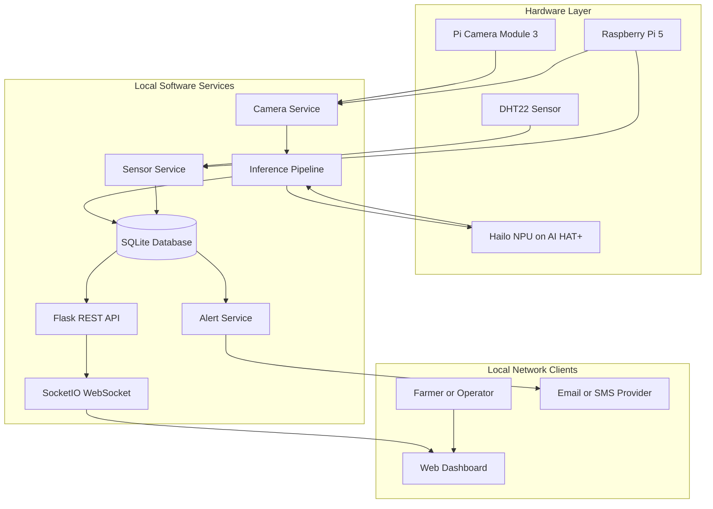
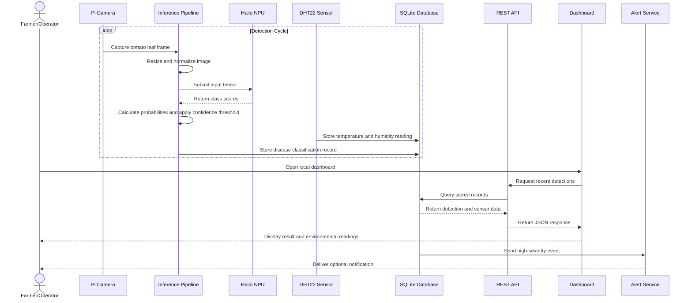
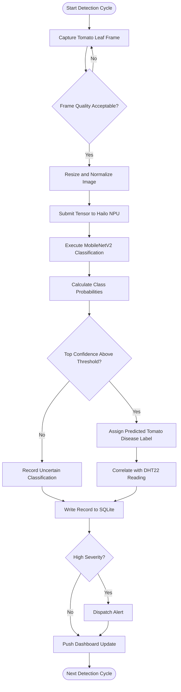
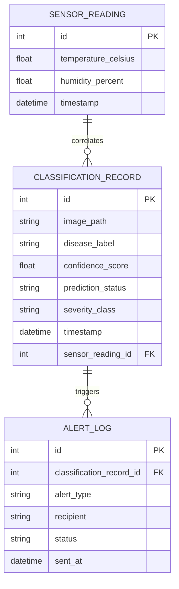

# CHAPTER ONE

# INTRODUCTION

## 1.1 Background to the Study

Agriculture remains one of the most fundamental pillars of human civilisation, serving as the primary source of food, raw materials, and economic livelihood for billions of people worldwide. In Nigeria and across sub-Saharan Africa, agriculture accounts for a substantial proportion of gross domestic product (GDP) and provides the main source of income for the majority of the rural population. According to the Food and Agriculture Organisation of the United Nations, approximately 600 million smallholder farming households worldwide depend on agriculture for their survival, and this sector feeds over 70% of the global population (FAO, 2022). Despite its central importance, agricultural productivity continues to be severely threatened by a wide range of biotic stressors, chief among them being plant diseases caused by fungal, bacterial, viral, and oomycete pathogens.

Plant diseases are responsible for pre-harvest losses estimated to affect between 20% and 40% of global agricultural production annually, translating to economic losses in excess of $220 billion per year (Savary et al., 2019). In developing nations, where smallholder farmers lack access to diagnostic laboratories, agricultural extension officers, or reliable internet connectivity, these losses are disproportionately severe. Tomato production is particularly vulnerable because diseases such as Bacterial Spot, Early Blight, Late Blight, Leaf Mould, and Septoria Leaf Spot can reduce leaf health, fruit quality, and final yield when they are not recognised and managed promptly. Late Blight, caused by *Phytophthora infestans*, remains one of the most destructive tomato diseases and continues to cause substantial agricultural losses (Fry, 2008).

Traditional methods of crop disease diagnosis rely heavily on human expert observation — agronomists or experienced farmers visually inspecting plants and making judgements based on symptom patterns. This approach suffers from several fundamental limitations. It is inherently subjective, dependent on the knowledge and experience of the individual. It is not scalable across large farm areas. It is slow, as symptoms must reach a visible threshold before detection is possible. And it is unavailable to the majority of smallholder farmers who lack proximity to agricultural specialists. Laboratory-based diagnostic methods such as polymerase chain reaction (PCR) and ELISA testing provide greater accuracy but require expensive equipment, trained laboratory personnel, and days or weeks of turnaround time — entirely incompatible with the time-sensitive nature of farm management decisions.

The convergence of the Internet of Things (IoT), computer vision, and artificial intelligence (AI) over the past decade has opened a new paradigm for precision agriculture. IoT systems integrate physical sensing hardware with software services to collect, transmit, and analyse real-world data in near real time. In the agricultural domain, IoT applications have been explored for soil moisture monitoring, irrigation automation, pest detection, weather station networks, and livestock health monitoring (Elijah et al., 2018). The integration of camera-based computer vision into these systems creates the possibility of automated, continuous, and non-destructive monitoring of crop health from the leaf level.

Deep learning, a subfield of machine learning characterised by the use of multi-layered artificial neural networks, has demonstrated remarkable success in image classification tasks. Convolutional Neural Networks (CNNs) in particular have been shown to achieve accuracy levels comparable to or exceeding that of human experts in plant disease identification tasks. The landmark work of Mohanty, Hughes, and Salathé, using the PlantVillage dataset of over 54,000 labelled leaf images, demonstrated that a deep learning model could classify 26 diseases across 14 crop species with accuracy approaching 99.35% under controlled conditions (Mohanty et al., 2016). Lightweight architectures such as MobileNetV2 reduce computational cost through efficient convolutional operations and are therefore suitable candidates for tomato disease classification on constrained edge hardware (Howard et al., 2017).

However, a major barrier to the practical deployment of these systems in real agricultural settings has been the computational cost of running deep neural network inference. Models capable of high accuracy may require cloud servers or GPU acceleration, thereby introducing latency, cost, and internet dependency. The emergence of dedicated Neural Processing Units (NPUs) makes it possible to execute compact classification models locally. The Raspberry Pi AI HAT+ integrates a Hailo accelerator with the Raspberry Pi 5 through PCIe. The available AI HAT+ variants use either the 13-TOPS Hailo-8L or the 26-TOPS Hailo-8; the exact installed variant will be recorded before model compilation and hardware benchmarking. This platform provides a practical path for running a lightweight tomato disease classifier without continuous cloud access.

This project, therefore, seeks to design and implement a fully integrated IoT system for the automated classification of selected tomato diseases. The system combines the Raspberry Pi 5 single-board computer as its central processing unit with the Raspberry Pi AI HAT+ for hardware-accelerated inference, the Pi Camera Module 3 for tomato leaf image capture, and a DHT22 environmental sensor for the concurrent collection of temperature and relative humidity data. These two data streams, visual and environmental, are correlated and persisted in a local database, made accessible through a REST API, and presented to users through a browser-based monitoring dashboard. Automated alerts are dispatched when high-severity tomato disease events are classified with sufficient confidence. The core system is designed to operate independently of internet connectivity, making it suitable for deployment in rural and off-grid agricultural environments.

---

## 1.2 Statement of Problem

Despite the well-documented economic and humanitarian cost of crop diseases, the vast majority of smallholder farmers — particularly in sub-Saharan Africa and other developing regions — continue to rely on manual, unaided visual inspection as their primary means of plant health monitoring. This practice is not only inadequate but creates a cascade of problems that collectively undermine agricultural productivity and food security.

The specific problems motivating this research are identified as follows:

**1. Late and inaccurate disease diagnosis:** Manual visual inspection of crops requires diseases to reach an advanced, visually obvious stage before a farmer or agronomist can identify them. By this point, the pathogen population within the plant has often already proliferated to a level that makes treatment ineffective and cross-contamination of neighbouring plants probable. Studies have shown that detection delays of as few as five to seven days in diseases like tomato Late Blight can result in the loss of an entire growing season (Fry, 2008).

**2. Absence of objective and consistent diagnosis:** Human diagnosis of plant disease symptoms is inherently subjective and varies significantly based on the expertise, experience, and even fatigue of the observer. Symptoms of different diseases can share visual similarities — for example, Early Blight and Septoria Leaf Spot on tomato both present as dark lesions on leaves — leading to misdiagnosis and inappropriate treatment with incorrect pesticides, which wastes resources and may accelerate the development of pathogen resistance.

**3. Inaccessibility of expert knowledge at point of need:** Qualified plant pathologists, agricultural extension officers, and diagnostic laboratory services are concentrated in urban centres and are largely inaccessible to smallholder farmers at the farm level, particularly in rural areas of Nigeria and across Africa. This geographic and economic barrier means that most farmers are forced to make pest management decisions without adequate information.

**4. Lack of integration with environmental context:** Crop diseases do not develop in isolation from their environment. The spread and severity of many diseases are strongly influenced by environmental conditions, particularly temperature and relative humidity. For instance, Late Blight in tomatoes proliferates most rapidly when relative humidity exceeds 90% and temperatures are between 10°C and 20°C (Fry, 2008). Existing manual inspection approaches do not correlate disease observations with environmental readings, eliminating a critical dimension of diagnostic and predictive information.

**5. Absence of historical disease data:** Without an automated logging and data persistence system, farmers have no mechanism to build a historical record of disease occurrence, progression, or response to treatment on their specific land parcels. This absence of data prevents evidence-based decision making and makes it impossible to identify seasonal patterns, recurring hotspots, or the longitudinal effectiveness of interventions.

**6. High cost and cloud-dependency of existing smart agriculture solutions:** Commercial precision agriculture platforms that incorporate AI-based disease detection typically require expensive subscription services, reliable broadband connectivity, and specialised hardware out of reach for smallholder farmers. Solutions that depend on cloud inference introduce unacceptable latency, ongoing operating costs, and complete failure modes when connectivity is unavailable (Elijah et al., 2018).

This study is designed to directly address these six identified problems through the design and implementation of an affordable, offline-capable IoT system that provides timely, AI-powered classification of selected tomato diseases at the point of need.

---

## 1.3 Objectives of the Study

The broad aim of this study is to design and implement an Internet of Things system that classifies selected tomato diseases using edge artificial intelligence inference on dedicated NPU hardware, coupled with continuous environmental monitoring and presented through a local-network web dashboard.

The specific objectives of the study are:

1. To design a hardware architecture integrating the Raspberry Pi 5, Raspberry Pi AI HAT+, Pi Camera Module 3, and DHT22 temperature and humidity sensor into a functional, stable, and low-cost tomato disease classification unit, directly addressing Problem 6 (cost and hardware accessibility).

2. To develop and train a tomato-only MobileNetV2 image-classification model using the PlantVillage tomato subset to distinguish Bacterial Spot, Early Blight, Late Blight, Leaf Mould, and Septoria Leaf Spot, with target classification accuracy and macro F1-score of at least 85% on the held-out test subset, directly addressing Problem 2 (absence of objective diagnosis) (Mohanty et al., 2016; Howard et al., 2017).

3. To export the trained classification model to ONNX, compile it to Hailo Executable Format (HEF) using the Hailo Dataflow Compiler for the installed AI HAT+ variant, and validate its inference throughput and latency on the target hardware, directly addressing Problem 1 (late diagnosis) by enabling timely local classification.

4. To implement a software inference pipeline that captures tomato leaf frames from the Pi Camera Module 3, resizes and normalises them, performs NPU-accelerated classification, and produces human-readable outputs containing the predicted disease label, confidence score, and prediction status, directly addressing Problem 2 (inconsistent diagnosis).

5. To implement a sensor service that concurrently reads temperature and relative humidity from the DHT22 sensor via the GPIO interface and correlates each environmental reading with the nearest contemporaneous tomato classification record, directly addressing Problem 4 (lack of environmental context).

6. To design and implement a relational database schema and a repository layer that persistently stores all classification records, sensor readings, and alert logs in a local SQLite database with configurable data retention, directly addressing Problem 5 (absence of historical disease data).

7. To develop a RESTful API server and a browser-based monitoring dashboard accessible over the local network, allowing farmers or operators to view live tomato disease predictions, browse classification history with labelled images, and export data as CSV or JSON reports, directly addressing Problem 3 (inaccessibility of expert knowledge).

8. To implement an automated alert notification system that dispatches email and, optionally, SMS notifications when a high-severity tomato disease is classified with sufficient confidence.

9. To validate the complete end-to-end system through structured unit and integration testing, and to evaluate the system's overall performance in terms of classification accuracy, macro F1-score, inference latency, system resource utilisation, and sensor measurement reliability.

---

## 1.4 Research Questions

This study is guided by the following research questions:

1. To what extent can a MobileNetV2 model, trained on the selected PlantVillage tomato disease classes and compiled for deployment on the Raspberry Pi AI HAT+, achieve classification accuracy and macro F1-score of at least 85% under the defined controlled test conditions?

2. What inference throughput and per-image latency are achieved when the compiled tomato disease classifier runs on the installed Raspberry Pi AI HAT+ variant, and does the performance meet the requirement of processing at least 10 frames per second under the defined benchmark conditions?

3. How effectively does the integration of DHT22 environmental readings with tomato disease classification events enrich the information available to the farmer, and what relationship is observed between environmental conditions and classification frequency during controlled prototype tests?

4. Can the system's web dashboard and REST API, deployed over a local network without internet connectivity, provide a usable and informative interface for monitoring tomato leaf classifications and reviewing historical records?

5. What are the principal sources of error, hardware limitations, and performance bottlenecks in the implemented system, and how do they compare with the known limitations of related work in the literature?

---

## 1.5 Scope of the Study

This study focuses on the design, implementation, testing, and evaluation of a standalone IoT system for tomato disease classification deployed on the Raspberry Pi 5 platform with AI HAT+ hardware acceleration. The scope is defined as follows:

**In scope:**

i. Hardware integration of the Raspberry Pi 5, Raspberry Pi AI HAT+, Pi Camera Module 3, and DHT22 sensor on a breadboard prototype circuit. The installed Hailo accelerator variant and rated TOPS will be recorded during hardware setup.

ii. Software development in Python 3.11 using the Picamera2 library for camera interfacing, Adafruit CircuitPython DHT for sensor interfacing, the HailoRT SDK for NPU inference, Flask and Flask-SocketIO for the API and dashboard, and SQLAlchemy with SQLite for the data persistence layer.

iii. Deep learning model training using the publicly available PlantVillage tomato subset, limited to Bacterial Spot, Early Blight, Late Blight, Leaf Mould, and Septoria Leaf Spot. The model performs one image-level classification for each accepted tomato leaf input.

iv. Model compilation to the Hailo Executable Format (HEF) using the Hailo Dataflow Compiler on a separate CUDA-capable training machine, with INT8 post-training quantisation applied.

v. End-to-end system testing on the Raspberry Pi 5 hardware platform under controlled laboratory conditions with physical tomato leaf specimens and printed tomato disease test images.

vi. Performance benchmarking covering inference latency, throughput, classification accuracy, macro and per-class precision, recall, F1-score, confusion-matrix analysis, and system resource utilisation (CPU, RAM, and device temperature).

**Out of scope:**

i. Deployment and field testing in active commercial farming environments. Due to time and resource constraints, field validation is beyond the scope of this study and is identified as future work.

ii. Multi-camera configurations, drone-mounted deployment, or satellite imagery analysis.

iii. Classification of crops other than tomato and classification of tomato conditions outside the five selected disease classes.

iv. Prediction of disease progression or spread over time. The system classifies the current image and does not perform disease forecasting.

v. Localisation of multiple diseased regions with bounding boxes or simultaneous classification of several leaves within one frame.

vi. Integration with external agrochemical recommendation databases or automated irrigation or pesticide dispensing actuators.

vii. Formal clinical or regulatory evaluation of the system's diagnostic outputs.

---

## 1.6 Limitations of the Study

The following limitations are acknowledged and are expected to have an effect on the generalisability and completeness of the study's findings:

i. **Dataset domain gap:** The PlantVillage dataset, while large and widely used, consists predominantly of images captured under controlled laboratory conditions with uniform white or grey backgrounds. Leaf images captured in real agricultural settings have significantly more visual complexity — variable lighting, overlapping leaves, soil and debris in the background, and variations in plant age and growth stage. The trained model may therefore exhibit reduced accuracy when deployed in natural field conditions, a phenomenon known as the domain gap problem (Mohanty et al., 2016). Addressing this would require additional data collection in Nigerian or African field settings, which is beyond the scope of this project.

ii. **DHT22 sensor sampling rate:** The DHT22 sensor has a hardware-imposed maximum sampling rate of 0.5 Hz, meaning it can provide at most one reading every two seconds. This limits the temporal resolution of environmental data and means that rapid microclimatic changes at the leaf surface may not be captured between sampling intervals.

iii. **Fixed single-camera field of view:** The Pi Camera Module 3 covers a fixed field of view determined by its 120° wide-angle lens. A single camera unit can only monitor a limited section of crop canopy at any one time. Comprehensive monitoring of a full-scale farming plot would require multiple units, which introduces cost and complexity not addressed in this study.

iv. **SQLite concurrency constraints:** SQLite, while appropriate for a single-node embedded system, has well-known limitations under concurrent write workloads. Should the system be extended to support multiple simultaneous data-writing services in a future version, migration to a more robust database engine such as PostgreSQL would be necessary.

v. **Prototype-level hardware assembly:** The current hardware implementation uses a solderless breadboard, which, while suitable for a university prototype, introduces susceptibility to vibration-induced connection failures and is not weatherproof. A production-grade deployment would require a custom PCB and an enclosure rated for outdoor conditions.

vi. **Alert delivery network dependency:** While the system is designed to operate without internet connectivity for its core detection and monitoring functions, the alert notification subsystem (email and SMS) requires at minimum periodic network access to deliver messages. In fully off-grid environments without mobile data coverage, this feature would be unavailable.

vii. **Training hardware dependency:** Model training and compilation require a separate machine with a CUDA-capable GPU and the Hailo Dataflow Compiler installed. This represents a barrier to updating or retraining the model without access to appropriate training infrastructure.

---

## 1.7 Significance of the Study

This study makes contributions of practical, academic, and social significance, as outlined below.

**Practical Significance:**

The system developed in this study provides a concrete, low-cost, and deployable tool that directly addresses one of the most damaging threats to agricultural productivity in developing nations. A fully assembled unit using the specified hardware components — Raspberry Pi 5, AI HAT+, Pi Camera Module 3, DHT22 sensor, and supporting peripherals — can be built for a fraction of the cost of commercial precision agriculture platforms, while operating entirely without internet connectivity. This economic and operational accessibility makes the system a viable option for smallholder farmers, agricultural cooperatives, government extension services, and non-governmental organisations working in food security.

By providing real-time, automated disease alerts, the system enables intervention at the earliest detectable stage of disease onset, before spread has rendered treatment ineffective. Even modest improvements in early detection rates can translate to significant reductions in crop losses. Given that Nigeria's agricultural sector supports over 70% of the rural population and contributes approximately 22% of GDP, technology that improves crop disease management carries substantial national economic significance (World Bank, 2023).

**Academic Significance:**

This study contributes to the body of academic literature on edge AI for precision agriculture, an area of active and growing research interest. Specifically, it provides an empirical evaluation of a lightweight MobileNetV2 tomato disease classifier deployed on the Raspberry Pi AI HAT+. The study documents the full pipeline from tomato dataset preparation and transfer learning through ONNX export, Hailo DFC compilation, INT8 quantisation, and edge deployment, providing a reproducible workflow that future researchers can build upon.

The integration of tomato disease classification with concurrent environmental sensing, correlating classification events with real-time temperature and humidity readings, represents a more holistic approach to automated tomato health monitoring than is found in prior work that treats image classification in isolation from its environmental context.

**Social and Developmental Significance:**

Food insecurity remains one of the most pressing challenges facing Nigeria and the African continent. The FAO estimates that approximately 257 million people in sub-Saharan Africa face acute food insecurity (FAO, 2022). Technology that can meaningfully reduce crop losses directly contributes to improving food availability and stability. Furthermore, the development of locally built, open-source agricultural technology by Nigerian software engineering students and researchers contributes to the broader goal of technological self-sufficiency, reduces dependency on imported solutions designed for conditions very different from those of the Nigerian agricultural environment, and builds local capacity and expertise in embedded systems, artificial intelligence, and IoT engineering.

**Educational Significance:**

This project serves as an applied demonstration of the intersection of multiple software engineering disciplines — embedded systems programming, machine learning, API development, database design, real-time systems, and user interface design — within a single, coherent, and practically motivated system. As such, it provides a pedagogical model for project-based learning in software engineering programmes and illustrates how theoretical computer science and software engineering concepts can be applied to solve real-world problems in the Nigerian context.

---

## 1.8 Definition of Terms

The following terms are used throughout this research report and are defined here for clarity:

**Artificial Intelligence (AI):** A field of computer science concerned with the creation of systems that can perform tasks that would normally require human intelligence, including visual perception, decision making, language understanding, and pattern recognition.

**Classification Accuracy:** The proportion of test images for which the model predicts the correct tomato disease class.

**Convolutional Neural Network (CNN):** A class of deep learning model specifically designed for processing grid-structured data such as images. CNNs use convolutional layers to automatically learn hierarchical spatial features from raw pixel data and are the dominant architecture for computer vision tasks.

**Deep Learning:** A subfield of machine learning that uses artificial neural networks with multiple hidden layers to learn complex, non-linear representations of data. Deep learning underpins the tomato disease classification model used in this system.

**DHT22:** A digital temperature and relative humidity sensor manufactured by Aosong Electronics, capable of measuring temperatures from -40°C to +80°C with ±0.5°C accuracy and relative humidity from 0% to 100% with ±2–5% accuracy, communicating over a single-wire digital protocol at a maximum rate of 0.5 Hz.

**Edge AI (Edge Inference):** The execution of artificial intelligence model inference computations directly on a local device at the point of data collection — as opposed to transmitting data to a remote cloud server for processing. Edge AI reduces latency, eliminates cloud dependency, and preserves data privacy.

**Flask:** A lightweight Python web framework based on the WSGI standard, used in this project to implement the REST API server and web dashboard.

**General Purpose Input/Output (GPIO):** A set of programmable digital pins on a microcontroller or single-board computer that can be configured as either input or output, used in this project to interface the Raspberry Pi 5 with the DHT22 sensor.

**Hailo Dataflow Compiler (DFC):** A software toolchain provided by Hailo Technologies for compiling pre-trained neural network models (typically in ONNX format) to the Hailo Executable Format (HEF), applying quantisation and hardware-specific optimisations for deployment on Hailo NPU devices.

**Hailo Executable Format (HEF):** A proprietary binary file format produced by the Hailo Dataflow Compiler, containing a quantised and hardware-optimised neural network model ready for execution on a Hailo NPU device.

**HailoRT SDK:** The Hailo Runtime software development kit, providing C++ and Python APIs for loading HEF model files onto Hailo NPU hardware and executing inference operations.

**Inference:** The phase of a neural network's use in which the trained model receives new, unseen input data and produces a prediction or output, as opposed to the training phase in which the model's weights are updated based on labelled data.

**Internet of Things (IoT):** A paradigm in which physical devices — sensors, actuators, cameras, and other hardware — are embedded with software, connectivity, and sensing capabilities that allow them to collect data from the physical world and communicate it to other devices or systems, enabling automated monitoring and control.

**Image Classification:** A computer-vision task in which a model assigns one class label to an input image. In this study, the label represents one of the five selected tomato diseases.

**Macro F1-Score:** The arithmetic mean of the class-specific F1-scores, giving equal importance to each disease class regardless of the number of test images in that class.

**Neural Processing Unit (NPU):** A type of microprocessor specifically designed and optimised for the matrix multiplication and tensor operations that dominate neural network inference workloads, offering significantly higher efficiency than general-purpose CPUs or GPUs for these tasks.

**MobileNetV2:** A lightweight convolutional neural-network architecture that uses efficient inverted residual and depthwise separable convolution operations. It is used as the base architecture for tomato disease classification in this study.

**ONNX (Open Neural Network Exchange):** An open standard file format and ecosystem for representing machine learning models, enabling interoperability between different deep learning frameworks and deployment toolchains.

**PCIe (Peripheral Component Interconnect Express):** A high-speed serial computer expansion bus standard used in this project as the communication interface between the Raspberry Pi 5 and the AI HAT+ carrying the Hailo accelerator.

**Picamera2:** The official open-source Python library for interfacing with the Raspberry Pi Camera Module 3 (and other Pi camera variants) under Raspberry Pi OS Bookworm, based on the libcamera stack.

**PlantVillage Dataset:** A large, publicly available dataset of labelled plant leaf images spanning several crops and disease classes. This study uses only the tomato images belonging to the five selected disease classes for training and evaluating the classifier.

**Raspberry Pi 5:** The fifth generation of the Raspberry Pi single-board computer, featuring a Broadcom BCM2712 quad-core ARM Cortex-A76 processor running at up to 2.4 GHz, up to 8 GB LPDDR4X RAM, and a PCIe 2.0 interface exposed through the 40-pin HAT connector for accessory expansion.

**Raspberry Pi AI HAT+:** An official Raspberry Pi accessory that integrates a Hailo neural processing unit with the Raspberry Pi 5 through PCIe. AI HAT+ variants are available with a 13-TOPS Hailo-8L or a 26-TOPS Hailo-8 accelerator; the installed variant determines the compilation target used in this study.

**REST API (Representational State Transfer Application Programming Interface):** An architectural style for building networked application interfaces that uses standard HTTP methods and stateless communication, returning data in JSON format. It is used in this project to expose classification and sensor data to the web dashboard and external clients.

**SQLite:** A self-contained, serverless, zero-configuration relational database engine stored as a single file on disk. SQLite is used in this project as the local data store for classification records, sensor readings, and alert logs.

**TOPS (Tera Operations Per Second):** A unit of measure for the computational throughput of AI accelerators, representing one trillion (10¹²) arithmetic operations per second. The AI HAT+ is available in 13-TOPS Hailo-8L and 26-TOPS Hailo-8 variants.

**WebSocket:** A full-duplex, persistent communication protocol over a single TCP connection, used in this project via Flask-SocketIO to push real-time classification and sensor update events from the server to connected browser clients without requiring client-side polling.

---


# CHAPTER TWO

# LITERATURE REVIEW

## 2.1 CONCEPTUAL FRAMEWORK

The rapid expansion of global agriculture and the need for sustainable food security have placed significant demands on continuous monitoring systems, especially for staple crops such as tomatoes. Tomato plants are highly susceptible to a wide array of pathogens, leading to diseases that can drastically reduce both crop yield and fruit quality. Historically, identifying these diseases depended heavily on the visual assessment and intuition of trained agronomists. Such manual approaches introduce delays, high subjectivity, and inconsistency, often culminating in unreliable outcomes when expert intervention is unavailable. The advent of artificial intelligence, digital imaging, and edge computing has paved the way for automated diagnostic tools. By conceptualising the "Kaizen Model"—a philosophy of continuous, incremental improvement—this project seeks to deploy a self-optimising disease detection model on edge computing devices, such as the Raspberry Pi.

This conceptual framework interrogates the foundational ideas underpinning the Kaizen Model for tomato disease detection using edge computing. It explores the agricultural significance of tomato diseases, the paradigm shift brought by deep learning and computer vision, and the architecture of edge computing. Furthermore, it outlines the principles of integrating these components to achieve continuous enhancement in detection accuracy and operational efficiency.

### 2.1.1 The Concept of Tomato Disease and Agricultural Monitoring

Tomato (*Solanum lycopersicum*) is one of the most widely cultivated and economically important vegetable crops worldwide. However, it is fundamentally vulnerable to environmental stress and pathogenic infections caused by fungi, bacteria, viruses, and nematodes. The concept of crop disease encompasses any physiological or structural disruption that diminishes the plant's ability to grow, produce fruit, or maintain standard biological functions. 

The economic implications of tomato diseases are profound. Diseases such as early blight, late blight, and septoria leaf spot can obliterate entire harvest yields within weeks if not properly managed. This vulnerability places heavy financial burdens on farmers and threatens food supply chains. 

#### 2.1.1.1 Significance of Tomato in Global Agriculture

Tomatoes contribute significantly to both dietary nutrition and global agricultural economies. Because of their extensive consumption, whether raw or processed, maintaining a healthy yield is critical for agricultural sustainability. Tomato cultivation is practiced in varying environments, from open fields to highly controlled greenhouses. However, regardless of the cultivation method, the crop remains intensely vulnerable to a matrix of aggressive pathogens. These vulnerabilities necessitate rigorous, real-time monitoring solutions to prevent localized infections from morphing into widespread agricultural disasters. 

#### 2.1.1.2 Impact of Specific Tomato Diseases (Early Blight and Late Blight)

Diseases such as early blight and late blight are notoriously destructive. Early blight, caused by the fungus *Alternaria solani*, manifests as dark, concentric rings on older leaves, progressively moving upward and causing defoliation. Late blight, caused by the oomycete *Phytophthora infestans*, is highly contagious and thrives in cool, moist conditions, leading to rapid decay of leaves, stems, and fruits. Detecting these diseases at their onset is critical; early symptoms can often be misconstrued as nutrient deficiencies or environmental stress, complicating diagnostic efforts. Accurate differentiation at the earliest stage is the cornerstone of effective disease management and is a primary focus of automated image-based models.

#### 2.1.1.3 Limitations of Visual Inspection and Manual Detection

Traditional disease management relies heavily on manual scouting, where farmers routinely walk through fields to identify symptomatic plants. This method carries intrinsic limitations. First, it requires substantial human expertise, a resource often lacking in resource-constrained or remote farming communities. Second, manual scouting is time-consuming and inefficient for large-scale operations. Finally, human judgment is inherently prone to error due to fatigue, varying lighting conditions, and the visual similarities shared by different diseases in their early stages. These limitations necessitate the integration of computational solutions to provide consistent, objective, and rapid diagnostic capabilities.

#### 2.1.1.4 Disease Progression, Symptom Overlap, and Field Variability

Tomato disease management is complicated by the fact that the same pathogen does not always produce identical symptoms across all plants or all environments. Disease expression is shaped by cultivar, canopy density, leaf age, irrigation regime, ambient temperature, humidity, and the duration of infection. The studies on thermal imaging and hyperspectral imaging both show that disease signatures can be detected only when the image acquisition method captures features that ordinary observation misses. Raza et al. demonstrate that temperature differences and depth-related effects can be strong indicators of disease before conspicuous visual lesions appear, while Xie et al. show that spectral reflectance in selected wavelengths exposes disease differences that are difficult to distinguish in plain visible light.

This variability matters for an IoT edge system because the model must be able to classify images collected under changing conditions without waiting for laboratory confirmation. In practical tomato production, leaves may be partially shaded, folded, wet from irrigation, or captured at different angles. Each of these conditions changes the appearance of the lesion, and the same disease can therefore appear visually different from one frame to the next. A Kaizen-oriented edge system treats these inconsistencies as a reason to improve continuously rather than as a reason to stop at a static accuracy benchmark.

#### 2.1.1.5 Why Continuous Monitoring Is More Valuable Than Periodic Inspection

The literature repeatedly shows that early detection is more valuable than late detection because the cost of intervention rises rapidly once the infection has spread beyond a few leaves. Al-Hiary et al. explicitly frame speed and accuracy as the two main characteristics required of plant disease detection systems, and their work demonstrates that even modest gains in processing speed can make field use more practical. Saleem et al. likewise emphasise that visualization and classification are most useful when they operate as part of a pipeline that supports early recognition rather than retrospective diagnosis.

Continuous monitoring is therefore central to the design philosophy of the Kaizen Model. Instead of asking the farmer to remember to manually inspect crops at a fixed interval, the system keeps collecting images and context data so that symptoms can be caught while they are still localized. This is particularly important for tomato disease because late blight and early blight can spread quickly when humidity and leaf wetness are favourable. The system is therefore not just a classifier; it is a monitoring tool that creates a repeated cycle of observation, detection, logging, and improvement.

#### 2.1.1.6 Tomato Disease as a Visual and Temporal Problem

Tomato disease diagnosis is both a visual problem and a temporal problem. It is visual because the lesion texture, colour shift, edge contour, and chlorosis pattern must be recognized from the image. It is temporal because the same plant may move from healthy to symptomatic to severely infected over a short interval. The studies reviewed in this chapter show that a single imaging modality rarely captures every aspect of the problem. Thermal imaging contributes pre-symptomatic stress information; hyperspectral imaging reveals biochemical changes in reflectance; RGB imagery provides the symptom patterns most familiar to practitioners; and depth or stereo cues reduce the distortion that comes from plant structure.

For this reason, the project topic is best understood as a diagnostic monitoring system rather than as a one-off classification exercise. The Kaizen Model name is appropriate because the system is designed to learn from repeated operational use, refine its detection threshold, and remain sensitive to the way tomato disease symptoms evolve in a real farm or greenhouse environment.

#### 2.1.1.7 Practical Implications for Tomato Producers

For tomato producers, the operational meaning of disease detection is not simply whether a leaf is infected, but whether the result arrives in time to change management decisions. If the system identifies suspicious lesions early, a farmer can isolate an infected plant, increase inspection frequency in the surrounding row, adjust humidity controls in the greenhouse, or apply a targeted treatment before the disease becomes widespread. The literature on smart farming shows that such timely action is the central promise of connected agricultural systems: to convert raw observation into usable decisions.

The importance of this practical translation is one reason the chapter emphasises edge deployment. A cloud-only system may be accurate in a laboratory setting, but it becomes much less useful if the internet connection is unstable at the moment the image is captured. By processing locally on the Raspberry Pi, the model stays close to the plant, the response loop stays short, and the output remains available when the farmer needs it.

### 2.1.2 Computer Vision and Deep Learning for Tomato Disease Detection

Computer vision involves the extraction of meaningful semantic information from digital images. In agricultural contexts, it enables machines to analyze leaf images to differentiate between healthy and diseased tissues. Initially, these systems relied on hand-crafted features using techniques like K-means clustering and colour histograms. However, deep learning and Convolutional Neural Networks (CNNs) have revolutionized this space by automatically learning hierarchical features directly from raw pixel data.

#### 2.1.2.1 Image Classification and Neural Networks

Deep learning architectures excel at identifying complex, non-linear patterns. CNNs utilize successive convolutional layers to detect fundamental features like edges and textures, progressively synthesizing them into higher-level representations of disease lesions. A discrete convolution at spatial position $(i, j)$ for a feature map $y$ is expressed as:

<div style="margin-left: 40px;">

$$ y(i,\,j) = \sum_{m}\sum_{n} x(i+m,\; j+n) \cdot w(m,\, n) + b $$

<div style="text-align: right;">(Equation 2.1)</div>

</div>

Where $x$ is the input map, $w$ is the filter weight, and $b$ is the bias. The output is processed through a softmax activation function to compute class probabilities. CNN-based image classification acts as the core predictive engine for modern agricultural diagnostics, driving high accuracy rates on diverse datasets.

#### 2.1.2.2 Fast and Accurate Detection Methods

The demand for "fast and accurate" detection has shifted research from deep, computationally heavy networks to optimized architectures. Diagnosing plant diseases effectively requires balancing the computational cost of the model with the accuracy of out-of-sample predictions. Real-time detection systems require inference times low enough to process images sequentially without bottlenecks, an essential characteristic for edge computing deployments on single-board computers.

#### 2.1.2.3 Mobile-Optimized Convolutional Neural Networks

Running standard deep networks (like VGG-16 or ResNet) on constrained edge devices introduces significant latency. To resolve this, mobile-optimized architectures emphasize computational efficiency. By substituting standard convolutions with depthwise separable convolutions, computational costs are radically decreased. The cost ratio comparing depthwise separable convolutions to standard convolutions is represented as:

<div style="margin-left: 40px;">

$$ \frac{\text{Depthwise Separable}}{\text{Standard}} = \frac{1}{N} + \frac{1}{D_K^2} $$

<div style="text-align: right;">(Equation 2.2)</div>

</div>

where $N$ is the number of output channels and $D_K$ is the kernel size. These optimized models retain predictive capacity while operating within the tight memory and power budgets of microprocessors like the Raspberry Pi, serving as the neural foundation for the Kaizen project.

#### 2.1.2.4 Disease Symptom Visualization Techniques

Beyond simple classification, understanding *how* a CNN arrives at a diagnosis is vital for user trust (explainability). Symptom visualization techniques, such as Class Activation Mapping (CAM) or saliency maps, highlight the specific regions of an image that triggered the model's decision. By visualizing the attention of the neural network, developers can verify that the model is actively learning disease lesion patterns rather than relying on spurious background artifacts.

#### 2.1.2.5 Transfer Learning as a Practical Training Strategy

Brahimi et al. and Saleem et al. both show that deep learning becomes especially useful for plant disease classification when the model starts from an already learned visual representation rather than from random initialization. In practical agricultural settings, labelled disease images are expensive to collect and even more expensive to verify. Transfer learning reduces that burden because the backbone network already knows how to represent edges, texture transitions, colour gradients, and object contours. The crop-specific part of the problem is then concentrated in the final classification layers, which can be adapted to tomato disease categories.

This is important for the Kaizen Model because continuous improvement does not necessarily mean retraining the entire network from scratch every time new images are collected. A more realistic workflow is to retain the base representation, collect difficult examples from field use, and fine-tune the classifier or selected upper layers. That approach keeps the system responsive to local conditions while avoiding unnecessary retraining cost on the Raspberry Pi.

#### 2.1.2.6 The Importance of Datasets and Label Quality

The PlantVillage-based review by Saleem et al. makes a clear point that dataset composition strongly shapes what a disease detector can and cannot learn. Controlled datasets support clean benchmarking, but they may hide the complexity that appears in natural production environments. Brahimi et al. therefore stand out because they use a much larger tomato disease dataset and couple the classifier with visualization methods that make the model more explainable to practitioners. Even so, the model's reliability still depends on the consistency of the labels used in training.

For this project, the literature implies that data quality must be treated as an ongoing issue rather than a one-time preparation step. A Kaizen-style deployment should preserve images that the model found difficult, review low-confidence predictions, and use the resulting examples to improve future training cycles. In this way, the deployed edge node does not merely classify; it also becomes a data capture point for future refinement.

#### 2.1.2.7 Lightweight Architectures for Embedded Deployment

Howard et al. show that MobileNet exists precisely to solve the latency and resource constraints that arise when computer vision must run on mobile or embedded devices. The architecture replaces full convolutions with depthwise separable convolutions so that most of the computation occurs in pointwise layers that are easier to optimize. The value of this design in the present project is not only that it is smaller, but that it is predictable enough to run consistently on an embedded platform that must also handle image capture, logging, and user interface duties.

This matters because agricultural deployment is not like laboratory evaluation. The model may need to work while the device is also reading sensors, maintaining a local database, and updating the dashboard. A heavy model that performs well in a benchmark but stalls the device in operation would not be a good fit for Kaizen-style edge intelligence. The literature therefore supports choosing a compact network architecture that is aligned with the compute profile of the Raspberry Pi rather than with the unrestricted resources of a workstation GPU.

#### 2.1.2.8 Visualization, Trust, and Model Auditing

Toda and Okura demonstrate that CNNs can be interpreted by looking at the layers and attention maps that contribute to the diagnosis. Their work is especially relevant because they show that the network can capture the colours and textures of lesions specific to respective diseases, which suggests that interpretability is not merely a cosmetic addition but a form of quality control. When a model highlights the lesion and not the background, it becomes easier to trust the diagnosis and easier to audit the training process.

The same insight is useful for the Kaizen Model. If the system will improve itself over time, then users need some evidence that the improvement is grounded in real disease features rather than in accidental background patterns. Visualization methods make that possible by helping the developer and the farmer confirm that the model is learning from the correct parts of the image. In this project, interpretability is therefore part of the engineering requirement, not an optional research luxury.

#### 2.1.2.9 Image Processing as a Bridge Between Theory and Practice

The literature also shows that plant disease classification is rarely a pure end-to-end learning task. Even the deep-learning papers are framed by a pre-processing step, a training step, and a validation step. Traditional image-processing studies such as Al-Hiary et al. and Bhange and Hingoliwala make this explicit by using K-means clustering, thresholding, and color statistics before classification. The deep-learning work then takes the same practical lesson and replaces the hand-crafted feature stage with learned features.

This means that the current project should be understood as a hybrid system: it uses deep learning for classification, but it still benefits from careful input preparation, quality control, and confidence-aware output handling. The chapter therefore keeps the image-processing language because it remains relevant to how the deployed system will actually behave in the field.

#### 2.1.2.10 Relevance of Tomato-Specific Studies

Tomato has been the focus of several papers in the reference set because it is both economically important and visually suitable for leaf-based disease classification. Brahimi et al. provide evidence that a tomato-specific dataset can support high classification performance when paired with CNNs and visualization. Raza et al. add a different perspective by showing that tomato disease can also be approached through thermal and stereo visible imaging, while Xie et al. show that hyperspectral data can isolate early blight and late blight before ordinary symptoms become obvious. Taken together, these studies show that tomato disease detection is a mature enough problem to support multiple sensing strategies, but still challenging enough to justify continuous improvement through the Kaizen Model.

The present project is therefore not trying to solve a trivial classification toy problem. It is entering a well-established and technically demanding field where accuracy, interpretability, and deployment efficiency all matter at once. The deep-learning literature makes it clear that the model must be chosen for the deployment environment, the data preparation method must respect the constraints of agricultural imagery, and the output must be understandable enough to guide action.

### 2.1.3 Edge Computing and The Kaizen Model Approach

The Kaizen Model applied to this agricultural IoT system represents the philosophy of continuous, incremental improvement of model accuracy and operational efficiency. Instead of deploying a static model to a centralized cloud, this system leverages edge computing to process data directly at the field level, creating a self-sufficient and continually refining detection node.

#### 2.1.3.1 Meaning of Edge Computing in Agricultural IoT

Edge computing relocates data processing from distant cloud servers to the edge of the network—near the data source. In agricultural settings, internet connectivity is often limited, intermittent, or completely absent. Edge devices (like the Raspberry Pi) execute inference locally, eliminating network latency and avoiding the bandwidth costs associated with transmitting high-resolution images to the cloud. This decentralized approach ensures that diagnostic alerts are generated instantaneously, empowering farmers to react without delay.

#### 2.1.3.2 The Kaizen Philosophy Applied to Machine Learning

Kaizen, a Japanese business philosophy translating to "continuous improvement," is generally applied to manufacturing. In the context of this project, the "Kaizen Model" is a methodological approach to edge AI. It signifies a system wherein the edge device not only performs inference but acts as a node for continuous data collection. Occasional misclassifications or low-confidence predictions are logged, establishing an active feedback loop. This curated localized dataset is periodically used to fine-tune the model, progressively tailoring its accuracy to the specific environmental lighting, tomato varietals, and endemic pathogens unique to that particular farm.

#### 2.1.3.3 Raspberry Pi and Hardware Accelerators

The Raspberry Pi represents a highly versatile, low-cost microcomputer capable of serving as an agricultural edge node. While its native CPU is capable of executing mobile-optimized CNNs, inference latency can be further reduced using dedicated Neural Processing Units (NPUs) or hardware accelerators attached via USB or PCIe interfaces. These accelerators perform matrix multiplications at high speeds and low power consumption, allowing the edge device to maintain continuous environmental monitoring, data logging, and model execution simultaneously without thermal throttling.

#### 2.1.3.4 Smart Farming, IoT, and the Movement of Data

Pivoto et al. describe smart farming as the integration of information and communication technologies into machinery, equipment, and sensors so that agricultural production becomes more data intensive and more decision oriented. That observation is directly relevant here because the Kaizen Model depends on continuous information flow from the camera, the environmental sensor, and the inference engine. The edge node is not valuable simply because it computes locally; it is valuable because it keeps the data moving through a short and controlled pipeline that supports immediate decision making.

In the tomato disease system, the image capture event, the model inference event, the confidence score, and the environmental reading should be treated as one linked record. That is consistent with the smart-farming literature, which frames agricultural data as most useful when it can be collected, processed, stored, and analyzed as part of a coherent management system. Without that linkage, the model would generate isolated labels that are hard to interpret and even harder to use operationally.

#### 2.1.3.5 Why Edge Computing Fits Agricultural Environments

Liakos et al. note that machine learning becomes especially meaningful in agriculture when sensor data can be turned into actionable insight in real time. Edge computing fits that requirement because it keeps the inference close to the data source and avoids waiting for long network round-trips. In the agricultural field, that matters because network reliability is often lower than in urban settings and because the cost of delay can be high when disease spreads quickly.

This is one reason the project topic uses edge computing rather than cloud computing as its main technical identity. A disease detector for tomatoes that only works when internet access is stable would be weaker in the exact contexts where it is most needed. By contrast, a Raspberry Pi-based system can capture the image, process it, and produce a result on site. The cloud can still be useful for backup, archival storage, or later model improvement, but the core diagnostic value remains local.

#### 2.1.3.6 Local Intelligence, Privacy, and Reliability

Edge deployment also offers practical advantages in data privacy and robustness. Agricultural images are not usually sensitive in the same way as medical data, but farmers still benefit from keeping their raw field data local when possible. Local processing reduces the amount of data that must be transmitted, which in turn reduces exposure to transmission failures and lowers the dependence on external service availability. The smart-farming literature repeatedly identifies integration and interoperability as major concerns, and keeping the diagnostic step local simplifies the system architecture.

The Kaizen Model uses this local processing advantage to create an iterative improvement loop. Because the device can store low-confidence outputs and unusual cases locally, it can later use them to refine the classifier. In this way, the deployed node becomes a learning instrument as well as a monitoring instrument. The system improves by being used, which is the practical meaning of Kaizen in an edge-AI setting.

#### 2.1.3.7 Continuous Improvement as a Deployment Strategy

Kaizen is often interpreted as a manufacturing philosophy, but in this project it is a deployment strategy for data-driven agriculture. Each captured image either confirms the system's current behaviour or highlights a gap that can be used for refinement. Repeatedly collecting and reviewing those gaps is what turns a static classifier into a continuously improving model. That is why the Kaizen label is not just branding; it describes the operational method of the device.

The implication for the literature review is that the system should not be evaluated only by one final accuracy score. It should also be judged by how it handles difficult field cases, how gracefully it supports iterative retraining, and how well it fits the realities of an agricultural deployment where conditions change over time.

#### 2.1.3.8 Morphological Expression and Symptom Interpretation

The most visible contribution of the image-based literature is its explanation of how disease actually appears on a tomato leaf. Early blight, late blight, Septoria leaf spot, and bacterial spot do not merely differ in name; they differ in the way lesions expand, the colour changes they produce, and the border patterns that emerge around the infected tissue. These distinctions are the visual basis on which the CNN learns. When the model is trained properly, it is not memorising labels in the abstract; it is learning the morphology of infection as it appears in field images.

This matters because symptom interpretation is often the point at which growers lose confidence in automated tools. A system that cannot distinguish between nutrient stress and pathogenic damage will produce confusion rather than insight. The literature therefore implies that image-based classification must be tied to sound agronomic interpretation. For the Kaizen Model, this means that the output class should be treated as a disease hypothesis grounded in visible symptom structure, not as an unquestionable final truth. The closer the model stays to the actual morphology of disease, the easier it becomes to defend its results in a practical farming environment.

#### 2.1.3.9 Deployment Context and Farmer Workflow

The final conceptual issue in the literature is workflow. A tomato disease detector only becomes useful when it fits the sequence of actions that already exists in a farm. That workflow usually includes observation, suspicion, verification, intervention, and follow-up. The system therefore has to support the farmer's existing decision path instead of replacing it with something alien or overly technical.

The Kaizen Model responds to this requirement by structuring output as a usable event: an image is captured, a result is generated, the environmental state is recorded, and the inference is stored for later review. This sequence mirrors ordinary field behaviour because it allows the user to check the diagnosis, compare it with adjacent plants, and decide whether action is necessary. In thesis terms, the conceptual framework is strongest when it connects the internal mechanics of the model to the external routine of the farmer. The literature shows that technology adoption becomes more credible when the tool respects existing habits, reduces uncertainty, and shortens the time between suspicion and response.

### 2.1.4 Thermal and Stereo Visible Light Imaging Techniques

While standard RGB visible-light imaging is the primary modality for disease detection, advanced crop monitoring often incorporates complementary imaging techniques. Stereo visible light imaging captures a sense of depth, providing structural context to the plant canopy. Thermal imaging detects surface temperature variations on leaves; since pathogen infection often disrupts transpiration and stomatal function, thermal irregularities can indicate plant stress before visible lesions fully manifest. Analyzing these disparate data forms adds robustness to agricultural monitoring systems.

#### 2.1.4.1 Thermal Imaging and Pre-Symptomatic Stress Detection

Raza et al. provide the clearest evidence in the reference set that thermal imaging can support disease detection before symptoms are visually obvious. Their study shows that a diseased plant can exhibit a different thermal profile because infection affects transpiration, canopy temperature, and the distribution of heat across the leaf surface. That matters for tomato disease because a farmer often wants to know that a plant is stressed before the lesions become widespread.

Thermal imaging is therefore not a replacement for visible-light analysis; it is a complementary layer of evidence. In the Kaizen Model, it supports the idea that the system should be able to use whatever signal is available, then combine that signal with the visible image result to produce a stronger overall inference.

#### 2.1.4.2 Stereo Vision, Depth, and Canopy Structure

The same Raza et al. paper also shows why depth information is useful. Leaf angle, canopy depth, and occlusion can affect how a disease appears in a thermal or visible image. Stereo visible light imaging reduces that ambiguity by helping the system understand how the plant is arranged in space. A lesion seen on a leaf at the edge of the canopy may be more informative than the same colour variation seen on a leaf in deep shadow, and depth helps the model keep those situations separate.

This is important because field images rarely come from a controlled studio environment. They are often captured at oblique angles, under moving light, or among overlapping leaves. Depth information therefore improves not just classification quality but also the reliability of the preprocessing step, since the system can be made less sensitive to the geometry of the plant.

#### 2.1.4.3 Hyperspectral Imaging and Wavelength Selection

Xie et al. demonstrate that hyperspectral imaging can detect early blight and late blight with extremely high accuracy when the correct wavelengths are selected. Their work is especially important because it shows that disease detection is not only about the image plane but also about the spectral signature behind the image. By selecting five effective wavelengths and then adding texture features derived from those wavelengths, they reduce a large hyperspectral cube to a more practical classification problem.

The broader implication is that the same tomato disease may produce distinct spectral behaviour even when the visible symptoms appear similar. That is why hyperspectral imaging is valuable as a reference point for the chapter: it shows how advanced sensing can resolve confusion that a standard RGB camera cannot. Although the current project uses a practical edge-oriented imaging setup rather than a full hyperspectral instrument, the literature still matters because it explains what kinds of information distinguish the disease classes at a deeper level.

#### 2.1.4.4 Why Multi-Modal Imaging Strengthens Decision Quality

The strongest lesson from the imaging papers is that no single sensor tells the whole story. Thermal imaging identifies stress-related temperature variation, stereo imaging captures depth and geometry, hyperspectral imaging reveals wavelength-specific disease behaviour, and RGB imaging captures the everyday symptom structure that farmers and agronomists already understand. The combined effect is a more reliable decision process.

For the Kaizen Model, this matters because the system can be designed around practical RGB capture while still being conceptually informed by the richer sensor literature. The literature justifies the idea that edge systems should not be thought of as simple camera classifiers. They are decision systems that can benefit from multiple cues, even if the deployed version uses a subset of those cues because of hardware constraints.

### 2.1.5 Data Segmentation Techniques

Before a neural network processes an image, it is often advantageous to segment the region of interest. Techniques such as K-means clustering partition the image into distinct colour spaces, effectively isolating the diseased leaf tissue from background soil, healthy plant matter, and shadow. By isolating the specific phenotypic anomalies, the computational load on the classification network is reduced, and the accuracy of feature extraction is notably elevated.

#### 2.1.5.1 K-means Clustering and Image Simplification

The K-means-based paper by Bhange and Hingoliwala shows that segmentation can significantly improve the interpretability and efficiency of disease recognition. Their pipeline groups pixels into clusters, masks out mostly green or irrelevant regions, and then removes boundary noise before extracting features. That approach is still relevant because it demonstrates a general principle: the classifier should see the lesion, not the entire cluttered background.

In a tomato setting, segmentation helps isolate the diseased portion of the leaf from soil, stems, shadows, and overlapping foliage. This is especially important when disease symptoms are subtle or when the infected region covers only part of the leaf. By reducing background variation, the model has a better chance of learning the actual disease pattern rather than the accidental visual context around it.

#### 2.1.5.2 Colour and Texture Features as Diagnostic Cues

Bhange and Hingoliwala also show that texture analysis becomes more useful when it is applied after segmentation. Their use of color co-occurrence and grey-level dependence matrices illustrates why texture matters in disease analysis: infection changes the surface structure and the distribution of colour values, not just the overall tone of the leaf. That observation lines up with Brahimi et al., who use CNN visualization to show that deep models also attend to lesion-specific colour and texture patterns.

The implication for this chapter is that segmentation remains relevant even when the final model is deep learning based. It helps the system isolate useful signal before classification and offers an interpretable bridge between older computer-vision methods and the newer CNN-based approach used in the Kaizen Model.

#### 2.1.5.3 Segmentation as a Response to Real-World Noise

Real agricultural images contain noise that is not just random, but structured. Leaves overlap, light falls unevenly, cameras tilt, and the background changes from one row to another. Segmentation gives the system a way to simplify this complexity. Al-Hiary et al. show that even a relatively simple preprocessing improvement can yield faster and more accurate disease recognition, which reinforces the value of careful input preparation in a deployment context.

For this project, the segmentation literature supports the idea that preprocessing is part of the diagnostic system, not an optional add-on. The Kaizen Model should therefore treat input cleaning, region selection, and confidence filtering as part of the broader disease-monitoring loop.

#### 2.1.5.4 Linking Segmentation to Edge Deployment

On an embedded platform, segmentation also serves a computational role. If the system can reduce the number of irrelevant pixels before classification, it can lower the load on the edge processor and help the Raspberry Pi or accelerator focus on the diseased region. That is consistent with the broader edge-computing logic discussed by Liakos et al. and Pivoto et al.: use the available computation in a way that supports timely, practical decision making.

#### 2.1.6 Environmental Context and Disease Ecology

Tomato disease does not develop in isolation from the surrounding growing conditions. The reviewed literature repeatedly shows that temperature, humidity, canopy structure, water availability, and ventilation all influence whether an infection becomes visible and how quickly it spreads. This is one of the reasons the DHT22 sensor is not a decorative component in the project. Its readings are part of the disease ecology of the system because they help explain why a particular detection occurs at a particular time.

The ecological view is important for the Kaizen Model because it makes the system more than an image classifier. A classifier only says whether a lesion resembles a known class. An ecological monitoring system can also suggest why the event is occurring, whether the environment is favourable to disease spread, and whether repeated detections should be interpreted as isolated noise or as the beginning of a broader outbreak. In this sense, the environmental sensor is a contextual layer that improves the usefulness of the image model without changing the core classification task.

#### 2.1.7 Detection as Decision Support Rather Than Mere Identification

The most practical way to understand the system is as decision support. The output is not designed to end with a label alone; it is designed to guide the next management action. That may involve isolation of infected plants, reinspection of nearby rows, humidity control in greenhouse environments, or chemical intervention where appropriate. The literature on smart farming consistently shows that the value of sensing increases when the output is tied to action.

This matters because the Kaizen Model is not intended as an abstract academic classifier. It is a field-oriented device whose main purpose is to shorten the distance between symptom appearance and response. The presence of a dashboard, database, and alerting mechanism therefore reflects the decision-support orientation of the project. Every detection is stored so that it can be reviewed, compared, and used to improve future decisions, which makes the system a live part of farm management rather than a passive recorder.

---

## 2.2 THEORETICAL FRAMEWORK

The architectural and operational development of the Kaizen Edge Computing Model for tomato disease detection is grounded in multiple theoretical frameworks. These theories elucidate the computational mechanisms of machine learning, system evolution, and technology adoption in precision agriculture.

### 2.2.1 Deep Learning Feature Extraction Theory

The theory of deep hierarchical feature extraction posits that neural networks do not simply memorize patterns but learn hierarchical mathematical representations of the structural world. The early layers act as Gabor filters and edge detectors. In plant pathology, this theory is critical because it explains how a model can reliably differentiate the sharp concentric rings of early blight from the diffuse, water-soaked lesions of late blight. Deep learning theory dictates that with sufficient heterogeneous data, the model generalizes the underlying pathogenic syntax rather than overfitting to specific photographic conditions.

### 2.2.2 The Kaizen Conceptual Theory in System Design

Originating from organizational theory, the Kaizen framework revolves around standardizing operations while executing continuous, localized improvements. In software architecture, this maps to iterative deployment and continuous integration (CI/CD) pipelines. Pertaining to edge AI, Kaizen theory validates the architectural decision to build an autonomous edge node that collects inferential edge cases over time, ensuring the model adapts to environmental drift. Instead of treating the AI model as a finished product upon deployment, the Kaizen framework treats the deployed system as a baseline that naturally matures in accuracy over its operational lifecycle.

### 2.2.3 Edge Computing and Distributed Sensor Theory

Distributed systems theory examines how multiple interconnected nodes communicate to achieve a unified goal without centralized control. Edge computing is an extension of this theory, prioritizing data locality to counter the physics constraints of network transmission. It suggests that computation should gravitate to the heaviest data rather than moving heavy data to computation. For a resource-constrained agricultural environment, edge computing theory underpins the rationale for processing high-density imaging data instantly on the device, extracting merely the low-density metadata (such as "Late Blight Detected: 94% Confidence") for eventual remote transmission. 

### 2.2.4 Technology Acceptance in Smart Farming

The Technology Acceptance Model (TAM) theorizes that a user's intent to adopt new technology is determined by perceived usefulness and perceived ease of use. In agricultural contexts, a technically flawless AI model offers no value if the farmer finds it impenetrable. Embedding the Kaizen model into an edge device ensures perceived ease of use—the farmer requires no technical expertise in AI or network routing. The device operates autonomously. As the model continuously improves (Kaizen), its diagnostic reliability increases, directly enhancing its perceived usefulness, thus successfully crossing the barrier of technological adoption.

### 2.2.5 Transfer Learning Theory and Knowledge Reuse

Transfer learning explains why a model pre-trained on large-scale image data can still be effective on a specialized tomato disease task. The theory assumes that early layers learn general features such as edges, contours, and texture transitions, while later layers adapt those features to the target domain. In practice, this is exactly what the reference papers show: deep models trained on plant imagery benefit from prior visual knowledge and then specialize to disease symptoms through fine-tuning.

The practical value of this theory for the present project is that it reduces training cost and makes the system more realistic for embedded deployment. A Kaizen-based edge model should not begin each improvement cycle from a blank state if a learned representation already exists. Instead, the system should reuse what it already knows, then refine the parts of the network that are most sensitive to the local tomato-growing environment. That makes the model more stable and supports incremental improvement rather than disruptive retraining.

### 2.2.6 Systems Theory and Interdependent Agricultural Components

Systems theory helps explain why the project has to be designed as a connected whole rather than as isolated parts. The camera, the sensor, the classifier, the storage layer, and the dashboard each perform a local function, but the value of the system emerges only when those functions are coordinated. The smart farming literature by Pivoto et al. is especially relevant here because it stresses integration, data movement, and the interaction between hardware, software, and user decisions.

In systems terms, the disease detector is a socio-technical system. The output from the model changes what the farmer does, and those actions change the crop environment that the next images will capture. That means the system includes feedback loops, not just data pipelines. If a detection causes a farmer to adjust humidity or isolate a plant, that action changes the future data distribution. The Kaizen Model fits this logic because it is built around improvement through feedback.

### 2.2.7 Interpretability Theory and Model Accountability

Toda and Okura's analysis of CNN visualizations supports a broader theoretical claim: the value of a prediction model increases when its internal reasoning can be partly inspected. Interpretability theory in this chapter is therefore not about making the network simple enough to read like a rules engine; it is about making the learned decision process sufficiently visible to support trust and debugging. Attention maps, activation maps, and lesion-localization outputs help establish that the network is responding to disease-relevant regions rather than to accidental background features.

This matters for edge AI because the farmer or technician interacting with the system needs confidence that the local model is not hallucinating disease from shadows, dirt, or canopy structure. The interpretability theory therefore supports the design of output screens, logging strategies, and confidence thresholds. A system that explains itself is easier to use and easier to improve, both of which are central to the Kaizen approach.

### 2.2.8 Precision Agriculture Theory and Targeted Intervention

Precision agriculture theory holds that farm inputs and responses should be matched to local conditions rather than applied uniformly everywhere. The machine learning review by Liakos et al. and the smart farming analysis by Pivoto et al. both reinforce this idea by showing that data-driven systems improve decision quality when they are linked to specific farm conditions. A tomato disease detector is therefore not just a classifier but a precision-agriculture instrument because it helps direct attention to the exact plant, row, or region where action is needed.

This theoretical perspective strengthens the justification for edge deployment, since precision agriculture is most effective when the sensing and the response happen near the place where the crop is growing. Cloud inference can support strategic analysis later, but the immediate action that precision agriculture requires is local. The Kaizen Model is aligned with this because the system is designed to keep the feedback loop small, the information actionable, and the intervention timely.

### 2.2.9 Kaizen Theory as Iterative Technical Maturity

The final theoretical point is that Kaizen should be understood as technical maturity through repeated use. In this project, that means the model becomes better not by occasional dramatic redesign but by continuous refinement of data, thresholds, and deployment routines. Each low-confidence case is a candidate for improvement, each false positive is a clue about the training distribution, and each missed detection is a sign that the model needs better examples or better preprocessing.

That interpretation is especially appropriate for an edge system in agriculture because the operating environment is never fully stable. Lighting changes, seasons change, cultivars change, and disease pressure changes. A Kaizen model is therefore theoretically well matched to the domain because it expects change and uses it as a mechanism for progress rather than as a failure state.

### 2.2.10 Human-in-the-Loop Theory and Agricultural Oversight

Although the Kaizen Model is automated, it is not meant to remove the human from disease management. Human-in-the-loop theory argues that machine outputs become more reliable and more useful when humans remain involved in review, correction, and decision making. In the context of tomato disease detection, this means the system should assist the farmer or agronomist rather than replace them. The model can flag suspicious plants, rank cases by confidence, and retain images for review, but the final intervention still depends on agronomic judgment.

This theoretical position is consistent with the reference literature on visualization. Toda and Okura show that attention maps help reveal whether the model is focusing on the lesion or on irrelevant background information. Brahimi et al. similarly show that visualization can expose the disease regions that drive inference. The implication is that human review is not a weakness in the system; it is a safeguard that keeps the model aligned with reality. For a Kaizen deployment, human feedback becomes part of the model-improvement cycle because corrected outputs can be used later to improve future training runs.

### 2.2.11 Resource-Aware Architecture Theory

Edge deployment requires a theory of resource awareness because embedded hardware is governed by memory limits, thermal limits, and power limits that are absent from desktop or server environments. The MobileNet paper provides the technical basis for this theoretical point by showing that depthwise separable convolutions reduce compute without removing the model's ability to learn useful visual representations. In practical terms, the model architecture must be designed so that the Raspberry Pi can keep up with the rest of the system, including camera capture, storage, and dashboard updates.

This resource-aware perspective also explains why the project cannot simply adopt the largest available network and expect the edge device to cope. The architecture must be chosen according to the environment in which the model will be used. That is a theoretical issue as much as a technical one, because it ties the notion of algorithm design to the physical limitations of the deployment context. The literature on smart farming and mobile vision both support this position by making clear that the value of a model lies in how well it fits the constraints of the field.

### 2.2.12 Model Trust, Error Tolerance, and Operational Usefulness

Another theoretical dimension is error tolerance. In real agricultural use, a disease detector does not need to be perfect to be useful, but it does need to make errors in a controlled and understandable way. A false positive may lead to extra inspection, while a false negative may allow disease to progress. The system therefore needs thresholds, confidence scores, and interpretability features that help users decide how much trust to place in each prediction.

The Technology Acceptance Model supports this logic because perceived usefulness rises when the user believes the system helps make better decisions. Trust is part of that perception. If the system can explain why it made a decision, show the affected leaf area, and store the result for later review, the user is more likely to continue using it. In this sense, the theoretical basis of the project is not limited to machine learning alone; it also includes the psychology of use and the practical reality of farm decision making.

### 2.2.13 Socio-Technical Adoption in Rural Farming Contexts

Technical systems succeed in agriculture only when they are socially acceptable and operationally realistic. A tomato farmer is less interested in the mathematical elegance of the model than in whether the system can be used consistently with minimal training, minimal maintenance, and minimal disruption to daily work. The socio-technical perspective therefore complements the Technology Acceptance Model by making clear that adoption depends on the interaction between the device, the farm environment, and the habits of the user.

For the Kaizen Model, this means the interface should avoid unnecessary complexity and the alert logic should be simple enough to interpret quickly. A farmer who has to decode a complicated technical output will not benefit from even a highly accurate classifier. The literature on smart farming and visual explanation supports the opposite approach: keep the system legible, present only the information needed for action, and let the backend complexity remain hidden where it belongs.

### 2.2.14 Data Lifecycle and Continuous Learning Theory

The project also depends on a data lifecycle theory in which capture, storage, review, and reuse are treated as connected stages. The edge device captures a frame, the database stores the result, the dashboard presents it, and the training workflow may later use it for refinement. This is the operational meaning of Kaizen in a machine-learning setting: each output is potentially a future input to system improvement.

The usefulness of this theory is that it prevents the project from treating deployment and training as separate universes. In a living agricultural system, the data generated during deployment can be more representative than the data collected during initial training because it reflects the actual lighting, leaf angles, and disease pressures of the target environment. That is why the system stores annotated images, timestamped readings, and confidence values. These records form the basis for future learning cycles.

### 2.2.15 Evaluation Theory and Multi-Metric Assessment

Evaluation theory in this project argues that a single score cannot fully describe system quality. Accuracy is necessary, but it does not capture latency, false alarm burden, interpretability, or suitability for embedded hardware. The literature on deep learning and mobile vision makes clear that model evaluation should include practical constraints as well as classification performance. For a tomato disease detector, a technically elegant model that is too slow or too opaque is not a successful model.

This is why the project architecture includes multiple layers of validation: inference performance, environmental correlation, storage reliability, dashboard clarity, and alert usefulness. Together, these layers define whether the system is genuinely operational in a farm context. The Kaizen Model therefore relies on evaluation as a continuing process rather than a final test at the end of development.

### 2.2.16 Closed-Loop Control and Adaptive Response Theory

One of the most important theoretical strengths of the Kaizen Model is that it can be read as a closed-loop control system. In this framing, the camera and sensor readings act as inputs, the classifier generates an interpreted state, the database preserves the result, and the dashboard or alert mechanism produces a human-readable response. The user then acts on that response, and the outcome of the action becomes part of the next observation cycle. This is not just a software pipeline; it is a control loop in which perception leads to action and action changes future perception.

The value of this theory is that it makes the project more than a passive detector. It becomes a system that can support ongoing adaptation. If the farmer corrects a low-confidence diagnosis, or if a later observation confirms that the earlier classification was incomplete, that information can feed back into future model improvement. The literature on smart farming and edge AI supports this logic because it shows that local sensing is most effective when the device is also able to participate in the cycle of correction and refinement.

### 2.2.17 Maintenance, Reliability, and Lifecycle Responsibility

Theoretical discussions of agricultural AI should also include maintenance. A deployed model exists within a physical device that will age, heat up, accumulate data, and require occasional software updates. Reliability is therefore not only about model accuracy; it is also about whether the system can remain stable over time without excessive technical intervention. This is especially relevant for the Raspberry Pi-based implementation, where hardware resources are limited and operational robustness matters as much as predictive performance.

Lifecycle responsibility is part of the theoretical frame because the project is not a one-off experiment. If the system is to be meaningful in a farm setting, it must support data storage, calibration review, model replacement, and fault recovery. The literature on edge computing implies that the best systems are those that are sustainable under real operational constraints. For that reason, the Kaizen Model is designed not only to detect disease but also to create a manageable technical lifecycle in which logs, images, and alert histories remain available for maintenance and improvement.

---

## 2.3 EMPIRICAL FRAMEWORK

The viability, optimization, and real-world deployment logistics of applying deep learning for plant disease detection have driven substantial empirical research over the past decade. An analysis of empirical literature demonstrates a clear evolutionary trajectory: from initial proofs of concept on standardized datasets to heavily optimized, real-time edge processing applications suitable for precision agriculture.

### 2.3.1 Reviews of Machine Learning in Agriculture

Comprehensive reviews systematically capture the broad efficacy of machine learning in agro-ecosystems. Liakos et al. provided a detailed examination of machine learning mechanics in farming, confirming that algorithms could analyze complex multidimensional agricultural data far more efficiently than traditional statistical models. The study demonstrated the operational shift across various farming practices—from crop management to livestock sensing—indicating that support vector machines, neural networks, and clustering algorithms consistently outperformed human baselines in controlled conditions. Such large-scale reviews concretely establish the empirical justification for adopting automated algorithms in high-value crop monitoring.

Furthermore, empirical assessments of smart farming, particularly documented by Pivoto et al., underscore how agricultural engineering is steadily incorporating Internet of Things (IoT) ecosystems. The findings indicate that the scientific development of smart farming technologies is fundamentally anchored in autonomous sensing. Their evaluations established that localized sensory networks significantly improve decision-making timelines, reducing the empirical incidence of catastrophic crop failure by facilitating prophylactic, algorithmic interventions.

### 2.3.2 Empirical Studies on Efficient CNNs for Mobile Vision

Operating profound neurological computations on embedded systems requires specific empirical vetting of architecture types. The introduction and subsequent evaluation of mobile-optimized CNNs by Howard et al. provided empirical proof that convolution efficiency could be drastically optimized without sacrificing critical accuracy. By testing MobileNet architectures on standard datasets, researchers observed an exponential reduction in the mathematical parameters needed for inference. 

This breakthrough directly empowers edge computing in agriculture. Because tomato disease classification requires detecting subtle color and texture gradients in real-time, relying on an empirically validated, lightweight architecture ensures that models run effectively on the constrained processing units available to smallholder farmers and modern greenhouse operations alike. The empirical reduction in inference latency allows edge devices to process real-time monitoring feeds actively, realizing the continuous nature of the Kaizen approach.

### 2.3.3 Evidence on Tomato Disease Classification

Research focusing acutely on tomato pathogenesis confirms the precision capabilities of deep learning. Brahimi et al. conducted an extensive empirical study specifically on deep learning for tomato disease classification. By evaluating thousands of images of infected tomato leaves, their work verified that deep convolutional architectures not only achieve state-of-the-art predictive accuracy but can successfully partition visually similar symptomatic classes (such as late blight versus early blight). 

Moreover, their research highlighted the empirical necessity of symptom visualization strategies. Utilizing saliency maps and visualization layers, they empirically demonstrated that the neural network's activation maps aligned closely with the biological lesions characterized by human phytopathologists. This research bridges the "black box" criticism of deep learning, providing empirical assurance that the model mathematically correlates its predictions to valid phenotypic disease markers.

Saleem et al. similarly consolidated the experimental outcomes of plant disease detection frameworks by reviewing performance variations across multiple deep learning iterations. Their synthesis verified that deep feature extraction continuously outperforms manually engineered visual features across all measurable metrics (Accuracy, F1-Score, and Precision). Their analysis substantiates the core technical premise of this project: deep learning provides the most robust empirical mechanism for automated plant diagnostics.

### 2.3.4 Studies on Segmentation and Plant Disease Classification

Empirical investigation into image pre-processing further refines model performance. Bhange et al. presented an empirical methodology combining K-means-based segmentation with neural network-based classification. Their experiments evaluated the utility of isolating the region of interest before applying classification algorithms. They empirically proved that segmenting the diseased section of the leaf from complex background noise considerably minimized the computational strain on the neural network and reduced misclassification rates caused by background artifacts. 

Toda and Okura extended the empirical dialogue around *how* CNNs actually diagnose diseases. Through rigorous visualization studies, they documented the internal logic applied by CNNs during the classification of afflicted plant tissue. Their findings established that convolutional matrices actively isolate color and structural deformities consistent with pathogen behavior. Similarly, advanced detection studies focusing exclusively on rapid processing pathways for early and late blight empirically assert the importance of time-bound analytics. By incorporating thermal variations and stereo visible light imaging, authors such as Raza et al. have empirically justified the fusion of multiple visual spectrums. Their studies demonstrated that thermal discrepancies often pre-date visible necrotic lesions, meaning multi-sensor fusion provides an empirical advantage for early-stage disease deterrence.

### 2.3.5 Efficacy of Hyperspectral Imaging for Early Blight and Late Blight 

In a specialized domain of crop disease classification, Xie et al. extensively documented the deployment of hyperspectral imaging specifically to detect early blight and late blight in tomatoes. Moving beyond standard visible spectrum models, their study demonstrated that integrating near-infrared (NIR) ranges heavily fortified detection accuracy before symptoms were palpable to the human eye. The research underscored the critical phase differentiation: classifying early blight versus late blight is challenging purely visually, but under hyperspectral bands, the reflection properties of disrupted chlorophyll uniquely isolate the respective pathogen. Incorporating such multi-spectral methodologies provides empirical foundations for next-generation sensory systems deployed within the IoT edge pipeline.

### 2.3.6 Architecting Fast and Accurate Disease Classification

Al-Hiary et al. presented a seminal paper optimizing the speed and accuracy of detection pipelines. They evaluated early disease indicators using highly optimized bounding algorithms and K-means clustering over large sets of afflicted foliage. Their methodology significantly reduced image processing overhead by isolating color features intrinsic solely to the lesions, effectively reducing the false positive rate. This research validates the operational prerequisite for edge-based models: pre-processing steps must dynamically strip away environmental noise so the classifier processes only pathological structures. It is this precise efficiency that enables the Kaizen Model to continually cycle predictions without overwhelming the edge CPU.

### 2.3.7 Thermal and Stereo Evidence for Earlier Detection

Raza et al. provide empirical support for combining thermal and visible light data with depth information when disease symptoms are not yet obvious. Their study is important because it shows that the plant can be diagnosed from stress patterns, not only from visible lesions. The model they build improves when thermal imagery is joined with stereo information, which means the classifier can rely on more than one type of evidence to decide whether the tomato plant is diseased.

This finding has direct relevance to the Kaizen Model because it shows that a disease detector can be made more robust by acknowledging that symptom appearance is not the only source of useful information. Temperature deviation, plant depth, and canopy geometry all contribute to the final interpretation. For a field system, that means the edge node should not be treated as a passive camera recorder but as a small decision engine that can use contextual information to lower uncertainty.

### 2.3.8 Hyperspectral Imaging as a Benchmark for Fine-Grained Disease Separation

Xie et al. show that early blight and late blight can be separated with very high accuracy when the correct wavelengths are selected and then paired with texture features. Their work is especially useful empirically because it demonstrates that disease classes that look similar in ordinary RGB images may become separable once the spectral dimension is included. The fact that five selected wavelengths were enough to maintain strong performance is also important because it suggests that the most useful spectral information can be compressed into a smaller representation.

For the current project, this paper functions as a benchmark. It tells us that tomato disease separation is technically possible and that the hard part is choosing the right input representation. The Kaizen Model does not reproduce the hyperspectral pipeline directly, but the study still matters because it identifies the type of class confusion the system must avoid and the kind of signal that makes separation more reliable.

### 2.3.9 Interpretability as an Empirical Requirement

Toda and Okura do more than prove that CNNs can classify plant disease; they show that the model can be interrogated with visualization techniques to reveal what information it is using. Their work is significant because the model’s usefulness increases when the lesion regions are highlighted and irrelevant layers are removed. They report that by removing unhelpful layers identified through visualization, the model can be simplified substantially without losing accuracy.

This has two implications for the present project. First, the output of the tomato disease classifier should be auditable, especially when it is deployed on a local edge device where errors may not be caught by a second system. Second, model simplicity matters in an embedded environment because every unnecessary parameter adds cost in memory, latency, and maintenance. The empirical literature therefore supports a model design that is not only accurate but also inspectable and efficient.

### 2.3.10 Deployment Constraints, Data Drift, and Iterative Improvement

The literature on mobile vision and smart farming consistently highlights that a model’s laboratory accuracy is not the same thing as its field performance. Howard et al. show that efficient architectures are needed because embedded deployment imposes resource constraints. Liakos et al. and Pivoto et al. show that agricultural systems are data-rich but operationally fragmented, which means the model must work even when the data sources are imperfect or inconsistent.

This point is central to the Kaizen Model. A deployed edge detector will encounter new lighting conditions, new leaf positions, new growth stages, and perhaps new disease expressions over time. Those changes create data drift, which means the model must be able to adapt gradually rather than remain static. The empirical literature does not suggest that edge AI solves drift automatically, but it does show that efficient architectures, clean preprocessing, and interpretability make drift easier to manage.

### 2.3.11 Empirical Implications for System Design

Taken together, the empirical studies show that a tomato disease detector should be designed as a layered system. One layer captures the image or sensor signal, another layer prepares the input through segmentation or normalization, another layer classifies the disease, and a final layer interprets and stores the result for later use. That layered structure is visible across the reviewed papers even when the authors use different sensing modalities or different machine-learning methods.

The practical implication is that a bulkier chapter is not just a longer chapter; it is a more faithful chapter. The studies support a story in which smart farming, edge deployment, thermal imaging, hyperspectral sensing, segmentation, CNN interpretation, and model compression all belong to the same technological movement. The Kaizen Model is simply the deployment form that binds those ideas together for tomato disease detection on a Raspberry Pi.

### 2.3.12 Comparative Synthesis of the Reviewed Studies

The reviewed empirical studies can be grouped into three broad methodological streams. The first stream consists of classical image-processing methods such as Bhange and Hingoliwala and Al-Hiary et al., which emphasize segmentation, colour masking, and engineered features before classification. The second stream consists of deep-learning methods such as Brahimi et al., Howard et al., and Saleem et al., which shift the burden of feature construction to the network itself. The third stream consists of multimodal sensing studies such as Raza et al. and Xie et al., which argue that the input signal itself should be improved so that the classifier receives richer information.

This grouping is useful because it shows that the literature is not contradictory. Instead, it is cumulative. Classical methods teach the importance of preprocessing and region selection, deep learning teaches the importance of automatic feature learning and scalable architecture, and multimodal sensing teaches the importance of collecting a stronger signal from the start. The Kaizen Model draws on all three streams by using a lightweight classifier, careful input handling, and operational improvement over time.

### 2.3.13 Empirical Lessons on Accuracy, Precision, and Practical Speed

Another lesson from the literature is that accuracy alone is not a sufficient measure of usefulness. Brahimi et al. show very high classification accuracy on tomato disease data, but they also supplement that result with visualization so that the diagnosis can be examined. Al-Hiary et al. show that faster preprocessing can be more valuable in practical use than a small marginal change in accuracy because the system becomes more responsive in the field. Howard et al. demonstrate that a smaller network can preserve enough accuracy while dramatically lowering computation cost, which is essential for edge deployment.

The lesson here is that a practical tomato disease detector should be evaluated on multiple dimensions at once. Accuracy matters, but so do latency, interpretability, confidence stability, and the ability to work in the presence of real-world image variation. The literature suggests that an edge model is only truly strong when it balances these concerns instead of maximizing one metric while ignoring the others.

### 2.3.14 Research Gaps in the Existing Literature

Despite the strength of the reviewed papers, several gaps remain visible. One gap is the limited number of studies that connect disease detection directly to a working embedded deployment. Some papers focus on accuracy, others on imaging modality, and others on interpretability, but fewer studies combine all of them in one continuous operational system. That gap is exactly where the Kaizen Model belongs.

Another gap is the limited treatment of improvement over time. Most studies benchmark the model once using a fixed dataset, but fewer papers discuss how a model should behave after deployment when lighting changes, leaf arrangement changes, or new examples appear. The Kaizen approach is designed to address this missing dimension by treating deployment as part of learning rather than as the end of learning.

A further gap is the relative shortage of studies that explicitly link environmental context to disease inference in a practical edge workflow. Raza et al. show that thermal and depth cues matter, and Pivoto et al. show that smart farming depends on integrated sensor data, but the field still lacks many examples of fully integrated systems that capture environmental readings, image cues, and model outputs as one unified decision record. The present project addresses that absence by designing disease detection as an IoT process rather than just a classification task.

### 2.3.15 Empirical Implications for the Present Project

The empirical literature therefore provides a clear development path for the project. It suggests that the model should be compact enough for edge use, interpretable enough for user trust, and flexible enough to support future improvement. It also suggests that tomato disease detection benefits from a combination of segmentation, deep feature learning, and multimodal thinking, even if the deployed implementation ultimately uses a narrower set of sensors because of cost or hardware constraints.

For the Kaizen Model, the most important empirical conclusion is that the system should be built to learn from use. Images that are hard to classify, outputs that are uncertain, and cases that are later corrected should be preserved as future training value. That design choice turns the edge device into both a detector and a recorder of agricultural evidence. It also aligns the technical architecture with the empirical lesson that agricultural systems become more powerful when they are designed for real-world adaptation rather than static laboratory success.

### 2.3.16 Empirical Comparison of Signal Quality Across Modalities

The reviewed studies also differ in the quality of the signal they use. RGB-based classification is the most accessible because it requires the least specialized hardware and is easiest to deploy on an edge device. Thermal and stereo imaging add useful contextual detail but require more calibration. Hyperspectral imaging offers very high discrimination power, but it also raises cost and complexity substantially. The empirical lesson is that the best signal is not always the most expensive one; the best signal is the one that balances information richness with practical deployability.

For the present project, that comparison is important because the Raspberry Pi environment demands a practical compromise. The Kaizen Model must therefore be judged not by whether it uses the richest possible sensing setup in the abstract, but by whether it uses the most appropriate sensing setup for a real edge deployment. The literature suggests that a carefully tuned RGB-based system with environmental context can still be highly useful when paired with a strong model architecture and good preprocessing.

### 2.3.17 Empirical Limits of Controlled Dataset Performance

Another key empirical insight is that performance on controlled datasets should be interpreted cautiously. Studies like Brahimi et al. achieve high accuracy because the input conditions are relatively consistent and the target classes are well defined. However, real field conditions introduce blur, uneven illumination, partial occlusion, and mixed symptom presentation. That means the model's error distribution changes once it leaves the dataset environment.

This limitation is not a flaw in the literature; it is a reminder of what the literature actually proves. It proves that the methods are viable and that the architecture can learn the task, but it does not guarantee field performance without adaptation. The Kaizen Model is specifically intended to address this gap by treating deployment as a second stage of learning rather than the endpoint of development. That makes the project more aligned with the empirical reality of agriculture, where conditions change and models must be maintained.

### 2.3.18 Empirical Basis for the Kaizen Improvement Cycle

The strongest empirical justification for the Kaizen improvement cycle is that the reviewed papers all imply the same thing in different ways: better data, better preprocessing, better architectures, and better interpretation produce better disease recognition. If a system can capture its own difficult cases and store them for later review, then it can gradually move toward those same improvements in a real deployment. The literature therefore supports a cycle in which observation leads to analysis, analysis leads to adjustment, and adjustment leads to better future observations.

This cycle is exactly what the project needs if it is to remain useful after initial installation. A tomato disease detector that improves through use is more valuable than one that remains fixed because farms are not fixed environments. Weather changes, planting cycles change, and disease pressure changes. The Kaizen Model is empirically defensible because it takes those changes seriously and uses them as input to improvement rather than as reasons to stop.

### 2.3.19 Field Validation and Generalisation Challenges

The empirical literature also makes clear that field validation is the hardest part of agricultural machine learning. It is easy to report high scores when the dataset is clean, well labelled, and collected under controlled conditions. It is much harder to prove that the same model will behave well in a real tomato plot where leaves overlap, light changes from hour to hour, and disease symptoms are mixed with dust, shadows, and physical damage. Generalisation is therefore the decisive problem that separates a laboratory prototype from a useful system.

This challenge is central to the Kaizen Model because the project is explicitly built around improvement through use. The system must be able to handle uncertainty, not hide it. That means the literature supports logging problematic cases, revisiting them during retraining, and accepting that some predictions will require human review. In practice, field validation is not a single evaluation event but an ongoing method of checking whether the model still matches the reality in which it operates.

### 2.3.20 Synthesis of the Empirical Evidence for the Final Design

When the studies are read together, they point to a clear design direction. The evidence supports using deep learning for recognition, compact architectures for embedded deployment, image preprocessing for clearer symptom boundaries, and environmental sensing for contextual awareness. No single paper provides the entire solution, but together the papers define a credible and practical path for the Kaizen Model.

The synthesis also suggests that the project should not overclaim. It should present itself as a field-oriented system that combines established methods into a coherent edge workflow. That is a stronger empirical position than promising universal performance. A realistic design grounded in the literature can still be highly valuable if it is accurate enough, fast enough, and interpretable enough for actual agricultural use. The final implication of the reviewed studies is that tomato disease detection becomes most useful when it is treated as a complete system of sensing, inference, storage, and feedback rather than as an isolated classifier.

### 2.3.21 Human-in-the-Loop Verification and Annotation Feedback

The empirical literature also supports the idea that expert review remains important even when automation is strong. In agricultural image analysis, a model can identify patterns quickly, but it cannot always resolve ambiguous cases with the contextual understanding of an experienced grower or agronomist. This is especially true where symptoms overlap, where more than one stressor is present, or where the image quality is poor. The practical lesson is that automated inference should be complemented by human oversight rather than presented as a substitute for it.

For the Kaizen Model, this means that uncertain or low-confidence outputs should not disappear into the system without trace. They should be made visible in logs or dashboards so that a human reviewer can decide whether the prediction is correct, incomplete, or misleading. That review process is empirically valuable because it creates a bridge between machine prediction and agricultural expertise. It also turns the system into a learning instrument: every reviewed case can potentially become a future training example, a calibration point, or an indicator that the class boundaries need adjustment.

This feedback logic is consistent with the broader literature on deep learning in agriculture because many of the reviewed studies implicitly rely on human-labelled datasets. If human annotation was necessary to create the original training set, then human verification is equally necessary when the model moves into a more variable field environment. The difference is that deployment allows the annotation process to be selective and focused on difficult cases, which makes the improvement cycle more efficient than retraining from scratch.

### 2.3.22 Logging, Traceability, and Evidence Preservation

A final empirical point concerns traceability. The literature on smart farming suggests that useful agricultural systems should not only make predictions; they should also preserve evidence about how those predictions were produced. In practice, this means keeping records of the image captured, the environmental reading, the predicted class, the confidence level, and the timestamp. When these elements are stored together, a later reviewer can reconstruct what the system saw and why it responded in a particular way.

Traceability matters for both scientific and operational reasons. Scientifically, it allows the researcher to examine whether errors occur under specific conditions such as low light, high humidity, or partial leaf occlusion. Operationally, it gives the farmer a history of detected events that can be compared across days or weeks. This history can reveal whether a disease is spreading, whether an intervention is working, or whether the model is producing repeated false alarms in a certain part of the field.

The Kaizen Model depends on this empirical logic because improvement cannot happen without evidence. If the system does not preserve its own outputs, then there is nothing to review, nothing to compare, and nothing to improve. For that reason, logging is not a peripheral software feature in this project; it is part of the empirical foundation of the system. The evidence preserved by the node becomes the basis for future refinement, future validation, and future confidence in the diagnostic workflow.

---

## 2.4 SUMMARY OF LITERATURE REVIEW

The literature consistently highlights a critical, transformative shift in agricultural disease management, moving away from subjective, manual processes towards algorithmic, automated resilience. Theoretical constructs of edge computing and distributed systems confirm that localizing computation at the physical crop level resolves prohibitive latency and connectivity barriers. Concurrently, deep learning theories affirm that modern convolutional neural networks, particularly when optimized via depthwise separable convolutions for mobile architectures, operate with unparalleled speed and diagnostic precision on constrained hardware.

Empirical studies uniformly support the superiority of neural networks for recognizing the specific phenotypic markers of diseases like tomato early and late blight. Critically, investigations underscore that leveraging symptom visualization bolsters accountability and trust in technological adoptions. By integrating these scientific advancements, the conceptualization of a Kaizen Model via Edge Computing emerges not merely as a diagnostic tool, but as an evolving, self-improving node in an autonomous farming ecosystem. The synthesis of this literature defines the exact gap this project intends to fill: deploying an edge-based, continuously iterative (Kaizen) diagnostic model specifically tailored for robust tomato disease management.

The review also shows that tomato disease detection cannot be reduced to a single algorithmic trick. Raza et al. demonstrate the value of thermal and stereo imaging, Xie et al. show the diagnostic power of wavelength selection and texture analysis, Bhange and Hingoliwala show that segmentation can expose disease regions more clearly, and Al-Hiary et al. show that carefully engineered preprocessing improves both speed and precision. These studies collectively argue that the quality of the diagnosis depends as much on the sensing and preprocessing chain as on the classifier itself.

At the same time, Brahimi et al., Howard et al., and Toda and Okura show that deep learning provides a strong foundation for tomato disease recognition when the model is both efficient and interpretable. Brahimi et al. establish that tomato-specific CNNs can achieve strong accuracy and visual explanation, Howard et al. provide the mobile architecture needed for deployment, and Toda and Okura demonstrate that visualization can be used to confirm that the network is learning disease-relevant cues. This combination is particularly important for the Kaizen Model because a system that improves continuously must also be understandable enough to trust during each improvement cycle.

Finally, the smart farming literature by Liakos et al. and Pivoto et al. places the entire project in a wider agricultural context. Their work shows that modern agriculture is increasingly dependent on integrated data systems, sensor networks, and real-time decision support. The proposed Kaizen Model fits that trajectory by placing disease detection at the edge, where the data are captured and where a response can be taken immediately. The literature therefore supports the project not as an isolated software exercise, but as a practical contribution to precision agriculture, smart farming, and field-level disease management.

---

# CHAPTER THREE

# RESEARCH METHODOLOGY

## 3.1 Introduction

This chapter presents the methodology adopted for the design, implementation, testing, and evaluation of the tomato disease detection system. The project is an applied system-development study that combines computer vision, deep learning, edge computing, environmental sensing, database management, and web-based monitoring. The system is designed to identify selected tomato diseases from leaf images, associate detection events with temperature and relative-humidity readings, preserve the records locally, and present the results through a browser-based dashboard.

The chapter explains the Agile development methodology used to organise the work, the lifecycle phases applied to the project, the system models that describe the proposed solution, and the evaluation procedure used to assess the completed prototype. The methodology is informed by research on tomato disease classification, efficient neural networks, smart farming, image preprocessing, and interpretable plant-disease detection (Brahimi et al., 2017; Howard et al., 2017; Liakos et al., 2018; Pivoto et al., 2018; Saleem et al., 2019).

## 3.2 Research Methodology

The study adopts an applied research and iterative Agile system-development methodology. Applied research is appropriate because the study is directed towards producing and evaluating a working tomato disease detection prototype rather than only describing a theoretical model. The development process combines software engineering activities with machine-learning experimentation and physical hardware integration.

### 3.2.1 Agile Software Development Methodology

Agile Software Development is adopted as the main development methodology for this project. Agile organises development into short and repeatable cycles in which requirements are reviewed, a working increment is implemented, the increment is tested, and feedback is used to guide the next cycle. This approach is appropriate because the final behaviour of an embedded artificial-intelligence system cannot be determined completely before the camera, sensor, NPU, model, database, dashboard, and alert services have been tested together.

Agile is appropriate for the tomato disease detection system for the following reasons:

- The Raspberry Pi, AI HAT+, camera, and DHT22 sensor require physical integration and testing.
- The model pipeline may require repeated changes to image preparation, class labels, confidence thresholds, and post-processing.
- Hailo compilation and NPU execution must be verified on the target hardware rather than assumed to behave like desktop inference.
- The API, database, dashboard, and alert services depend on the outputs of the inference and sensor services.
- Short development cycles make it possible to identify performance bottlenecks before the complete system is assembled.
- Agricultural machine-learning research shows that controlled-dataset performance must be interpreted together with deployment limitations and real-world variation (Brahimi et al., 2017; Raza et al., 2015; Saleem et al., 2019).

### 3.2.2 Comparison with Other Methodologies

The selected methodology was compared with Waterfall, Structured Systems Analysis and Design Methodology (SSADM), Object-Oriented Analysis and Design Methodology (OOADM), and Prototyping. The comparison considers the type of project, the need for hardware experimentation, the need for model training, and the requirement for repeated system testing.

| Methodology | Limitation for This Project | Reason Agile Is Preferred |
|---|---|---|
| Waterfall | Changes to hardware, dataset classes, or model requirements are difficult to introduce after a phase has been completed. | Agile permits requirements and implementation decisions to be refined between cycles. |
| SSADM | Provides detailed structured analysis but can introduce documentation overhead for a small embedded AI prototype. | Agile gives greater emphasis to working hardware and software increments. |
| OOADM | Supports software object modelling but does not by itself address model training, hardware calibration, or experimental evaluation. | Agile covers the interaction between software, hardware, machine learning, and testing. |
| Prototyping | Helps validate an early interface or concept but does not provide a complete lifecycle for model deployment and system validation. | Agile supports repeated prototyping, integration, testing, and review. |
| Agile | Requires disciplined sprint planning, testing, and documentation. | It is selected because it accommodates uncertainty and continuous integration across the project components. |

**Table 3.1: Comparison of Development Methodologies.**

The comparison indicates that Agile is better suited to this study because the project contains both experimental and implementation activities. Hardware behaviour, model accuracy, inference speed, and service integration cannot be confirmed through documentation alone; they must be tested and refined through successive working increments. The comparison also reflects the reviewed research. Classical image-processing methods use segmentation and engineered features, while deep-learning methods learn representations directly from images. Both approaches are useful for comparison, but a lightweight deep-learning workflow is more suitable for the planned edge deployment (Al-Hiary et al., 2011; Bhange and Hingoliwala, 2011; Brahimi et al., 2017; Howard et al., 2017).

#### Tools and Materials

The materials are divided into hardware and software components. They were selected to support tomato leaf image acquisition, environmental monitoring, local inference, data persistence, and local-network reporting.

#### Hardware Components

| Component | Specification | Role in System |
|---|---|---|
| Raspberry Pi 5 | Quad-core ARM Cortex-A76 processor, 8 GB RAM | Host computer for the system services |
| Raspberry Pi AI HAT+ | Hailo accelerator variant to be confirmed before compilation: 13-TOPS Hailo-8L or 26-TOPS Hailo-8 | Hardware-accelerated neural-network inference |
| Pi Camera Module 3 | 12 MP autofocus camera; Wide version used if the 120 degree field of view is required | Tomato leaf image capture |
| DHT22 Sensor | Temperature and relative-humidity sensor | Environmental monitoring |
| Solderless Breadboard | Half-size prototyping board | Sensor circuit assembly |
| Jumper Wires | GPIO connection wires | Electrical connections between the Raspberry Pi and DHT22 |
| MicroSD Card | Class 10 or better | Operating system and local data storage |
| USB-C Power Supply | Raspberry Pi-compatible supply | Stable power delivery |
| Monitor and Keyboard | Initial configuration equipment | System setup and troubleshooting |
| Training Workstation | CUDA-capable computer used for model training and compilation | Model preparation and deployment tooling |

**Table 3.2: Hardware Components and Their Roles.**

The hardware table identifies the physical resources required to construct and operate the prototype. The Raspberry Pi 5 provides the main computing environment, while the camera and DHT22 sensor provide the visual and environmental inputs. The AI HAT+ is included to accelerate model inference, and the remaining components support power delivery, wiring, local storage, setup, and model preparation.

#### Software Components

| Software | Role in System |
|---|---|
| Raspberry Pi OS | Operating system for the Raspberry Pi 5 |
| Python | Primary programming language |
| Picamera2 | Camera interfacing |
| Adafruit CircuitPython DHT | DHT22 sensor interfacing |
| HailoRT SDK | Runtime execution of the compiled model |
| Hailo Dataflow Compiler | Conversion of the trained model to Hailo Executable Format |
| PyTorch and Torchvision | MobileNetV2 transfer learning and classification-model development |
| Flask | REST API and server-side application framework |
| Flask-SocketIO | Real-time dashboard updates |
| SQLAlchemy and SQLite | Local data persistence |
| OpenCV and NumPy | Image processing and numerical operations |
| Pytest | Unit and integration testing |
| Git and GitHub | Version control and source management |

**Table 3.3: Software Components and Their Roles.**

The software components form the processing and service layer of the system. The camera and sensor libraries collect the input data, PyTorch and Torchvision support MobileNetV2 transfer learning, and the Hailo tools prepare and execute the compiled classification model. Flask, SocketIO, SQLAlchemy, and SQLite provide local access, persistence, and live reporting. Testing and version-control tools support verification and reproducibility throughout the development process.

## 3.3 Agile Lifecycle Applied to the Project

The Agile lifecycle used in this study is an adaptation of iterative development to a tomato disease classification prototype. Each phase produces an output that is reviewed before the next phase is expanded. The lifecycle supports the gradual integration of the hardware platform, tomato image dataset, disease classification model, environmental sensor, local storage, dashboard, and alert services.


**Figure 3.1: Agile Methodology Lifecycle Applied to the Tomato Disease Detection Project.**  
**Source:** Researcher-provided diagram. The original publication source was not supplied; it should be identified and cited before final academic submission if the diagram was obtained externally.

### 3.3.1 Planning Phase

The planning phase establishes the purpose, boundaries, resources, and expected outputs of the project. The project is limited to tomato disease detection using image data from the selected tomato disease classes. The main physical platform consists of the Raspberry Pi 5, Raspberry Pi AI HAT+, Pi Camera Module 3, and DHT22 temperature and humidity sensor. The software scope includes model training and deployment, local inference, data persistence, API access, dashboard monitoring, and alert notification.

The planning phase also establishes the main development outputs. These outputs include a configured hardware platform, a trained tomato disease model, a Hailo-deployed inference model, a persistent monitoring service, and a complete working prototype. The project requirements are reviewed at the end of each development increment so that changes can be recorded before the next increment is started.

### 3.3.2 Analysis and Requirements Phase

The analysis and requirements phase translates the project objectives into functional and non-functional requirements. Functional requirements include capturing tomato leaf images, reading environmental data, classifying each accepted image, saving labelled results, displaying current and historical predictions, exporting records, and sending high-severity alerts. Non-functional requirements include local operation, acceptable inference speed, reliable data persistence, service availability, and manageable resource utilisation on the Raspberry Pi.

The analysis also identifies the main data relationships required by the system. A classification record must be associated with its image, predicted disease label, confidence score, prediction status, severity, and timestamp. The closest available temperature and humidity readings must be correlated with the classification record. Alert events must preserve the notification type, recipient, status, and time sent. These requirements guide the system models and database design presented in Section 3.4.

### 3.3.3 Design Phase

During the design phase, the system is organised into hardware, local service, database, and client layers. The camera service receives image frames, the sensor service receives DHT22 readings, and the inference pipeline prepares images and submits them to the Hailo NPU. The resulting classifications and sensor readings are stored in SQLite, while the API, WebSocket service, dashboard, and alert service provide access to the stored information.

The design phase also defines the model input dimensions, class order, ImageNet normalisation values, confidence threshold, database entities, service boundaries, and interaction sequence. The architecture, use case, sequence, activity, and entity-relationship models are presented in Section 3.4.

### 3.3.4 Implementation Phase

Implementation proceeds through focused development increments. The sprint plan below connects the Agile lifecycle to the actual tomato disease detection project.

| Sprint | Main Activities | Expected Output |
|---|---|---|
| Sprint 1 | Raspberry Pi operating-system setup, camera installation, DHT22 wiring, and AI HAT+ configuration | Configured hardware platform |
| Sprint 2 | Tomato dataset preparation, image-label review, preprocessing, and MobileNetV2 transfer learning | Initial tomato disease classification model |
| Sprint 3 | ONNX export, Hailo Dataflow Compiler processing, HEF generation, and NPU inference testing | Hailo-deployed inference model |
| Sprint 4 | Sensor service, SQLite schema, repository layer, detection storage, and sensor correlation | Persistent monitoring service |
| Sprint 5 | Flask API, SocketIO dashboard, reporting, alert notification, and end-to-end integration | Complete working prototype |

**Table 3.4: Agile Development Increments for the Tomato Disease Detection Project.**

The sprint plan shows how the project progresses from basic hardware preparation to a complete integrated prototype. Each sprint produces a tangible output that becomes an input to the next sprint. For example, the trained tomato disease model produced during Sprint 2 is required before NPU deployment can be completed in Sprint 3, while the database and sensor services developed in Sprint 4 are required before the dashboard and alert functions can be evaluated in Sprint 5.

### 3.3.5 Testing Phase

Testing is performed continuously during implementation and is expanded after the individual services have been integrated. Unit tests examine individual functions such as image preprocessing, post-processing, sensor reading, database operations, API responses, and alert logic. Integration tests examine communication between the camera, inference pipeline, sensor service, database, API, dashboard, and alert service. System tests examine complete tomato leaf detection cycles on the Raspberry Pi 5 and AI HAT+.

The testing phase records defects, corrections, test inputs, expected outputs, actual outputs, and pass or fail decisions. Hardware-dependent functions may use controlled mocks during unit testing, but the final system test must be performed on the target hardware under the conditions specified in Section 3.5.

### 3.3.6 Deployment and Review Phase

The deployment and review phase places the working increment on the Raspberry Pi 5 target platform and evaluates it against the defined requirements. The review considers detection quality, inference latency, frames per second, sensor-read reliability, CPU and memory usage, database persistence, API response time, dashboard update delay, and alert delivery.

The result of each review is used to decide whether the project should proceed, repeat a development activity, or correct a defect. The project is considered ready for final evaluation when the hardware, model, sensor, database, API, dashboard, and alert services operate together and the acceptance criteria in Section 3.5 are measurable. The final results are reported separately from the methodology so that measured outcomes are not confused with planned targets.

## 3.4 System Models

The system models describe the structure, interactions, processing activities, and data relationships of the tomato disease detection system. The models are based on the project requirements and are informed by smart-farming and agricultural machine-learning research (Liakos et al., 2018; Pivoto et al., 2018; Saleem et al., 2019).

### 3.4.1 Architectural Model

The system follows an edge-first architecture. The camera and DHT22 sensor collect data, the Raspberry Pi coordinates the services, the Hailo NPU accelerates model inference, and the database, API, dashboard, and alert services operate locally. Internet access is required only for optional external alert delivery.



**Figure 3.2: Architectural Model of the Tomato Disease Detection System.**  
**Source:** Researcher’s design, informed by smart-farming system architecture research (Liakos et al., 2018; Pivoto et al., 2018). Rendered using Mermaid.

The architectural model separates the system into hardware, local services, and client layers. Data enters through the camera and DHT22 sensor, is processed by the Raspberry Pi and Hailo NPU, and is then persisted in the SQLite database. The API and WebSocket service make the stored and live results available to the dashboard, while the alert service handles optional external notifications. This arrangement keeps the core tomato disease detection workflow operational on the local device even when external connectivity is unavailable.

### 3.4.2 Use Case Diagram

The use case diagram presents the functional relationship between the Farmer/Operator, the System Administrator, and the tomato disease detection system. The editable diagram has been created using draw.io.

[Open the editable draw.io use case diagram](diagrams/CHAPTER-THREE-USE-CASE-DIAGRAM.drawio)

**Figure 3.3: Use Case Diagram of the Tomato Disease Detection System.**  
**Source:** Researcher’s design, informed by the system requirements and agricultural monitoring literature. Created using draw.io.

The use case model demonstrates that the Farmer/Operator primarily interacts with the system to monitor tomato disease detections, review historical evidence, inspect environmental readings, export reports, and receive alerts. The System Administrator performs configuration and maintenance activities, including setting alert thresholds, managing data retention, and monitoring system services. The distinction between these actors clarifies the access responsibilities that must be supported by the implemented dashboard and service interfaces.

The principal use cases are:

- View live tomato disease detections.
- View detection history and annotated images.
- View temperature and humidity readings.
- Export detection records as CSV or JSON.
- Receive high-severity disease alerts.
- Configure alert thresholds and data retention.
- Monitor and restart system services.

### 3.4.3 Sequence Diagram

The sequence diagram shows the interaction between the principal components during a tomato detection cycle.



**Figure 3.4: Sequence Diagram for Tomato Disease Detection and Reporting.**  
**Source:** Researcher’s design, informed by the data-flow requirements of smart-farming monitoring systems (Liakos et al., 2018; Pivoto et al., 2018). Rendered using Mermaid.

The sequence model shows that image acquisition and sensor measurement occur during the detection cycle, while dashboard access may occur at any time through the local API. The inference pipeline sends the captured image to the NPU, receives the disease prediction, and stores the result together with the nearest environmental reading. A high-severity detection is subsequently passed to the alert service, while the dashboard receives the stored or live result for monitoring.

### 3.4.4 Activity Diagram

The activity model represents the processing sequence from image capture to persistence and notification.



**Figure 3.5: Activity Diagram for the Tomato Disease Inference Pipeline.**  
**Source:** Researcher’s design, informed by image-processing and deep-learning detection workflows (Al-Hiary et al., 2011; Brahimi et al., 2017; Saleem et al., 2019). Rendered using Mermaid.

The activity model explains the control flow used for each tomato leaf frame. It includes a quality decision before inference, image preparation, NPU execution, class-probability calculation, confidence filtering, disease-label assignment, environmental correlation, database persistence, and severity-based alerting. A low-confidence result is stored as uncertain rather than being interpreted as a healthy leaf. The loop back to the next cycle represents continuous monitoring rather than a single manual diagnosis.

### 3.4.5 Entity-Relationship Diagram

The database model stores tomato disease classifications, environmental readings, and alert events. A classification record is linked to the closest available sensor reading, while an alert log records notifications generated from high-severity classifications.



**Figure 3.6: Entity-Relationship Diagram for Local Tomato Disease Records.**  
**Source:** Researcher’s database design, informed by the need for persistent and traceable agricultural monitoring data (Liakos et al., 2018; Pivoto et al., 2018). Rendered using Mermaid.

The entity-relationship model provides traceability between a tomato disease classification and the environmental conditions recorded at approximately the same time. The alert log preserves evidence of notification events, including the recipient, delivery status, and time sent. These relationships allow the system to support historical analysis, reporting, and later review of incorrect or uncertain classifications.

## 3.5 System Evaluation Procedure

The system will be evaluated as an integrated tomato disease detection prototype using a controlled engineering evaluation. The evaluation will examine the quality and preparation of the tomato image dataset, the accuracy of the trained model, the effect of model conversion for edge inference, the reliability of the DHT22 sensor, the operation of the local database and API, the dashboard response, and the delivery of alerts.

The evaluation is designed to answer four practical questions. First, can the model distinguish the selected tomato disease classes? Second, can the compiled model operate with acceptable speed on the Raspberry Pi AI HAT+? Third, can the camera, sensor, database, API, dashboard, and alert services operate together without losing or corrupting records? Finally, can the resulting system provide useful evidence for reviewing tomato disease events? This multi-dimensional approach is consistent with research showing that agricultural machine-learning systems must be assessed using accuracy, computational efficiency, interpretability, and deployment conditions rather than accuracy alone (Liakos et al., 2018; Saleem et al., 2019; Toda and Okura, 2019).

### Dataset and Data Preparation

The dataset will contain tomato leaf images belonging to the five disease classes defined for the project: Bacterial Spot, Early Blight, Late Blight, Leaf Mould, and Septoria Leaf Spot. These five classes are available in the PlantVillage tomato subset and can therefore be used to train a model that matches the project scope. When the highest predicted probability is below the selected confidence threshold, the system will record an uncertain classification rather than claiming that the leaf is healthy. Healthy tomato leaves are outside the five-class model unless a separately labelled healthy class is deliberately added and documented before training.

The original PlantVillage class identifiers will be mapped consistently to the project display labels. `Tomato___Bacterial_spot` will map to Bacterial Spot, `Tomato___Early_blight` to Early Blight, `Tomato___Late_blight` to Late Blight, `Tomato___Leaf_Mold` to Leaf Mould, and `Tomato___Septoria_leaf_spot` to Septoria Leaf Spot. This mapping will be saved with the trained model so that desktop, ONNX, and Hailo inference use the same class order.

The repository identifies the PlantVillage tomato subset as the primary image source. The preparation process will use an 80/10/10 split for training, validation, and testing. The final number of images retained in each class and each split will be recorded from the dataset-preparation output and reported with the experimental results. No image from the held-out test set will be used for training, augmentation fitting, threshold selection, or model checkpoint selection.

The preparation procedure will include:

1. Collecting and verifying the tomato images and disease labels.
2. Removing corrupt, duplicated, or incorrectly labelled images.
3. Recording the number of images available in each disease class before and after cleaning.
4. Reviewing class balance and identifying classes that may require controlled augmentation.
5. Organising the verified images into class-labelled directories or an equivalent classification manifest.
6. Dividing images into training, validation, and test subsets using a fixed random seed.
7. Ensuring that related images from the same plant or capture sequence do not appear in more than one subset where such grouping information is available.
8. Resizing input images to 224 x 224 pixels for MobileNetV2 processing.
9. Applying training-only augmentation involving suitable changes in scale, position, orientation, and illumination.
10. Reserving the test subset for the final evaluation only.

| Configuration Item | Project Setting or Required Record |
|---|---|
| Crop scope | Tomato only |
| Target disease classes | Bacterial Spot, Early Blight, Late Blight, Leaf Mould, and Septoria Leaf Spot |
| Primary dataset source | PlantVillage tomato subset |
| Dataset split | 80% training, 10% validation, 10% testing |
| Input size | 224 x 224 pixels |
| Preprocessing | Resize, RGB conversion, normalization, and model-compatible tensor conversion |
| Augmentation | Training-only geometric and illumination variation |
| Class record | Number of images per class before cleaning and after splitting |
| Reproducibility record | Random seed, class order, label-set version, and preparation date |

**Table 3.5: Tomato Dataset and Input Configuration.**

The table defines the information required to reproduce the dataset preparation stage. The class list fixes the scope of the experiment to tomato disease detection, while the split and test-set restrictions protect the evaluation from data leakage. Recording the class counts and preparation settings is particularly important because tomato disease studies have shown that dataset size, class separation, image variation, and symptom visualisation influence reported performance (Brahimi et al., 2017; Saleem et al., 2019; Toda and Okura, 2019). Research using thermal, stereo, and hyperspectral imagery further shows that ordinary visible images may be affected by lighting, canopy structure, and symptom similarity (Raza et al., 2015; Xie et al., 2015).

### Model Training and Validation

The project uses MobileNetV2 as a five-class image classifier because it provides a practical balance between computational efficiency and classification performance for edge deployment. The model will be initialised with ImageNet-pretrained weights and adapted through transfer learning for the selected tomato disease classes. MobileNetV2 is preferred over the reference project’s final 22-class weights because the reference labels do not match this study. Only the reusable architecture, preprocessing pattern, and ONNX deployment approach will be adapted. The training workflow will use the best validation checkpoint rather than the final epoch automatically, thereby reducing the risk of selecting an overfitted model.

The initial training configuration is a maximum of 30 epochs with a batch size of 32 and early stopping based on validation performance. The model will use a 224 x 224 RGB input and ImageNet normalisation. The inference pipeline will accept the highest-probability class when its confidence score is at least 0.70; otherwise, it will store the result as uncertain. Any change to these values during experimentation will be recorded in the experiment log and reported with the results.

| Training or Deployment Item | Configuration or Evidence Required |
|---|---|
| Model architecture | MobileNetV2 image-classification model with transfer learning |
| Training epochs | Maximum of 30 epochs with documented early stopping |
| Batch size | 32, subject to available training memory |
| Input resolution | 224 x 224 pixels |
| Input normalisation | ImageNet channel mean and standard deviation |
| Model-selection rule | Best validation macro F1-score, with validation loss used as supporting evidence |
| Confidence threshold | 0.70 for accepting the predicted class; lower values are marked uncertain |
| Desktop evaluation | Test the selected model on the held-out test subset |
| Export path | PyTorch model to ONNX, then to Hailo Executable Format |
| Edge validation | Compare desktop and Raspberry Pi AI HAT+ outputs on the same test inputs |
| Deployment record | Model version, class order, weights, compiler settings, and calibration information |

**Table 3.6: Model Training and Deployment Configuration.**

The training table distinguishes fixed project settings from evidence that must be recorded during implementation. The desktop evaluation establishes the baseline model behaviour, while the edge validation determines whether export, quantisation, compilation, and NPU execution have changed the model output. The use of a compact architecture for a constrained device is supported by research on efficient convolutional neural networks (Howard et al., 2017), while tomato disease studies support automatic feature learning and visual examination of disease-relevant model responses (Brahimi et al., 2017; Toda and Okura, 2019).

The model-development procedure will be implemented as follows:

1. Prepare the tomato dataset according to the data-preparation procedure.
2. Initialise MobileNetV2 using ImageNet-pretrained weights and replace the final classification layer with a five-class output layer.
3. Train the model for the documented training schedule.
4. Monitor training loss, validation loss, classification accuracy, macro precision, macro recall, and macro F1-score during training.
5. Select and preserve the best validation checkpoint.
6. Evaluate the selected checkpoint on the held-out test subset.
7. Export the selected model to ONNX format.
8. Compile the ONNX model into Hailo Executable Format using the Hailo Dataflow Compiler.
9. Load the HEF model through HailoRT on the Raspberry Pi AI HAT+.
10. Run the same test inputs through the desktop and edge versions of the model.
11. Record any class-label, confidence-score, probability-ranking, or quantisation differences.

### Hardware and Software Testing

Testing will be performed at five levels. Hardware-dependent functions will be tested on the target Raspberry Pi where possible, while unit tests for camera, GPIO, and NPU-dependent code may use controlled mocks so that software logic can be checked independently of physical hardware. The repository defines Pytest as the testing framework and separates unit tests from integration tests.

| Test Level | Main Test Activities | Evidence to Record |
|---|---|---|
| Unit testing | Test camera capture, preprocessing, post-processing, DHT22 reading, database operations, API functions, and alert logic independently. | Test-case result, failure message, and corrected implementation where required |
| Integration testing | Verify that camera frames, inference results, sensor readings, database records, API responses, and dashboard updates are connected correctly. | Input record, output record, timestamp relationship, and pass or fail result |
| System testing | Run complete tomato leaf classification cycles on the Raspberry Pi 5 and AI HAT+. | Test image, predicted label, confidence, prediction status, labelled output, database record, and dashboard result |
| Performance testing | Measure inference latency, end-to-end latency, throughput, resource usage, and service response time. | Mean, median, maximum, and percentile measurements where available |
| Reliability testing | Run the sensor and core services continuously and record read failures, service interruptions, database errors, and recovery behaviour. | Duration, number of cycles, failures, recoveries, and final system state |

**Table 3.7: Hardware and Software Testing Matrix.**

The testing matrix establishes a progression from isolated component verification to complete prototype evaluation. Unit testing identifies defects within individual services, integration testing verifies communication between services, and system testing confirms that the complete tomato classification workflow operates on the target hardware. Performance and reliability testing then determine whether the system can continue operating under sustained use and whether failures are detected and recorded rather than silently lost.

The physical evaluation will use available tomato leaf specimens and printed tomato leaf images under controlled indoor conditions. Because the selected model performs whole-image classification, each accepted frame will be arranged so that one predominant tomato leaf or one prepared test image occupies the classification view. Each test record will include the input image or image identifier, expected label, predicted label, confidence score, prediction status, timestamp, sensor values, processing time, database status, dashboard status, and alert status. For repeatability, the camera position, approximate lighting condition, test-image distance, model version, confidence threshold, and software version will be recorded for each test session.

The sensor reliability run will cover a continuous controlled monitoring period, with the start time, end time, number of scheduled readings, successful readings, failed readings, and reference-instrument readings recorded. The inference benchmark will include a warm-up period before measurements are collected so that startup effects do not distort the reported latency. At least 30 measured inference cycles will be recorded for each benchmark configuration, together with the mean, median, maximum, and 95th-percentile latency where the measurement tooling supports it.

The evaluation will also record limitations caused by controlled datasets, lighting variation, leaf position, background complexity, symptom overlap, and the difference between RGB imaging and more expensive thermal or hyperspectral approaches (Raza et al., 2015; Xie et al., 2015). These conditions will be discussed as limitations of generalisation rather than treated as evidence that the model performs equally well in every agricultural environment.

### Performance Metrics

The following measures will be used to evaluate both the model and the complete system:

| Evaluation Area | Metrics or Evidence | Measurement Approach |
|---|---|---|
| Classification performance | Accuracy, macro and per-class precision, recall, F1-score, and per-class support | Calculate from predictions on the held-out test subset |
| Error analysis | Confusion matrix and examples of false positives and false negatives | Compare predicted labels with the verified test labels |
| Inference performance | Inference latency, end-to-end latency, and frames per second | Measure model execution and the complete capture-to-storage cycle separately |
| Resource usage | CPU utilisation, RAM usage, device temperature, and NPU execution behaviour | Record during inference and sustained-operation tests |
| Sensor reliability | Successful-read rate, temperature error, humidity error, and missing readings | Compare DHT22 readings with the scheduled sample count and reference instruments |
| Persistence | Database-write success rate, timestamp correctness, and sensor-classification correlation | Compare generated events with stored records and linked sensor readings |
| API and dashboard | Endpoint response time, dashboard update delay, and service availability | Repeat local requests and compare returned values with database records |
| Alerting | Alert-trigger correctness and notification delivery time | Compare high-severity records with generated notification logs |
| Reporting | Accuracy and completeness of CSV and JSON exports | Compare exported records with the database query used to generate them |

**Table 3.8: Evaluation Metrics and Evidence.**

The metrics table combines model-quality measures with operational system measures. Classification accuracy measures the proportion of test images assigned to the correct disease class. Precision measures the proportion of predictions for a class that are correct, recall measures the proportion of images belonging to a class that are correctly identified, and the F1-score combines precision and recall. Macro averages give equal importance to each of the five disease classes and reduce the possibility that a large class will dominate the reported result. Latency, resource, sensor, persistence, API, dashboard, alert, and reporting measures determine whether the classifier is useful as part of a complete edge system rather than only as a standalone experiment.

For operational measurements, inference latency will be calculated from the point at which an input tensor is submitted until the model output is available. End-to-end latency will include image capture, preprocessing, NPU inference, post-processing, sensor correlation, and database writing. Throughput will be reported as processed frames divided by the measurement duration. Sensor success rate will be calculated as successful readings divided by scheduled readings, multiplied by 100. Temperature and humidity errors will be reported against the selected reference instruments.

### Confusion Matrix Diagram

A confusion matrix will be used to examine how the model distinguishes between the selected tomato disease classes. Each row represents the actual disease class in the test set, while each column represents the class predicted by the model. Values along the main diagonal represent correct predictions, whereas values outside the diagonal represent confusion between disease classes. The editable draw.io version of the matrix is provided below.

[Open the editable draw.io confusion matrix](diagrams/CHAPTER-THREE-CONFUSION-MATRIX.drawio)

**Figure 3.7: Confusion Matrix Layout for the Tomato Disease Classification Model.**  
**Source:** Researcher’s evaluation design. Created using draw.io.

The diagonal positions in the completed matrix will be used to identify correctly classified tomato disease images. Off-diagonal positions will show the disease pairs that the model confuses most often, such as visually similar leaf symptoms. These counts will be used together with classification accuracy, precision, recall, and F1-score to explain not only how accurate the model is, but also the types of errors it produces. The final matrix will be reported with numerical values in the experimental findings chapter rather than being presented as a completed result in this methodology chapter.

The following table provides a text preview of the same matrix structure for readers viewing the Markdown document. The editable and presentation-ready version remains the draw.io diagram linked above.

| Actual \\ Predicted | Bacterial Spot | Early Blight | Late Blight | Leaf Mould | Septoria Leaf Spot |
|---|---:|---:|---:|---:|---:|
| Bacterial Spot | n11 | n12 | n13 | n14 | n15 |
| Early Blight | n21 | n22 | n23 | n24 | n25 |
| Late Blight | n31 | n32 | n33 | n34 | n35 |
| Leaf Mould | n41 | n42 | n43 | n44 | n45 |
| Septoria Leaf Spot | n51 | n52 | n53 | n54 | n55 |

**Table 3.9: Text Preview of the Tomato Disease Confusion Matrix.**

Each value n_ij represents the number of test images whose actual class is i and whose predicted class is j. The diagonal values n11, n22, n33, n44, and n55 represent correct predictions, while the remaining values represent classification errors. These symbolic values will be replaced with measured counts after the final test-set evaluation.

### Engineering Acceptance Thresholds

The study will use the following acceptance thresholds as engineering targets. These are evaluation criteria, not claims of achieved performance; the measured results will be reported separately after testing.

| Acceptance Area | Target |
|---|---|
| Tomato disease classification | Classification accuracy and macro F1-score of at least 85% on the held-out test subset |
| Edge inference throughput | At least 10 processed frames per second under the defined benchmark conditions |
| End-to-end classification cycle | No more than 500 milliseconds from capture to database write under the defined benchmark conditions |
| Sensor reliability | At least 95% successful DHT22 readings during the controlled monitoring run |
| System resource usage | Peak CPU utilisation below 70% and peak RAM usage below 4 GB during sustained operation |
| API response time | Standard local queries completed within 200 milliseconds under the defined request test |
| Alert delivery | High-severity notification delivered within 60 seconds when network access is available |
| Data export | CSV and JSON exports contain the complete records returned by the corresponding database query |

**Table 3.10: Engineering Acceptance Thresholds.**

The acceptance-threshold table provides a transparent basis for deciding whether the prototype meets its stated engineering objectives. The thresholds cover accuracy, speed, resource consumption, sensor operation, service responsiveness, notification behaviour, and data integrity. If a target is not achieved, the result will be reported with the measured value, test conditions, likely cause, and proposed improvement rather than being omitted.

## 3.6 Benefits and Limitations of the Methodology

The Agile methodology provides benefits for this project because the system contains uncertain and interdependent components. It allows the hardware and software to be integrated gradually, supports repeated testing of the model and sensor services, and makes it possible to improve the system after each review. It also encourages the project team to preserve working increments and evidence of defects rather than waiting until the end of development to discover integration problems.

| Area | Benefits | Limitations |
|---|---|---|
| Development control | Short increments make progress visible and allow defects to be addressed early. | Poorly documented sprint decisions can make the development history difficult to reproduce. |
| Hardware integration | Camera, DHT22, Raspberry Pi, and AI HAT+ components can be tested progressively. | Hardware availability, wiring faults, and device-specific errors can delay a sprint. |
| Machine-learning development | Dataset preparation, training, validation, and deployment can be repeated as evidence is collected. | Model performance may change when the dataset, class balance, or test conditions change. |
| System integration | The API, database, dashboard, and alert services can be connected one service at a time. | Changes in one service may require changes in dependent services. |
| Evaluation | Continuous testing produces evidence about accuracy, latency, resource usage, and reliability. | Repeated testing requires time, consistent test conditions, and careful record keeping. |
| Agricultural deployment | Local edge processing reduces dependence on continuous connectivity for core detection. | Controlled images and indoor tests may not represent all outdoor tomato-growing conditions. |

**Table 3.11: Benefits and Limitations of the Adopted Agile Methodology.**

The table shows that Agile is beneficial because it matches the iterative and experimental nature of the project, but it does not remove the technical limitations of the system. In particular, Agile cannot by itself solve dataset bias, domain shift, sensor accuracy problems, hardware constraints, or network dependency for optional notifications. Research on tomato disease detection and smart farming similarly indicates that model performance must be interpreted in relation to data quality, environmental variation, computational resources, and practical deployment conditions (Brahimi et al., 2017; Liakos et al., 2018; Raza et al., 2015; Saleem et al., 2019; Xie et al., 2015).

## 3.7 Chapter Summary

This chapter presented the methodology for designing and evaluating the tomato disease detection system. Agile was selected to support incremental integration of the hardware, model, sensor, database, API, dashboard, and alert services. The lifecycle was divided into planning, analysis and requirements, design, implementation, testing, and deployment and review phases. The system models described the architecture, use cases, processing sequence, activity flow, and database relationships. The evaluation procedure defined how tomato images will be prepared, how the model will be trained and deployed, how the integrated prototype will be tested, and how detection, performance, sensor, and service metrics will be measured. The benefits and limitations of the methodology were also discussed.

# CHAPTER FOUR

# SYSTEM DESIGN AND IMPLEMENTATION

## 4.1 Introduction

Chapter Three explained how the study would be carried out. This chapter moves from that plan to the system that was actually designed and implemented. The work brings together the software components, data structures, interfaces, model artefacts, and operating procedures needed to classify five tomato leaf diseases. It also covers the collection of temperature and humidity readings, local storage of each result, and access to the records through a browser dashboard and REST application programming interface.

A practical concern throughout development was the absence of the physical components during part of the work. For that reason, the system was built in modules. Desktop simulation and Raspberry Pi operation use the same classification pipeline, but they obtain their inputs from different adapters. Simulation uses generated images and repeatable environmental readings, whereas the physical system will use the Pi Camera Module 3 and DHT22. The inference layer follows the same approach: the trained MobileNetV2 model already runs through ONNX Runtime, while Hailo deployment remains a separate task to be completed after the exact AI HAT+ variant is confirmed.

The discussion begins with the architectural, use case, sequence, activity, deployment, and database designs. It then follows the implementation from image acquisition and preprocessing to classification, environmental sensing, storage, continuous monitoring, the REST API, and the dashboard. The final sections present the completed model and software tests before setting out the physical tests that are still required. Keeping these results separate is important because a simulated or mocked hardware test is useful evidence of software readiness, but it is not the same as a test conducted on the completed physical prototype.

## 4.2 System Design

The system was designed to carry out disease classification and environmental monitoring on a local edge device. Hardware access, inference, post-processing, storage, monitoring, and presentation were therefore given separate responsibilities. This arrangement made development easier to manage: each part could be tested on its own, and a simulated input could later be replaced by a physical adapter without rewriting the rest of the application.

### 4.2.1 Architectural Design

The architectural model from Chapter Three provided the starting point for implementation. It divides the system into a hardware layer, a local software-services layer, and a local-network client layer. Within this arrangement, the Raspberry Pi 5 hosts and coordinates the application. The Pi Camera Module 3 supplies tomato leaf images, the DHT22 provides environmental measurements, and the optional AI HAT+ is reserved for accelerated inference.

[Open the editable draw.io architectural diagram](diagrams/CHAPTER-FOUR-ARCHITECTURAL-DIAGRAM.drawio)


**Figure 4.1: Architectural Design of the Tomato Disease Detection System.**  
**Source:** Researcher's design, rebuilt in draw.io from the architectural model presented in Chapter Three.

As illustrated in Figure 4.1, the main workflow remains on the local device. The monitoring service requests an image and hands it to the inference pipeline. After preprocessing and classification, the pipeline reads the environmental sensor and saves both parts of the result in SQLite. The REST API makes those stored records and the monitoring controls available to the dashboard. Consequently, classification, sensing, storage, and local reporting can continue without a permanent internet connection.

At present, the application supports simulated inference and the trained ONNX model. The Hailo NPU remains in the diagram because it is part of the intended deployment, although the Hailo executable model and runtime adapter are not yet complete. This staged approach allows the camera and DHT22 to be connected and checked before accelerator-specific work begins. Initial hardware tests can therefore use simulated inference or run the ONNX model on the Raspberry Pi CPU.

### 4.2.2 Use Case Design

The use case model describes what the main users expect to do with the system. A Farmer or Operator needs to view current classifications, check earlier records, observe environmental readings, and export reports. Administrative work includes controlling the monitoring service, changing configuration, and checking whether the application is available. The editable diagram prepared in Chapter Three is reused here because these responsibilities still define the system boundary.

[Open the editable draw.io use case diagram](diagrams/CHAPTER-THREE-USE-CASE-DIAGRAM.drawio)


**Figure 4.2: Use Case Diagram of the Tomato Disease Detection System.**  
**Source:** Reused from the researcher's draw.io use case model in Chapter Three.

The diagram separates the functions that are already available from those that belong to the complete target system. The dashboard currently provides service status, recent detection history, environmental trends, manual inference, and monitoring controls, while the API supports CSV and JSON export. Alert delivery and advanced administrative configuration are still planned. Their presence in the use case model records the intended scope; it does not imply that those functions have already been deployed.

### 4.2.3 Processing Sequence

The sequence model follows one result from capture to display. A cycle may begin automatically through continuous monitoring or manually through the REST API. In either case, the service prevents overlapping runs so that two classifications cannot compete for the same camera, sensor, or pipeline at the same time.

[Open the editable draw.io sequence diagram](diagrams/CHAPTER-FOUR-SEQUENCE-DIAGRAM.drawio)


**Figure 4.3: Sequence Diagram for Classification and Reporting.**  
**Source:** Researcher's implementation design. Created using draw.io and informed by the sequence model in Chapter Three.

One important detail in Figure 4.3 is that storage is part of the cycle, not an afterthought. The service does not report a classification as complete until the prediction and its sensor reading have been committed to the database. The dashboard never communicates directly with the camera, model, or DHT22; it reads validated records through the API. This keeps the user interface independent of the hardware-facing code.

### 4.2.4 Activity and Control Flow

The activity model focuses on the decisions made during a monitoring cycle. Before a result is stored, the service checks its current state, prepares the image, runs inference, evaluates confidence, reads the sensor, and handles any error that occurs. A prediction is accepted only when its highest softmax probability reaches the configured threshold of 0.70. Lower-confidence predictions are kept as uncertain, which is safer than discarding them or presenting them as reliable diagnoses.

[Open the editable draw.io activity diagram](diagrams/CHAPTER-FOUR-ACTIVITY-DIAGRAM.drawio)


**Figure 4.4: Activity Diagram for a Monitoring Cycle.**  
**Source:** Researcher's implementation design. Created using draw.io and informed by the activity model in Chapter Three.

Several safeguards are visible in Figure 4.4. An image must be available and large enough to process, the classifier must return five finite values, and the sensor reading must be complete and physically plausible. The database transaction must also succeed before the cycle is counted as complete. If any of these steps fails, the monitoring status retains the error so that the operator can see it on the dashboard.

### 4.2.5 Deployment Design

The deployment model places each software responsibility on its intended physical node. Since Chapter Three did not include this view, a new UML deployment diagram was prepared in draw.io. The model deliberately separates the working application services from the Hailo acceleration path that is still pending.

[Open the editable draw.io deployment diagram](diagrams/CHAPTER-FOUR-DEPLOYMENT-DIAGRAM.drawio)


**Figure 4.5: Deployment Diagram of the Tomato Disease Detection System.**  
**Source:** Researcher's design. Created using draw.io.

In the intended installation, the Python application, Flask API, dashboard, and SQLite database all run on the Raspberry Pi 5. The Camera Module 3 connects through CSI, while the DHT22 data line uses BCM GPIO4. A farmer can open the dashboard from a phone or computer on the same trusted local network. The dashed line to the AI HAT+ marks the proposed PCIe and HailoRT path. Until that path is ready, ONNX Runtime provides a workable CPU-based inference option on the Pi.

## 4.3 Database Design

Each classification needs to remain connected to the environmental conditions observed during the same cycle. The database was designed around that requirement. SQLite is a good fit for the prototype because it is lightweight, file-based, supports transactions, and runs comfortably on a single edge device. SQLAlchemy creates the schema and handles database operations, which avoids scattering raw SQL statements across the application.

### 4.3.1 Entity-Relationship Design

The working schema contains two tables, `sensor_readings` and `classification_records`. Every classification record carries a required foreign key to one sensor reading. Chapter Three proposed an additional alert log, but that table has not been created because notification delivery is still future work. The entity-relationship diagram below therefore represents the database that exists now, not every entity proposed for the final system.

[Open the editable draw.io entity-relationship diagram](diagrams/CHAPTER-FOUR-ERD.drawio)


**Figure 4.6: Entity-Relationship Diagram of the Implemented SQLite Database.**  
**Source:** Researcher's design, rebuilt in draw.io from the database model in Chapter Three and aligned with the implemented schema.

The relationship in Figure 4.6 is intentionally simple: one classification is stored with one contextual sensor reading. All five class probabilities are retained as JSON text, allowing a prediction to be examined later rather than preserving only the winning label. The `model_version` field makes records traceable when the classifier changes, and `processing_time_ms` supports later performance analysis. Separate timestamps record when the image was processed and when the environmental reading was taken.

### 4.3.2 Data Dictionary

The fields used by both tables are listed in Table 4.1. Primary keys are generated automatically, and the sensor foreign key is indexed to make joined retrieval more efficient. Reporting values are stored at the time of classification, so opening an old record does not require the model to run again.

| Table | Field | Type | Purpose |
|---|---|---|---|
| `sensor_readings` | `id` | Integer, primary key | Uniquely identifies the environmental reading |
| `sensor_readings` | `temperature_c` | Float | Stores temperature in degrees Celsius |
| `sensor_readings` | `humidity_pct` | Float | Stores relative humidity as a percentage |
| `sensor_readings` | `recorded_at` | DateTime | Records when the sensor measurement was obtained |
| `classification_records` | `id` | Integer, primary key | Uniquely identifies the classification |
| `classification_records` | `image_path` | Text | Stores the physical, local, camera, or simulation image identifier |
| `classification_records` | `disease_label` | String | Stores the selected tomato disease label |
| `classification_records` | `confidence` | Float | Stores the highest predicted probability |
| `classification_records` | `prediction_status` | String | Distinguishes accepted and uncertain predictions |
| `classification_records` | `severity` | String | Stores the configured alert priority or `unassigned` |
| `classification_records` | `probabilities_json` | Text | Stores probabilities for all five classes |
| `classification_records` | `model_version` | String | Identifies the classifier version used |
| `classification_records` | `processing_time_ms` | Float | Stores end-to-end pipeline processing time |
| `classification_records` | `captured_at` | DateTime | Records the classification-cycle timestamp |
| `classification_records` | `sensor_reading_id` | Integer, foreign key | Links the classification to its sensor reading |

**Table 4.1: Data Dictionary for the Implemented Database.**

Together, these fields preserve information for both the user and the researcher. The disease label and confidence are immediately understandable on the dashboard, while the full probability output, model version, processing time, and timestamps are useful during evaluation. Both rows are written in one transaction. If either write fails, the operation is not treated as a complete classification, which avoids leaving a record without its environmental context.

## 4.4 System Implementation

The application was implemented in Python 3.11 and organised into packages for the API, camera, database, inference, monitoring, sensors, and configuration. The same domain objects are shared between these packages to maintain a consistent representation of captured images, sensor measurements, classification outcomes, and stored records. Dependencies and development commands are managed using `uv` through `pyproject.toml` and `uv.lock`.

### 4.4.1 Image Acquisition Implementation

Two interchangeable image sources were implemented. `GeneratedImageSource` creates repeatable synthetic leaf-like images for automated tests and continuous desktop simulation. The local-image loader reads a supplied image fully into memory and closes its file handle, making it suitable for testing the actual ONNX model with PlantVillage images.

`PiCameraSource` implements physical image capture through Picamera2. During initialisation, it creates a still-image configuration using the configured resolution and RGB888 format, starts the camera, and waits for the configured warm-up period. Each capture is converted to an RGB PIL image and may be rotated by 0, 90, 180, or 270 degrees. Captures can either be saved as timestamped JPEG files or represented by a unique `camera://picamera2/` identifier. The adapter also releases the camera safely when monitoring stops.

| Image source | Input | Output | Intended use |
|---|---|---|---|
| Generated source | Configured width, height, and sequence | Synthetic RGB image and simulation identifier | Automated and desktop simulation testing |
| Local-image loader | JPEG or other PIL-supported file | Fully loaded RGB-compatible image | Testing the trained ONNX model with labelled images |
| Pi Camera adapter | Camera Module 3 through Picamera2 | RGB image and camera identifier or saved JPEG path | Physical Raspberry Pi monitoring |

**Table 4.2: Implemented Image Acquisition Sources.**

These three sources supported a gradual move from software-only testing to physical integration. The generated image checks that the application is wired together correctly without requiring a camera or dataset. A local labelled image exercises the real model, and the Pi Camera adapter takes over when the physical camera is available. Because all three return the same captured-image object, the rest of the pipeline does not need to know which source was used.

### 4.4.2 Environmental Sensor Implementation

Environmental sensing was also implemented through interchangeable adapters. `SimulatedDHT22` generates repeatable temperature and relative-humidity values within configured ranges. This makes repeated tests deterministic and enables the complete persistence and dashboard paths to operate on a computer without GPIO hardware.

`DHT22Sensor` resolves the configured BCM pin through the Adafruit `board` library and uses `adafruit_dht.DHT22` to obtain physical values. Because DHT22 sensors may produce temporary checksum or timing errors, the adapter performs a bounded number of retries with a configurable delay. It rejects missing, non-finite, or out-of-range values and rounds valid readings to two decimal places. The GPIO device is released when the service is closed.

| Sensor feature | Implemented behaviour |
|---|---|
| Default pin | BCM GPIO4, represented as `board.D4` |
| Retry policy | Three attempts with a two-second delay by default |
| Temperature validation | From -40 to 80 degrees Celsius |
| Humidity validation | From 0 to 100 percent relative humidity |
| Simulation range | 20 to 35 degrees Celsius and 45 to 90 percent humidity |
| Resource handling | Idempotent close operation releases the GPIO device |

**Table 4.3: DHT22 Sensor Implementation Rules.**

The rules in Table 4.3 keep raw driver values from entering the rest of the application unchecked. The monitoring cycle receives a validated `SensorMeasurement`, and incomplete or implausible readings produce an error instead of being stored beside a disease prediction. The remaining question is measurement accuracy, which can only be assessed after the physical DHT22 is compared with a reference thermometer and hygrometer.

### 4.4.3 Image Preprocessing and Classification

The preprocessing service converts each input into the format expected by MobileNetV2. Images smaller than 32 pixels in either dimension are rejected. Valid images are converted to RGB, resized to 224 by 224 pixels using bilinear interpolation, scaled to the range from zero to one, and normalised using the ImageNet channel means and standard deviations. The image array is transposed from height-width-channel order to a contiguous float32 tensor with shape `1 x 3 x 224 x 224`.

The ONNX classifier validates the exported model against its metadata before inference. The metadata records the architecture, model version, class names, class-to-index mapping, input dimensions, normalisation values, ONNX input and output names, opset version, and file hash. This contract prevents an incompatible or modified model from being loaded unnoticed. ONNX Runtime returns five logits, one for each configured disease class.

Post-processing applies a numerically stable softmax function to the logits and selects the class with the highest probability. If the selected probability is at least 0.70, the result is marked `accepted` and receives the severity configured for that disease. Otherwise, the result is marked `uncertain`, and severity becomes `unassigned`. The five retained classes are Bacterial Spot, Early Blight, Late Blight, Leaf Mould, and Septoria Leaf Spot.

### 4.4.4 Continuous Monitoring Implementation

`ContinuousMonitoringService` performs repeated classification cycles at a configurable interval. The default interval is five seconds, which is suitable for initial simulation and respects the DHT22's comparatively slow sampling behaviour. A background thread controls repeated execution, while thread locks protect status updates and prevent overlapping cycles.

The service records whether monitoring is running, whether a cycle is active, the number of completed, failed, and skipped cycles, the start and completion times of the latest cycle, the latest stored record identifier, and the latest error message. Start and stop operations are idempotent, meaning that repeated requests do not create duplicate monitoring threads or produce invalid states. Manual inference uses the same `run_once` operation and therefore follows the same capture, classification, sensing, and storage workflow as automatic monitoring.

### 4.4.5 Persistence Implementation

The classification pipeline measures processing time from preprocessing through sensor acquisition and passes the completed outcome to `ClassificationRepository`. The repository creates the SQLite schema if it does not exist and uses a transaction to save the sensor reading followed by its classification record. It provides methods for retrieving the latest result, retrieving a record by identifier, filtering and paginating classifications, querying sensor history, counting records, and checking database availability.

Filtering supports disease label, prediction status, start time, and end time. Classification pages are limited to 100 records per request, sensor pages are limited to 500 records, and report export is capped at 10,000 records. These limits protect the local service from accidentally loading an unrestricted history into memory.

### 4.4.6 REST API Implementation

The Flask application provides local programmatic access to system state, monitoring controls, detections, sensor readings, and report exports. Query parameters are validated before repository access, and empty resources return appropriate HTTP responses. Table 4.4 lists the implemented endpoints.

| Method | Endpoint | Function |
|---|---|---|
| GET | `/` | Serves the monitoring dashboard |
| GET | `/api/v1/system/health` | Reports service and database health |
| GET | `/api/v1/system/info` | Reports record count and monitoring availability |
| GET | `/api/v1/detections/latest` | Returns the latest stored classification |
| GET | `/api/v1/detections/{id}` | Returns one classification by identifier |
| GET | `/api/v1/detections` | Lists filtered and paginated classifications |
| GET | `/api/v1/sensors/latest` | Returns the latest sensor reading |
| GET | `/api/v1/sensors/history` | Lists paginated sensor history |
| POST | `/api/v1/inference/trigger` | Runs one monitoring and inference cycle |
| POST | `/api/v1/inference/upload` | Validates and classifies a user-selected leaf image |
| GET | `/api/v1/monitoring/status` | Returns monitoring counters and state |
| POST | `/api/v1/monitoring/start` | Starts continuous monitoring |
| POST | `/api/v1/monitoring/stop` | Stops continuous monitoring |
| GET | `/api/v1/reports/export` | Exports matching records as CSV or JSON |

**Table 4.4: Implemented REST API Endpoints.**

The endpoint set serves two purposes. Read requests expose stored evidence, while the inference and monitoring requests allow an operator to upload a leaf image, start or stop monitoring, or trigger local acquisition. Uploaded content is limited to JPEG, PNG, and WebP images. The server checks the actual image content, applies a size limit, converts valid input to RGB, and sends it through the same locked pipeline used by camera captures. At this stage, the application has no authentication and is intended only for a trusted local network. Public exposure would require authentication, encrypted transport, and a more carefully hardened deployment.

### 4.4.7 Dashboard Implementation

The dashboard provides a browser-based view of system health, monitoring status, the latest disease classification, recent detection history, and temperature and humidity trends. It also includes a leaf-inspection area where an operator can select or drag a tomato leaf photograph, preview it, and request disease analysis. The resulting disease label and confidence are shown beside the image, while the complete result is added to the latest-classification panel and detection history. Controls for starting or stopping monitoring and triggering one immediate camera cycle remain available. JavaScript requests the relevant REST endpoints every three seconds and updates the page without requiring a full reload.

The current implementation uses REST polling rather than Flask-SocketIO. This decision keeps the deployed interface simple and makes the dashboard compatible with the same API used by tests and external clients. If real-time push events become necessary, WebSocket support can be introduced later without changing the database or classification pipeline.

| Dashboard area | Information or control provided |
|---|---|
| Connection indicator | Displays whether the REST service responds successfully |
| Monitoring status | Shows running state, cycle counters, and the latest error |
| Latest result | Shows disease label, confidence, status, severity, and model version |
| Detection table | Shows recent timestamps, predictions, sensor values, and status |
| Environmental trends | Displays recent temperature and humidity ranges and line plots |
| Leaf inspection | Previews and classifies an uploaded JPEG, PNG, or WebP leaf image |
| Monitoring controls | Starts, stops, or manually triggers the monitoring service |

**Table 4.5: Dashboard Components and Functions.**

The interface deliberately concentrates on the information needed to operate and verify the prototype. Every displayed value comes from either the monitoring service or the database through the API. During testing, this makes it possible to compare what the user sees with the API response and the underlying stored record.

### 4.4.8 Configuration and Command-Line Operation

The YAML configuration controls model selection, model paths, confidence threshold, database location, simulation ranges, camera settings, sensor settings, API binding, and monitoring behaviour. This avoids hard-coding deployment-specific settings into individual modules. Disease metadata is stored separately in `config/diseases.yaml`, where each class has a stable index, dataset label, display label, and severity priority.

The command-line application supports database initialisation, one-cycle simulation, classification of a local image, API serving, and physical hardware diagnostics. The `--backend` option selects simulation, ONNX, or the future Hailo backend. The `--check-hardware` option captures one camera frame and reads the DHT22 before releasing both devices. This diagnostic isolates peripheral access from model deployment and dashboard behaviour.

## 4.5 Model Implementation and Evaluation

The disease classifier was implemented using MobileNetV2 transfer learning because it offers a compact architecture suitable for eventual edge deployment. The final classification layer was adapted to the five selected PlantVillage tomato disease classes. Dataset preparation, training, evaluation, and ONNX export were implemented as reproducible command-line modules under `models/training`.

### 4.5.1 Dataset Preparation

The five PlantVillage folders were discovered by their configured dataset labels and split using seed 42. The preparation process checked file readability and dimensions, calculated a SHA-256 content hash for each image, and removed eight duplicate Late Blight files before splitting. No invalid image was reported. The procedure then created stratified training, validation, and test manifests so that each disease remained represented in each subset. Images assigned to one subset were not reused in another subset.

| Disease class | Training | Validation | Test | Total |
|---|---:|---:|---:|---:|
| Bacterial Spot | 1,703 | 212 | 212 | 2,127 |
| Early Blight | 800 | 100 | 100 | 1,000 |
| Late Blight | 1,521 | 190 | 190 | 1,901 |
| Leaf Mould | 762 | 95 | 95 | 952 |
| Septoria Leaf Spot | 1,417 | 177 | 177 | 1,771 |
| **Total** | **6,203** | **774** | **774** | **7,751** |

**Table 4.6: Reproducible Five-Class Dataset Split.**

Of the 7,751 valid unique images, roughly 80 percent were used for training, with about 10 percent each reserved for validation and testing. The split preserved the class proportions even though some diseases had more examples than others. Most importantly, the 774 test images were not used to choose model parameters. Removing duplicate images before the split also reduced the chance that an identical leaf image could appear in two subsets and make performance look better than it really was.

### 4.5.2 Training and Export Implementation

Training was performed on the available CPU using Python 3.11, PyTorch, Torchvision, MobileNetV2 pretrained weights, a batch size of eight, zero worker subprocesses, and random seed 42. Validation metrics were calculated after each epoch, and the checkpoint with the strongest validation evidence was retained. The selected baseline checkpoint was produced at epoch 5 and identified as `tomato-mobilenetv2-v1`.

The checkpoint was evaluated on the reserved test manifest and then exported to ONNX using opset 17. Export produced `tomato_mobilenet_v2.onnx` and an accompanying metadata file. The exported model was subsequently executed through ONNX Runtime against a PlantVillage Bacterial Spot image, producing a Bacterial Spot prediction with confidence 0.999988 and a recorded desktop pipeline time of 17.398 milliseconds. This single-image result confirms end-to-end ONNX compatibility but is not presented as Raspberry Pi or Hailo latency evidence.

### 4.5.3 Classification Results

The final test-set results are presented in Table 4.7. Macro averaging was used so that each disease class contributed equally to the reported precision, recall, and F1-score irrespective of class size.

| Measure | Result |
|---|---:|
| Test images | 774 |
| Accuracy | 97.93% |
| Macro precision | 98.09% |
| Macro recall | 97.90% |
| Macro F1-score | 97.97% |

**Table 4.7: Overall MobileNetV2 Test Results.**

The classifier exceeded the 85 percent acceptance targets set in Chapter Three for both accuracy and macro F1-score. Macro precision, recall, and F1-score are also close to one another, suggesting that the overall result was not driven only by the larger classes. Even so, these figures come from held-out PlantVillage images. They should not be taken as evidence that the model will perform identically on leaves photographed in the field under changing light and cluttered backgrounds.

| Disease class | Precision | Recall | F1-score | Support |
|---|---:|---:|---:|---:|
| Bacterial Spot | 100.00% | 97.17% | 98.56% | 212 |
| Early Blight | 98.96% | 95.00% | 96.94% | 100 |
| Late Blight | 97.89% | 97.89% | 97.89% | 190 |
| Leaf Mould | 98.96% | 100.00% | 99.48% | 95 |
| Septoria Leaf Spot | 94.62% | 99.44% | 96.97% | 177 |

**Table 4.8: Per-Class Classification Results.**

Performance remained strong across all five diseases, with every F1-score above 96 percent. Leaf Mould achieved complete recall on its 95 test images, whereas Early Blight recorded the lowest recall at 95 percent. Septoria Leaf Spot had the lowest precision. In practical terms, this means that a small number of leaves belonging to other diseases were incorrectly labelled as Septoria Leaf Spot.

### 4.5.4 Confusion Matrix

The confusion-matrix design introduced in Chapter Three was completed using the predictions generated from the reserved test set. The editable symbolic layout remains available in draw.io, while the numerical evaluation output is presented below.

[Open the reused editable draw.io confusion-matrix layout](diagrams/CHAPTER-THREE-CONFUSION-MATRIX.drawio)


**Figure 4.7: Confusion Matrix for the Five-Class MobileNetV2 Test Set.**  
**Source:** Researcher's model-evaluation output generated from the 774-image held-out test set.

Most values in Figure 4.7 fall on the main diagonal, where correct predictions appear. The model correctly identified 206 Bacterial Spot, 95 Early Blight, 186 Late Blight, 95 Leaf Mould, and 176 Septoria Leaf Spot images. Misclassifications affected six Bacterial Spot images, five Early Blight images, four Late Blight images, and one Septoria Leaf Spot image. Every Leaf Mould test image was classified correctly.

| Actual class / Predicted class | Bacterial Spot | Early Blight | Late Blight | Leaf Mould | Septoria Leaf Spot |
|---|---:|---:|---:|---:|---:|
| Bacterial Spot | 206 | 1 | 1 | 0 | 4 |
| Early Blight | 0 | 95 | 2 | 0 | 3 |
| Late Blight | 0 | 0 | 186 | 1 | 3 |
| Leaf Mould | 0 | 0 | 0 | 95 | 0 |
| Septoria Leaf Spot | 0 | 0 | 1 | 0 | 176 |

**Table 4.9: Numerical Confusion Matrix.**

The numerical matrix makes the remaining error pattern easier to see. Septoria Leaf Spot attracted the highest number of false-positive assignments: four Bacterial Spot images, three Early Blight images, and three Late Blight images were assigned to that class. This pattern suggests that visual similarity with Septoria symptoms deserves particular attention when field images are collected and the model is refined.

## 4.6 System Testing

Testing was performed at unit, integration, simulation, model-evaluation, and manual API levels. Hardware adapters were tested with fake driver objects so that configuration, retry behaviour, rotation, and resource release could be verified on the development computer. These tests establish software readiness but do not replace testing with the physical Camera Module 3 and DHT22.

### 4.6.1 Automated Test Results

The recorded project test run collected 36 tests and completed with all 36 passing. The tests cover preprocessing, post-processing, camera sources, DHT22 behaviour, model metadata, ONNX inference contracts, monitoring concurrency, uploaded-image validation and classification, API responses, database persistence, dataset splitting, metrics, and integrated simulated pipeline execution.

| Test area | Evidence verified | Result |
|---|---|---|
| Dataset preparation | Stratified and reproducible train, validation, and test manifests | Passed |
| Image preprocessing | MobileNetV2 tensor shape, normalisation path, and small-image rejection | Passed |
| Classification post-processing | Confidence acceptance, uncertainty handling, and output-size validation | Passed |
| ONNX runtime | Five-logit output and invalid-input rejection | Passed |
| Model metadata | Round-trip loading, class contract, and modified-model rejection | Passed |
| Simulated camera | Generated image dimensions and local-image loading | Passed |
| Pi Camera adapter | Configuration, capture, rotation, and release using a fake camera | Passed |
| Simulated DHT22 | Repeatability and configured value ranges | Passed |
| DHT22 adapter | Retry behaviour, exhausted retries, rounding, and GPIO release using a fake device | Passed |
| Database integration | Classification and sensor reading saved together | Passed |
| Monitoring service | One-cycle status, idempotent start and stop, and overlap prevention | Passed |
| REST API and dashboard | Health, static assets, filters, pagination, export, controls, and validation | Passed |
| Pipeline integration | Simulated image classification and database storage | Passed |
| Metrics | Accuracy, precision, recall, F1-score, and confusion-matrix calculation | Passed |
| **Complete suite** | **36 collected tests** | **36 passed** |

**Table 4.10: Automated Software Test Summary.**

The 36 passing tests cover more than successful or ideal inputs. They also exercise missing records, invalid query parameters, invalid and oversized uploads, low-confidence predictions, incorrect classifier shapes, undersized images, repeated monitoring commands, overlapping cycles, and exhausted sensor retries. Passing these checks gives reasonable confidence that the components behave consistently in the development environment, including when something goes wrong.

### 4.6.2 Simulation and Manual Functional Testing

The application was exercised without hardware using generated images, simulated environmental measurements, SQLite storage, the REST API, and the web dashboard. A simulated classification produced an accepted Leaf Mould result with confidence approximately 84.96 percent and stored the accompanying temperature and humidity values. The monitoring API was then used to trigger inference and start the repeated monitoring service.

The actual ONNX model was also tested using a labelled Bacterial Spot image from the downloaded PlantVillage dataset. The complete command-line pipeline loaded the image, preprocessed it, ran the ONNX model, applied post-processing, obtained simulated sensor values, and stored the combined record. The output class matched the source folder label.

| Functional test | Input or action | Observed outcome |
|---|---|---|
| Database initialisation | `main.py --init-db` | SQLite database and missing tables created successfully |
| One-cycle simulation | Generated leaf image and simulated sensor | Classification and sensor values returned and stored |
| Manual API inference | POST to `/api/v1/inference/trigger` | New stored classification returned by the API |
| Continuous monitoring start | POST to `/api/v1/monitoring/start` | Monitoring state changed to running |
| ONNX local-image classification | PlantVillage Bacterial Spot image | Correct Bacterial Spot label with 99.9988% confidence |
| Report retrieval | CSV and JSON export requests | Stored records returned in both formats |
| Dashboard refresh | Browser REST polling | Health, status, detections, and sensor history updated |

**Table 4.11: Completed Functional and Simulation Tests.**

Taken together, the functional tests confirm that the modules can operate as one system on the development computer. Data travelled from image acquisition through inference and sensing to database storage, API retrieval, and dashboard presentation. The single-image ONNX processing time is useful as a desktop check, but it is not a substitute for the final latency measurement on the Raspberry Pi.

### 4.6.3 Physical Hardware Test Status

The physical adapters and diagnostic command are implemented, but physical acceptance testing has not yet been recorded. Table 4.12 separates completed software preparation from the evidence that must be collected after the components are connected to the Raspberry Pi.

| Hardware area | Current status | Evidence still required |
|---|---|---|
| Pi Camera Module 3 | Adapter implemented and unit-tested with a fake camera | Camera enumeration, physical capture, focus, orientation, lighting, and sustained capture results |
| DHT22 | Adapter implemented and unit-tested with a fake device | Wiring verification, success rate, retry count, and comparison with reference instruments |
| Raspberry Pi 5 | Deployment instructions and configuration prepared | Installation, service operation, CPU usage, memory usage, and temperature measurements |
| ONNX on Raspberry Pi CPU | Model and metadata available | Output agreement, inference latency, end-to-end latency, and sustained monitoring test |
| AI HAT+ | Configuration path reserved | Exact accelerator identification, ONNX-to-HEF compilation, Hailo runtime adapter, and NPU benchmark |
| Local-network dashboard | Desktop implementation tested | Access from a second device, refresh delay, stability, and trusted-LAN configuration |
| Alert delivery | Not implemented | Notification channel, cooldown rules, delivery logs, and failure recovery |

**Table 4.12: Physical Integration and Acceptance Test Status.**

The status summary makes clear where software readiness ends and physical evidence must begin. During the first hardware session, inference should remain simulated while `main.py --check-hardware` is used to check the camera and DHT22 independently. Once both peripherals behave reliably, the ONNX backend can be enabled for a complete CPU-based run on the Pi. Hailo deployment should follow only after the accelerator variant and its supporting software have been confirmed.

## 4.7 System Operating Procedure

Moving from development to hardware is intended to happen in stages. On the development computer, `uv sync --extra simulation --extra training` prepares the environment and `uv run pytest -v` checks the software. A single simulated cycle can be run with `uv run python main.py --simulate`, while a labelled local image can be passed through the ONNX backend. The REST API and dashboard are started with `uv run python main.py --serve`.

On the Raspberry Pi, Picamera2 should be installed through Raspberry Pi OS, and the `uv` environment should inherit system packages. The hardware extra provides the DHT22 library. For the first physical test, the configuration should use `monitoring.source: picamera2`, `sensor.backend: dht22`, and `inference.backend: simulation`. The command `uv run python main.py --check-hardware` then captures one image, reads one sensor measurement, prints a diagnostic result, and releases both devices.

After the diagnostic succeeds, `inference.backend` can be changed to `onnx` and the server started. Setting the API host to `0.0.0.0` allows another device on the same trusted network to open the dashboard using the Raspberry Pi's local address. Because authentication has not been implemented, this service must remain inside a trusted network during prototype testing.

## 4.8 Implementation Limitations and Outstanding Work

The model's strongest evidence still comes from controlled PlantVillage images. Its performance on the held-out test set is encouraging, but real leaves will introduce harder conditions, including uneven lighting, complex backgrounds, changing camera distances, and more than one visible symptom. Physical evaluation should deliberately vary these conditions. Incorrect and uncertain field predictions should also be kept, since they are likely to be the most useful examples for later improvement.

The current application performs whole-image classification rather than object detection. It assigns one predominant disease class to each image and does not produce bounding boxes, lesion counts, or percentage lesion coverage. The configured severity is an alert priority associated with the disease class and is not a measurement of symptom area or biological disease stage.

Hailo acceleration remains unfinished. The model has been exported to ONNX, but it has not yet been quantised, compiled into Hailo Executable Format, or executed through a Hailo runtime adapter. Until those tasks are completed, physical integration can proceed with simulated inference or ONNX Runtime on the Raspberry Pi CPU. Final edge performance results must report the actual backend and hardware used.

The dashboard uses periodic REST polling rather than WebSocket events, and automated email or SMS alert delivery has not been implemented. The database also does not yet include the proposed alert log. These items should be completed only if they remain within the approved project scope. Authentication, HTTPS, service supervision, backup, retention control, and secure remote access would also be required before deployment beyond a controlled prototype environment.

## 4.9 Chapter Summary

This chapter has shown how the proposed tomato disease detection system was turned into a working software prototype. The design work from Chapter Three was carried forward and refined into editable draw.io architecture, use case, sequence, activity, deployment, and database diagrams. The resulting application includes interchangeable camera and sensor adapters, MobileNetV2 preprocessing and ONNX inference, confidence-aware post-processing, transactional SQLite storage, continuous monitoring, a REST API, CSV and JSON reporting, and a browser dashboard.

Using reproducible PlantVillage splits, the five-class MobileNetV2 model achieved 97.93 percent accuracy and a 97.97 percent macro F1-score on 774 held-out images. The recorded automated test run passed all 36 tests, and desktop simulation confirmed the complete route from a camera capture or uploaded image to a stored result that can be viewed on the dashboard. What remains is physical evidence from the Pi Camera, DHT22, Raspberry Pi CPU, local network, and AI HAT+. The next sensible step is therefore a staged hardware integration: first check the peripherals, then run ONNX inference on the Pi, and finally introduce Hailo acceleration.

# CHAPTER FIVE

# SUMMARY, CONCLUSION AND RECOMMENDATIONS

## 5.1 Summary of Findings

This study designed and implemented a prototype Internet of Things system for tomato disease classification and environmental monitoring. The system combines image acquisition, a MobileNetV2 classifier, temperature and humidity measurements, local data storage, a REST API, and a browser dashboard. It is intended to operate at the edge so that the main monitoring workflow does not depend on a continuous internet connection. Development followed an iterative approach because the software, model, sensors, and target hardware required separate implementation and integration checks.

The classifier was trained for five PlantVillage tomato disease classes: Bacterial Spot, Early Blight, Late Blight, Leaf Mould, and Septoria Leaf Spot. Dataset preparation validated image files, removed exact duplicates, and produced reproducible training, validation, and test manifests using seed 42. Eight duplicate Late Blight images were removed, leaving 7,751 unique images. Of these, 6,203 were assigned to training, 774 to validation, and 774 to testing. The held-out test set was kept separate from training and model selection.

The selected MobileNetV2 checkpoint was produced at epoch 5, evaluated on the held-out test set, and exported to ONNX. The model achieved 97.93% accuracy and a 97.97% macro F1-score, exceeding the study's 85% targets for those two measures on this controlled test set. Macro precision was 98.09% and macro recall was 97.90%. All five class F1-scores exceeded 96%; Leaf Mould had the highest F1-score at 99.48%, while Early Blight had the lowest recall at 95.00%. Septoria Leaf Spot had the lowest precision at 94.62% and received several false-positive predictions from the other classes. These metrics apply to the PlantVillage test images; performance on field photographs remains to be measured.

The application implements a shared pipeline for simulated and ONNX inference. It converts images to RGB, resizes them to 224 by 224 pixels, applies ImageNet normalisation, and produces one predicted disease class with its probability distribution. A confidence threshold of 0.70 marks a result as accepted; a lower-confidence result is stored as uncertain. The five-class model has no healthy or open-set class. Its uncertain status identifies a low-confidence result among the configured classes; it does not identify healthy leaves or unrecognised diseases.

The software includes generated leaf-like images and repeatable simulated temperature and humidity measurements for desktop development and testing. The physical camera and DHT22 adapters are implemented, and the SQLite repository saves a classification together with its associated sensor reading in one transaction. The Flask API supports detection and sensor queries, monitoring controls, uploaded-image inference, and CSV or JSON exports. The dashboard presents system status, recent classifications, environmental trends, and image-upload analysis. The recorded automated test run passed all 36 tests, and desktop functional tests exercised the route from simulated or supplied images through storage and dashboard retrieval.

The extent to which the objectives were achieved is summarized below.

| Study objective | Finding |
|---|---|
| Design the Raspberry Pi, camera, sensor, and accelerator architecture | The modular architecture, configuration, and hardware adapters were prepared. Physical integration and acceptance testing remain outstanding. |
| Train and evaluate a five-class MobileNetV2 model | Achieved on the held-out PlantVillage test set; accuracy and macro F1-score exceeded the 85% targets. |
| Export the model and deploy it on Hailo hardware | ONNX export and desktop ONNX Runtime inference were completed. Hailo compilation, runtime integration, and NPU testing remain outstanding. |
| Implement image preprocessing and classification | Implemented for simulation and ONNX inference, with confidence-aware accepted and uncertain statuses. |
| Read DHT22 measurements and associate them with detections | Sensor adapters and database association are implemented. Physical sensor reliability and environmental-disease relationships have not been measured. |
| Persist classifications, readings, and alerts | Classification and sensor records are stored transactionally in SQLite. Alert delivery, alert logging, and configurable retention are not implemented. |
| Provide a REST API, dashboard, and reports | API, dashboard, monitoring controls, image uploads, and CSV/JSON exports are implemented and covered by software tests. Formal farmer usability testing remains outstanding. |
| Send high-severity email or SMS alerts | Not implemented in the current prototype. |
| Test the complete system and measure performance | Automated software tests and desktop simulations were completed. Physical hardware, Hailo, sustained-operation, and target-device performance measurements remain outstanding. |

Chapter Three defined further engineering targets, including at least 10 frames per second, a capture-to-database cycle of no more than 500 milliseconds, at least 95% successful DHT22 readings, CPU utilisation below 70%, RAM use below 4 GB, local API responses within 200 milliseconds, and alert delivery within 60 seconds when network access is available. Chapter Four reports that these targets have not yet been established on the physical Raspberry Pi. The 17.398 millisecond ONNX pipeline time recorded for one desktop image demonstrates desktop compatibility; Raspberry Pi and Hailo performance remains unmeasured.

## 5.2 Conclusions

The study demonstrates that a tomato disease classification workflow can be organised as a local edge application that joins image results with environmental readings and preserves them for review. The implemented prototype provides the core software path from image input to classification, database storage, API access, and dashboard presentation. Simulation made it possible to exercise this path on a development computer without the physical camera or sensor.

The MobileNetV2 model met the stated accuracy and macro F1-score targets on the held-out PlantVillage test set. This supports the use of transfer learning with a compact image-classification architecture for the selected five disease classes under the dataset's controlled conditions. The result establishes a baseline for further evaluation. Field generalisation, detection before visible symptoms, and reductions in crop loss remain unmeasured.

The environmental sensor association adds temperature and humidity context to each stored classification. The study confirms that the software can record these values with a detection, but it does not establish a statistical relationship between environmental conditions and disease occurrence. Such a conclusion requires reliable physical readings collected over time alongside verified disease labels.

The API, dashboard, monitoring controls, database, and report exports provide the functional basis for local monitoring. Their software behaviour was tested. Formal user evaluation and access from a second device on a physical local network remain unmeasured, so usability among farmers has not yet been established.

Overall, the work produced a tested software prototype and a strong controlled-dataset model baseline. Completion of the intended Raspberry Pi AI HAT+ deployment remains conditional on physical testing of the camera and DHT22, ONNX benchmarking on the Pi, and Hailo compilation and runtime integration. The evidence currently supports describing the project as an edge-oriented prototype; physical hardware and field validation are still pending.

## 5.3 Recommendations

Based on the implementation and evaluation, the following actions are recommended:

1. **Complete staged hardware integration.** First verify the Pi Camera Module 3 and DHT22 independently using the hardware diagnostic procedure. Compare the DHT22 with reference instruments and record successful readings, failed reads, retries, and measurement differences.

2. **Benchmark the complete workflow on the Raspberry Pi.** Run the ONNX model on the Pi CPU after the camera and sensor are stable. Record inference and capture-to-database latency, throughput, CPU use, RAM use, device temperature, and behaviour during sustained monitoring. Report the test conditions and compare measured values with the targets in Chapter Three.

3. **Complete and verify Hailo deployment.** Record the installed AI HAT+ accelerator variant and compatible software versions before compiling the ONNX model to HEF. Compare class outputs and confidence behaviour on the same test inputs across desktop ONNX, Raspberry Pi CPU, and Hailo inference.

4. **Validate the model with representative tomato images.** Collect and label images under varied lighting, backgrounds, leaf positions, growth stages, and symptom conditions. Use a separate field or greenhouse test set to measure generalisation. Preserve the PlantVillage result as a controlled baseline and report field results separately.

5. **Keep predictions within a human-reviewed decision process.** Present uncertain cases for inspection and make clear that the result supports a decision. The configured disease severity represents alert priority; lesion area and biological disease stage require separate validated measurements. Review confidence calibration before using the threshold to guide operational alerts.

6. **Complete alert and data-management functions if they remain in scope.** Add notification delivery, cooldown rules, an alert log, and tests for successful delivery and failure recovery. Define retention and backup procedures for stored records and images.

7. **Evaluate the dashboard with intended users and prepare it for deployment.** Ask farmers or agricultural extension workers to assess whether the labels, confidence, history, and environmental readings support their workflow. Before access beyond a controlled trusted network, add authentication, HTTPS, service supervision, and a documented recovery process.

## 5.4 Contribution to Knowledge

This study contributes an implemented and testable design for combining tomato leaf image classification with environmental monitoring on a local edge-oriented system. Its contributions are specific to the prototype and evidence produced in this work:

1. **An integrated monitoring workflow.** The system connects image acquisition, five-class disease inference, temperature and humidity readings, transactional local storage, API access, and dashboard presentation in one software pipeline. Each classification record retains the model output and its associated sensor measurement for later review.

2. **A reproducible five-class model workflow.** Dataset validation, duplicate detection, seeded split manifests, MobileNetV2 transfer learning, held-out evaluation, and ONNX export provide a repeatable path from PlantVillage images to a deployable model. The reported metrics and confusion matrix establish a controlled baseline for later comparisons.

3. **A model compatibility and integrity contract.** The ONNX metadata records the disease class order, input dimensions, normalisation values, tensor names, model version, and file hash. Runtime checks use this information to reject a model whose file or inference contract does not match the application configuration.

4. **A simulation path for development and verification.** Interchangeable image, sensor, and inference components let the application exercise the same storage, API, and dashboard path on a desktop computer. This supports software integration testing before physical hardware is available.

5. **Documented boundaries between model evidence and deployment evidence.** The study reports controlled test-set results and software test outcomes while identifying physical sensor, Raspberry Pi, Hailo, field-generalisation, and alert-delivery evidence that remains to be collected. This provides a clear baseline and test plan for subsequent work.

The contribution is an applied system design and reproducible prototype evaluation using established machine-learning and IoT components. The results provide a basis for further field data collection and hardware validation.

## 5.5 Future Work

Future development can extend the prototype in several connected directions. The first is physical deployment: verify the Raspberry Pi camera and DHT22, benchmark ONNX inference on the Pi CPU, and then complete Hailo model compilation and runtime integration. The planned performance targets should be measured under repeatable conditions, including warm-up, sustained operation, and full capture-to-storage cycles.

A second direction is broader model validation. A field-collected tomato image set, reviewed by knowledgeable annotators, would help measure the effect of natural backgrounds, lighting, overlapping leaves, and mixed symptoms. The class scope could be extended deliberately to include healthy leaves and an appropriate unknown or out-of-scope handling strategy. The image pipeline could also be extended from whole-image classification to leaf or lesion localisation, while keeping any severity estimate tied to a validated measurement method.

A third direction is to implement the Kaizen feedback process described in the project framework. With suitable human review, uncertain and misclassified cases could be labelled, organised into versioned datasets, and considered for scheduled retraining. Each updated model should be evaluated against a fixed held-out set and a separate field set before deployment; it should not update itself from unverified predictions.

Further work can examine whether repeated, verified disease detections are associated with temperature and humidity patterns over time. Longer monitoring periods and additional reference measurements would be needed before drawing conclusions about disease risk. Additional sensors, such as leaf-wetness or soil-moisture sensors, could be evaluated if they address a defined research question and can be integrated without making the system impractical for its intended users.

Finally, future versions may add alert delivery with delivery logs and offline queuing, WebSocket updates if polling proves insufficient, multi-device monitoring, configurable data retention, and stronger deployment security. These extensions should be prioritized through user feedback and measured system needs.

## REFERENCES

The references are consolidated from Chapters One, Two, and Three, alphabetized by the first author or group author, and formatted in APA style.

<p style="margin-left: 0.5in; text-indent: -0.5in;">Al-Hiary, H., Bani-Ahmad, S., Reyalat, M., Braik, M., &amp; ALRahamneh, Z. (2011). Fast and accurate detection and classification of plant diseases. <em>International Journal of Computer Applications, 17</em>(1), 31–38.</p>

<p style="margin-left: 0.5in; text-indent: -0.5in;">Bhange, M., &amp; Hingoliwala, H. A. (2011). Detection and classification of leaf diseases using K-means-based segmentation and neural networks-based classification. <em>International Journal of Computer Applications, 17</em>(1), 31–38.</p>

<p style="margin-left: 0.5in; text-indent: -0.5in;">Brahimi, M., Boukhalfa, K., &amp; Moussaoui, A. (2017). Deep learning for tomato diseases: Classification and symptoms visualization. <em>Applied Artificial Intelligence, 31</em>(4), 299–315.</p>

<p style="margin-left: 0.5in; text-indent: -0.5in;">Elijah, O., Rahman, T. A., Orikumhi, I., Leow, C. Y., &amp; Hindia, M. N. (2018). An overview of Internet of Things (IoT) and data analytics in agriculture: Benefits and challenges. <em>IEEE Internet of Things Journal, 5</em>(5), 3758–3773. https://doi.org/10.1109/JIOT.2018.2844296</p>

<p style="margin-left: 0.5in; text-indent: -0.5in;">Food and Agriculture Organization of the United Nations. (2022). <em>The state of food and agriculture 2022: Leveraging automation in agriculture.</em> https://doi.org/10.4060/cb9479en</p>

<p style="margin-left: 0.5in; text-indent: -0.5in;">Fry, W. E. (2008). <em>Phytophthora infestans</em>: The plant (and R gene) destroyer. <em>Molecular Plant Pathology, 9</em>(3), 385–402. https://doi.org/10.1111/j.1364-3703.2007.00465.x</p>

<p style="margin-left: 0.5in; text-indent: -0.5in;">Howard, A. G., Zhu, M., Chen, B., Kalenichenko, D., Wang, W., Weyand, W., Andreetto, M., &amp; Adam, H. (2017). MobileNets: Efficient convolutional neural networks for mobile vision applications. <em>arXiv</em>. https://arxiv.org/abs/1704.04861</p>

<p style="margin-left: 0.5in; text-indent: -0.5in;">Liakos, K. G., Busato, P., Moshou, D., Pearson, S., &amp; Bochtis, D. (2018). Machine learning in agriculture: A review. <em>Sensors, 18</em>(8), 2674.</p>

<p style="margin-left: 0.5in; text-indent: -0.5in;">Mohanty, S. P., Hughes, D. P., &amp; Salathé, M. (2016). Using deep learning for image-based plant disease detection. <em>Frontiers in Plant Science, 7</em>, Article 1419. https://doi.org/10.3389/fpls.2016.01419</p>

<p style="margin-left: 0.5in; text-indent: -0.5in;">Pivoto, D., Waquil, P. D., Talamini, E., Finocchio, C. P. S., Dalla Corte, V. F., &amp; Mores, G. V. (2018). Scientific development of smart farming technologies and their application in Brazil. <em>Information Processing in Agriculture, 5</em>(1), 21–32.</p>

<p style="margin-left: 0.5in; text-indent: -0.5in;">Raza, S. A., Prince, G., Clarkson, J. P., &amp; Meier, U. (2015). Automatic detection of diseased tomato plants using thermal and stereo visible light images. <em>PLOS ONE, 10</em>(4), Article e0123262.</p>

<p style="margin-left: 0.5in; text-indent: -0.5in;">Saleem, M. H., Potgieter, J., &amp; Arif, K. M. (2019). Plant disease detection and classification by deep learning. <em>Plants, 8</em>(11), 468.</p>

<p style="margin-left: 0.5in; text-indent: -0.5in;">Savary, S., Willocquet, L., Pethybridge, S. J., Esker, P., McRoberts, N., &amp; Nelson, A. (2019). The global burden of pathogens and pests on major food crops. <em>Nature Ecology &amp; Evolution, 3</em>(3), 430–439. https://doi.org/10.1038/s41559-018-0793-y</p>

<p style="margin-left: 0.5in; text-indent: -0.5in;">Toda, Y., &amp; Okura, F. (2019). How convolutional neural networks diagnose plant disease. <em>Plant Phenomics, 2019</em>, Article 9237136.</p>

<p style="margin-left: 0.5in; text-indent: -0.5in;">World Bank. (2023). <em>Agriculture overview: Nigeria.</em> https://www.worldbank.org/en/topic/agriculture/overview</p>

<p style="margin-left: 0.5in; text-indent: -0.5in;">Xie, C., Shao, Y., Li, X., &amp; He, Y. (2015). Detection of early blight and late blight diseases on tomato leaves using hyperspectral imaging. <em>Scientific Reports, 5</em>, Article 16564.</p>

# APPENDIX

This appendix contains supporting source-code listings, diagrams, extended model results, and reproducibility commands for the study. It supplements Chapters Three and Four. Source-code links point to maintained implementation files and test directories so that the appendix and executable implementation remain aligned.

## Appendix A: Source-Code Listings

The source files below are the complete implementation listings for the prototype. The two extracts that follow show the main classification flow and the confidence decision. They are included to make the processing logic easy to locate; the linked files remain the authoritative source.

| Listing | Source files | Purpose |
|---|---|---|
| A.1 Application entry point | [`main.py`](../main.py) | Loads configuration, builds the selected adapters and pipeline, and runs simulation, classification, hardware checks, or the Flask server. |
| A.2 Shared domain and pipeline | [`src/domain.py`](../src/domain.py), [`src/pipeline.py`](../src/pipeline.py) | Defines shared records and connects preprocessing, inference, sensor reading, timing, and persistence. |
| A.3 Image acquisition | [`src/camera/simulation.py`](../src/camera/simulation.py), [`src/camera/picamera.py`](../src/camera/picamera.py) | Provides generated and local images and the Picamera2 adapter. |
| A.4 Inference | [`src/inference/preprocessor.py`](../src/inference/preprocessor.py), [`src/inference/postprocessor.py`](../src/inference/postprocessor.py), [`src/inference/onnx_runner.py`](../src/inference/onnx_runner.py), [`src/inference/simulated_runner.py`](../src/inference/simulated_runner.py), [`src/inference/model_metadata.py`](../src/inference/model_metadata.py) | Prepares images, runs the selected classifier, applies confidence handling, and validates model metadata. |
| A.5 Environmental sensing | [`src/sensors/simulated.py`](../src/sensors/simulated.py), [`src/sensors/dht22.py`](../src/sensors/dht22.py) | Implements repeatable simulated measurements and the physical DHT22 adapter. |
| A.6 Monitoring | [`src/monitoring/service.py`](../src/monitoring/service.py) | Schedules cycles, prevents overlap, and records monitoring status and errors. |
| A.7 Persistence | [`src/database/models.py`](../src/database/models.py), [`src/database/repository.py`](../src/database/repository.py) | Defines the SQLite schema and transactional repository operations. |
| A.8 API and dashboard | [`src/api/app.py`](../src/api/app.py), [`src/api/templates/dashboard.html`](../src/api/templates/dashboard.html), [`src/api/static/dashboard.js`](../src/api/static/dashboard.js), [`src/api/static/dashboard.css`](../src/api/static/dashboard.css) | Implements REST endpoints, image upload, the dashboard view, and browser-side updates. |
| A.9 Model preparation and training | [`models/training/dataset_prep.py`](../models/training/dataset_prep.py), [`models/training/dataset.py`](../models/training/dataset.py), [`models/training/modeling.py`](../models/training/modeling.py), [`models/training/train.py`](../models/training/train.py) | Validates and splits the dataset, loads manifests, defines MobileNetV2 transforms, and trains the classifier. |
| A.10 Model evaluation and export | [`models/training/evaluate.py`](../models/training/evaluate.py), [`models/training/metrics.py`](../models/training/metrics.py), [`models/training/export_onnx.py`](../models/training/export_onnx.py) | Evaluates the held-out test set, writes metrics and confusion matrices, and exports and verifies ONNX. |
| A.11 Runtime configuration | [`config/config.yaml`](../config/config.yaml), [`config/diseases.yaml`](../config/diseases.yaml), [`src/utils/config.py`](../src/utils/config.py) | Provides runtime settings, disease labels and priorities, and configuration validation. |
| A.12 Automated tests | [`tests/unit`](../tests/unit), [`tests/integration`](../tests/integration), [`tests/conftest.py`](../tests/conftest.py) | Contains unit and integration test listings for the implemented services and pipeline. |

### Listing A.1: End-to-End Classification Cycle

The pipeline preprocesses the supplied image, obtains model logits, applies the confidence postprocessor, reads the sensor, and submits both results to the repository for storage.

```python
def run(self, image: Image.Image, image_path: str) -> StoredClassification:
    started_at = perf_counter()
    captured_at = datetime.now(UTC)
    tensor = self.preprocessor.preprocess(image)
    logits = self.classifier.predict(tensor)
    outcome = self.postprocessor.process(logits)
    sensor_measurement = self.sensor.read()
    processing_time_ms = (perf_counter() - started_at) * 1000.0

    return self.repository.save_classification(
        outcome=outcome,
        sensor=sensor_measurement,
        image_path=image_path,
        processing_time_ms=round(processing_time_ms, 3),
        captured_at=captured_at,
    )
```

**Source:** [`src/pipeline.py`](../src/pipeline.py).

### Listing A.2: Confidence-Aware Classification

The postprocessor converts five finite model logits to probabilities. It accepts the highest-probability class at or above the configured threshold and stores a lower-confidence result as uncertain.

```python
shifted = values - np.max(values)
exponentials = np.exp(shifted)
probabilities = exponentials / np.sum(exponentials)
best_index = int(np.argmax(probabilities))
disease = self.diseases[best_index]
confidence = float(probabilities[best_index])
accepted = confidence >= self.confidence_threshold

return ClassificationOutcome(
    label=disease.label,
    confidence=confidence,
    status="accepted" if accepted else "uncertain",
    severity=disease.severity if accepted else "unassigned",
    probabilities={item.label: float(probabilities[item.index]) for item in self.diseases},
    model_version=self.model_version,
)
```

**Source:** [`src/inference/postprocessor.py`](../src/inference/postprocessor.py). The configured threshold is 0.70. The five-class model does not include a healthy class; `uncertain` describes low confidence among the configured outputs.

## Appendix B: System Diagrams

The full-size diagrams below reproduce the system models and implementation diagrams referenced in Chapters Three and Four. Editable draw.io sources are linked with each figure where available.

### Figure B.1: Agile Development Lifecycle


**Source:** Researcher-provided diagram referenced in Chapter Three. The original publication source was not supplied; identify it or replace the image with a researcher-created diagram before final academic submission if it was obtained externally.

### Figure B.2: System Architecture


**Editable source:** [`CHAPTER-FOUR-ARCHITECTURAL-DIAGRAM.drawio`](diagrams/CHAPTER-FOUR-ARCHITECTURAL-DIAGRAM.drawio).

### Figure B.3: Use Case Diagram


**Editable source:** [`CHAPTER-THREE-USE-CASE-DIAGRAM.drawio`](diagrams/CHAPTER-THREE-USE-CASE-DIAGRAM.drawio).

### Figure B.4: Classification and Reporting Sequence


**Editable source:** [`CHAPTER-FOUR-SEQUENCE-DIAGRAM.drawio`](diagrams/CHAPTER-FOUR-SEQUENCE-DIAGRAM.drawio).

### Figure B.5: Monitoring Activity Diagram


**Editable source:** [`CHAPTER-FOUR-ACTIVITY-DIAGRAM.drawio`](diagrams/CHAPTER-FOUR-ACTIVITY-DIAGRAM.drawio).

### Figure B.6: Deployment Diagram


**Editable source:** [`CHAPTER-FOUR-DEPLOYMENT-DIAGRAM.drawio`](diagrams/CHAPTER-FOUR-DEPLOYMENT-DIAGRAM.drawio).

### Figure B.7: Implemented Database Entity-Relationship Diagram


**Editable source:** [`CHAPTER-FOUR-ERD.drawio`](diagrams/CHAPTER-FOUR-ERD.drawio).

### Figure B.8: Five-Class Confusion Matrix


**Editable source:** [`CHAPTER-THREE-CONFUSION-MATRIX.drawio`](diagrams/CHAPTER-THREE-CONFUSION-MATRIX.drawio). The numerical values are reproduced in Table C.3.

## Appendix C: Extended Dataset and Evaluation Tables

### Table C.1: Dataset Split by Disease Class

| Disease class | Training | Validation | Test | Total |
|---|---:|---:|---:|---:|
| Bacterial Spot | 1,703 | 212 | 212 | 2,127 |
| Early Blight | 800 | 100 | 100 | 1,000 |
| Late Blight | 1,521 | 190 | 190 | 1,901 |
| Leaf Mould | 762 | 95 | 95 | 952 |
| Septoria Leaf Spot | 1,417 | 177 | 177 | 1,771 |
| **Total** | **6,203** | **774** | **774** | **7,751** |

The split used seed 42. Eight duplicate Late Blight images were removed before the split. The test subset was reserved for final evaluation.

### Table C.2: Per-Class Test Metrics

| Disease class | Precision | Recall | F1-score | Test support |
|---|---:|---:|---:|---:|
| Bacterial Spot | 100.00% | 97.17% | 98.56% | 212 |
| Early Blight | 98.96% | 95.00% | 96.94% | 100 |
| Late Blight | 97.89% | 97.89% | 97.89% | 190 |
| Leaf Mould | 98.96% | 100.00% | 99.48% | 95 |
| Septoria Leaf Spot | 94.62% | 99.44% | 96.97% | 177 |

Overall test accuracy was 97.93%. Macro precision was 98.09%, macro recall was 97.90%, and macro F1-score was 97.97% across 774 test images.

### Table C.3: Numerical Confusion Matrix

Rows represent actual classes. Columns represent predicted classes.

| Actual / Predicted | Bacterial Spot | Early Blight | Late Blight | Leaf Mould | Septoria Leaf Spot |
|---|---:|---:|---:|---:|---:|
| Bacterial Spot | 206 | 1 | 1 | 0 | 4 |
| Early Blight | 0 | 95 | 2 | 0 | 3 |
| Late Blight | 0 | 0 | 186 | 1 | 3 |
| Leaf Mould | 0 | 0 | 0 | 95 | 0 |
| Septoria Leaf Spot | 0 | 0 | 1 | 0 | 176 |

### Table C.4: Model and Inference Contract

| Item | Recorded value |
|---|---|
| Architecture | MobileNetV2 |
| Model version | `tomato-mobilenetv2-v1` |
| Class order | Bacterial Spot; Early Blight; Late Blight; Leaf Mould; Septoria Leaf Spot |
| Input | RGB image, 224 by 224 pixels |
| Tensor layout | NCHW, float32 |
| Normalisation mean | `[0.485, 0.456, 0.406]` |
| Normalisation standard deviation | `[0.229, 0.224, 0.225]` |
| Confidence threshold | 0.70 |
| ONNX opset | 17 |
| ONNX SHA-256 | `656459cc4b275a7e3c97ec003691e422f7bd6b39183797414246c36f0e8a8cb6` |
| Dataset split seed | 42 |
| Model selection | Best validation macro F1-score; validation loss breaks ties |

### Table C.5: Engineering Targets and Evidence Status

| Acceptance area | Chapter Three target | Evidence reported in Chapter Four |
|---|---|---|
| Test-set accuracy | At least 85% | 97.93% on the 774-image PlantVillage test set; target met for this test set. |
| Test-set macro F1-score | At least 85% | 97.97% on the held-out test set; target met for this test set. |
| Edge inference throughput | At least 10 frames per second | Raspberry Pi and Hailo measurements remain pending. |
| Capture-to-database cycle | No more than 500 milliseconds | Target-device measurement remains pending. A single desktop ONNX run was recorded at 17.398 milliseconds. |
| DHT22 successful-read rate | At least 95% | Physical sensor run and reference comparison remain pending. |
| CPU use and RAM use | CPU below 70%; RAM below 4 GB | Sustained Raspberry Pi measurements remain pending. |
| Local API response time | Within 200 milliseconds | Functional API tests were reported; timed response measurements remain pending. |
| High-severity alert delivery | Within 60 seconds when network access is available | Alert delivery is not implemented. |
| CSV and JSON exports | Include all records matching the query | Export endpoints are implemented and exercised in software tests; a large-volume export benchmark is not reported. |

The reported evidence covers software tests and evaluation on PlantVillage images. Raspberry Pi, Hailo, and field performance remain to be evaluated.

## Appendix D: Reproduction Commands

The commands below summarize the training and export workflow reported in Chapter Four. They assume that Python 3.11, `uv`, the project dependencies, and the PlantVillage images are available. Dataset manifests, checkpoints, and exported models are generated artifacts and are not committed as ordinary source files.

### D.1 Prepare the Dataset

```powershell
uv run python -m models.training.dataset_prep `
  --dataset-root data/raw/PlantVillage `
  --output-dir data/processed/tomato_5class `
  --seed 42
```

### D.2 Train the Model

```powershell
uv run python -m models.training.train `
  --data-dir data/processed/tomato_5class `
  --output-dir models/training/runs/baseline `
  --epochs 30 `
  --batch-size 8 `
  --workers 0 `
  --device cpu `
  --seed 42
```

### D.3 Evaluate the Held-Out Test Set

```powershell
uv run python -m models.training.evaluate `
  --checkpoint models/training/runs/baseline/best_model.pt `
  --data-dir data/processed/tomato_5class `
  --output-dir models/evaluation/baseline `
  --batch-size 8 `
  --workers 0 `
  --device cpu
```

### D.4 Export and Verify the ONNX Model

```powershell
uv run python -m models.training.export_onnx `
  --checkpoint models/training/runs/baseline/best_model.pt `
  --output models/onnx/tomato_mobilenet_v2.onnx `
  --opset 17
```

The export step writes a metadata JSON file beside the ONNX model. The metadata records the class order, input contract, model version, and hashes used by the runtime validation process.