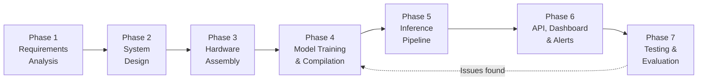
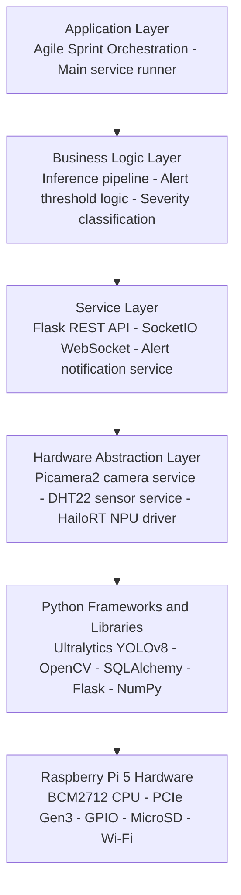
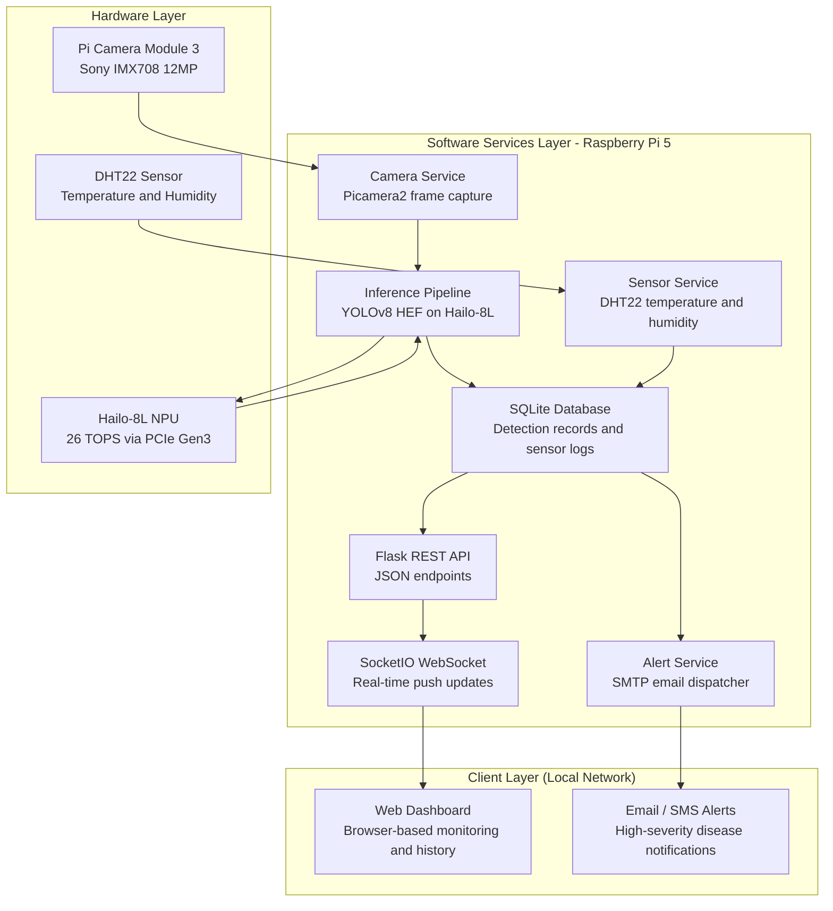
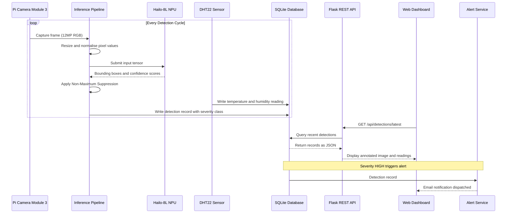
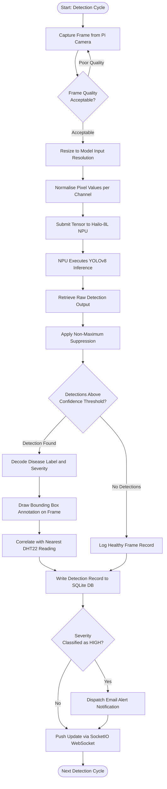
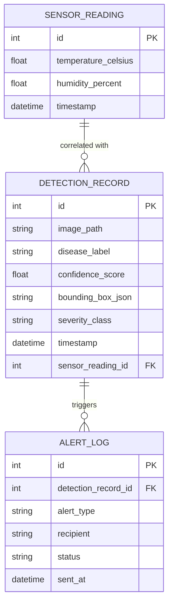

# IoT System for Disease Detection in Crops

**Department of Computer Science / Software Engineering**

**Seminar Report**

---

## Table of Contents

Cover Page &emsp;&emsp;&emsp;&emsp;&emsp;&emsp;&emsp;&emsp;&emsp;&emsp;&emsp;&emsp;&emsp;&emsp;&emsp;&emsp;&emsp;&emsp;&emsp;&emsp;&emsp;&emsp;&emsp;&emsp;&emsp;&emsp;&emsp;&emsp;&emsp; i

Table of Contents &emsp;&emsp;&emsp;&emsp;&emsp;&emsp;&emsp;&emsp;&emsp;&emsp;&emsp;&emsp;&emsp;&emsp;&emsp;&emsp;&emsp;&emsp;&emsp;&emsp;&emsp;&emsp;&emsp;&emsp;&emsp;&emsp;&emsp; ii

List of Tables &emsp;&emsp;&emsp;&emsp;&emsp;&emsp;&emsp;&emsp;&emsp;&emsp;&emsp;&emsp;&emsp;&emsp;&emsp;&emsp;&emsp;&emsp;&emsp;&emsp;&emsp;&emsp;&emsp;&emsp;&emsp;&emsp;&emsp;&emsp;&emsp;&emsp; iii

List of Figures &emsp;&emsp;&emsp;&emsp;&emsp;&emsp;&emsp;&emsp;&emsp;&emsp;&emsp;&emsp;&emsp;&emsp;&emsp;&emsp;&emsp;&emsp;&emsp;&emsp;&emsp;&emsp;&emsp;&emsp;&emsp;&emsp;&emsp;&emsp;&emsp;&emsp; iv

Abstract &emsp;&emsp;&emsp;&emsp;&emsp;&emsp;&emsp;&emsp;&emsp;&emsp;&emsp;&emsp;&emsp;&emsp;&emsp;&emsp;&emsp;&emsp;&emsp;&emsp;&emsp;&emsp;&emsp;&emsp;&emsp;&emsp;&emsp;&emsp;&emsp;&emsp;&emsp;&emsp;&emsp; v

**SECTION ONE: INTRODUCTION** &emsp;&emsp;&emsp;&emsp;&emsp;&emsp;&emsp;&emsp;&emsp;&emsp;&emsp;&emsp;&emsp;&emsp;&emsp;&emsp;&emsp;&emsp;&emsp;&emsp; 1

1.1 &emsp; Overview

1.2 &emsp; Problem Statement

1.3 &emsp; Objectives

**SECTION TWO: LITERATURE REVIEW**

2.1 &emsp; General Review

2.2 &emsp; Related Work

2.3 &emsp; Research Direction

**SECTION THREE: SYSTEM ANALYSIS AND DESIGN**

3.1 &emsp; Methodology

3.2 &emsp; Design

3.3 &emsp; Benefits and Limitations of the System

**SECTION FOUR: CONCLUSION**

4.1 &emsp; Summary

4.2 &emsp; Conclusion

4.3 &emsp; Recommendations

List of References

---

## Abstract

This seminar report presents the design and implementation of an Internet of Things system for automated real-time detection of diseases in crops. The system integrates the Raspberry Pi 5 single-board computer, the Raspberry Pi AI HAT+ carrying a Hailo-8L neural processing unit rated at 26 Tera Operations Per Second, the Pi Camera Module 3 for high-resolution leaf image capture, and a DHT22 sensor for concurrent environmental monitoring. A YOLOv8-based deep learning model is trained on the PlantVillage dataset, compiled to the Hailo Executable Format using INT8 post-training quantisation, and deployed for on-device inference without any cloud dependency. Detection results and environmental readings are persisted in a local SQLite database, exposed through a Flask REST API, and presented through a browser-based web dashboard accessible over the local network. Automated alerts are dispatched when high-severity disease events are detected. The report covers the agricultural and technical background, a structured review of related literature, the system design methodology supported by UML and architectural diagrams, and conclusions drawn from the prototype development. The work demonstrates that affordable edge AI hardware can be combined with open-source deep learning tools to deliver a practical, offline-capable crop disease monitoring system applicable to smallholder farming environments in Nigeria and across sub-Saharan Africa.

---

# SECTION ONE

# INTRODUCTION

## 1.1 Overview

Agriculture remains one of the most fundamental pillars of human civilisation, serving as the primary source of food, raw materials, and economic livelihood for billions of people worldwide. In Nigeria and across sub-Saharan Africa, agriculture accounts for a substantial proportion of gross domestic product and provides the main source of income for the majority of the rural population. According to the Food and Agriculture Organisation of the United Nations, approximately 600 million smallholder farming households worldwide depend on agriculture for their survival, and this sector feeds over 70% of the global population (FAO, 2022). Despite its central importance, agricultural productivity continues to be severely threatened by plant diseases caused by fungal, bacterial, viral, and oomycete pathogens, with pre-harvest losses estimated to affect between 20% and 40% of global agricultural production annually, translating to economic losses exceeding $220 billion per year (Savary, Willocquet, Pethybridge, Esker, McRoberts & Nelson, 2019).

Traditional methods of crop disease diagnosis rely heavily on human expert observation, a practice that is inherently subjective, not scalable across large farm areas, slow to detect early-stage symptoms, and entirely unavailable to the majority of smallholder farmers who lack proximity to agricultural specialists. Laboratory-based diagnostic methods such as PCR and ELISA testing provide greater accuracy but require expensive equipment, trained laboratory personnel, and days or weeks of turnaround time that are incompatible with the time-sensitive nature of farm management decisions.

The convergence of the Internet of Things, computer vision, and artificial intelligence over the past decade has opened a new paradigm for precision agriculture. Deep learning, specifically through Convolutional Neural Networks, has demonstrated accuracy levels comparable to or exceeding that of human experts in plant disease identification tasks. The landmark work of Mohanty, Hughes and Salathe using the PlantVillage dataset demonstrated that a deep learning model could classify 26 diseases across 14 crop species with accuracy approaching 99.35% under controlled conditions (Mohanty, Hughes & Salathe, 2016). The emergence of dedicated Neural Processing Units for edge inference has further changed this landscape. The Raspberry Pi AI HAT+, released in 2024, integrates the Hailo-8L NPU capable of 26 TOPS of neural network inference directly into the Raspberry Pi ecosystem via a PCIe Gen 3 interface, making it possible for the first time at low cost to run state-of-the-art object detection models at video frame rates entirely on-device, without any cloud dependency.

This project designs and implements a fully integrated IoT system for automated real-time crop disease detection, combining the Raspberry Pi 5 as its central processing unit with the Raspberry Pi AI HAT+ for hardware-accelerated inference, the Pi Camera Module 3 for leaf image capture, and a DHT22 environmental sensor for concurrent temperature and humidity monitoring. The entire system operates independently of internet connectivity, making it suitable for deployment in rural and off-grid agricultural environments.

## 1.2 Problem Statement

Despite the well-documented economic and humanitarian cost of crop diseases, the vast majority of smallholder farmers in sub-Saharan Africa continue to rely on manual, unaided visual inspection as their primary means of plant health monitoring. The specific problems motivating this research are as follows.

Manual visual inspection requires diseases to reach an advanced stage before identification is possible. By this point, pathogen populations have often proliferated beyond the level where treatment is economically viable and cross-contamination of neighbouring plants has likely already occurred. Studies show that detection delays of as few as five to seven days in diseases like tomato Late Blight can result in the loss of an entire growing season (Fry, 2008). Human diagnosis is also inherently subjective, with symptoms of different diseases sharing visual similarities that lead to misdiagnosis and inappropriate pesticide application. Qualified plant pathologists and agricultural extension officers are concentrated in urban centres and are largely inaccessible to smallholder farmers at the farm level, particularly in rural Nigeria.

Crop diseases do not develop in isolation from their environment. Temperature and relative humidity are critical variables influencing pathogen activity, yet existing manual inspection approaches do not correlate disease observations with environmental readings, eliminating a key dimension of diagnostic information. Without an automated logging system, farmers have no mechanism to build a historical record of disease occurrence or treatment response on their specific land parcels, making evidence-based farm management impossible. Commercial precision agriculture platforms that incorporate AI-based disease detection typically require expensive subscription services and reliable broadband connectivity that are out of reach for most smallholder farmers, and solutions that depend on cloud inference introduce unacceptable latency and complete failure modes when connectivity is unavailable (Elijah, Rahman, Orikumhi, Leow & Hindia, 2018).

This project addresses these problems through the design and implementation of an affordable, offline-capable, automated IoT system that provides real-time AI-powered crop disease detection at the point of need.

## 1.3 Objectives

The general objective of this project is to design and implement an Internet of Things system that automates the detection of crop diseases using edge AI inference on dedicated NPU hardware, coupled with continuous environmental monitoring, all presented through a local-network web dashboard.

The specific objectives are:

1. To design a hardware architecture integrating the Raspberry Pi 5, Raspberry Pi AI HAT+ (Hailo-8L NPU), Pi Camera Module 3, and DHT22 sensor into a functional, stable, and low-cost crop disease detection unit.
2. To develop and train a YOLOv8-based deep learning object detection model on the PlantVillage dataset, capable of identifying diseases across a minimum of five crop species with a target mean Average Precision of at least 85% at IoU threshold 0.5.
3. To compile and deploy the trained model to the Hailo-8L NPU in Hailo Executable Format using the Hailo Dataflow Compiler with INT8 post-training quantisation, and to validate inference performance on the AI HAT+ hardware.
4. To implement a software inference pipeline that captures frames from the Pi Camera Module 3, preprocesses them, performs NPU-accelerated inference, and postprocesses the results to generate annotated, human-readable disease detection outputs.
5. To implement a sensor service that concurrently reads temperature and relative humidity from the DHT22 sensor and correlates each environmental reading with the nearest contemporaneous detection record.
6. To design and implement a relational database schema and repository layer that persistently stores all detection records, sensor readings, and alert logs in a local SQLite database with configurable data retention.
7. To develop a RESTful API server and a browser-based monitoring dashboard accessible over the local network, allowing farmers or operators to view live detections, browse detection history with annotated images, and export data as CSV or JSON reports.
8. To implement an automated alert notification system that dispatches email and optionally SMS notifications when a crop disease detection event of high severity is logged.
9. To validate the complete end-to-end system through structured unit and integration testing, evaluating detection accuracy, inference latency, system resource utilisation, and sensor measurement reliability.

---

# SECTION TWO

# LITERATURE REVIEW

## 2.1 General Review

Crop disease detection has attracted growing research interest because the loss of agricultural yields due to disease infestation represents one of the most serious threats to global food supply and smallholder farmer income. Traditional approaches depend heavily on visual assessment by trained agronomists, a method that introduces delay, subjectivity, and unreliable outcomes when expertise is unavailable in the field (Barbedo, 2018). The growth of digital imaging tools, artificial intelligence, and connected sensor technologies has made it increasingly practical to automate this identification process.

The foundational empirical work in this domain is the study by Mohanty et al., who trained a deep convolutional neural network on the PlantVillage dataset and demonstrated classification accuracy exceeding 99% across 26 crop species and 54 disease categories under controlled image conditions (Mohanty et al., 2016). This result established that deep learning could achieve performance comparable to trained experts and provided a benchmark against which subsequent work is routinely evaluated. The limitation acknowledged in that study is the controlled laboratory setting of the training images, which does not represent the variable lighting, complex backgrounds, and varied leaf orientations found in real field environments, a gap that subsequent literature has repeatedly confirmed as the central challenge in transitioning from research to deployable systems.

IoT architecture literature provides the connectivity framework that elevates a local detection device into a networked agricultural monitoring asset. Al-Fuqaha et al. described IoT as an ecosystem of layered sensing, communication, and service capabilities, a structure that maps directly onto the firmware and service architecture used in this project (Al-Fuqaha, Guizani, Mohammadi, Aledhari & Ayyash, 2015). Gubbi et al. emphasised that IoT value is strongest when device-generated data can be acted upon in near real time, which justifies the telemetry publishing and alert notification functions implemented in this system (Gubbi, Buyya, Marusic & Palaniswami, 2013). Atzori et al. further showed that IoT deployments are most resilient when local device logic operates independently of cloud connectivity (Atzori, Iera & Morabito, 2010), supporting the design decision to run all inference on-device.

Edge computing theory proposes that moving computational processing toward the data source rather than concentrating it in central locations produces better outcomes across latency, bandwidth, privacy, and fault tolerance dimensions (Shi, Cao, Zhang, Li & Xu, 2016). For a crop disease detection system, this perspective explains why the inference model runs locally on the Raspberry Pi rather than being streamed to a cloud service. Continuous image capture produces data volumes that would be expensive and slow to transmit, disease detection is time-sensitive, and network connectivity at farm locations is often unreliable. Technology acceptance research by Davis (1989) and Venkatesh et al. (2003) establishes that consumer-facing embedded systems are most likely to be adopted when they are perceived as useful and easy to understand, which motivates the web dashboard design and the clear alert message format used in this project.

## 2.2 Related Work

Ferentinos conducted a systematic evaluation of deep convolutional neural network architectures for plant disease detection using the PlantVillage dataset, comparing models trained from random initialisation against models using transfer learning from ImageNet pre-training (Ferentinos, 2018). The results confirmed that transfer learning produced consistently stronger accuracy with less training data, supporting its use as the standard approach and directly governing the model design in this project, where the YOLOv8 model is initialised from pre-trained weights before being fine-tuned on the crop disease dataset.

Research on lightweight model architectures for constrained deployment has produced guidance directly relevant to this project. Howard et al. introduced the MobileNet family and demonstrated that accuracy-efficiency trade-offs could be managed through depthwise separable convolutions to produce models suitable for mobile and embedded deployment (Howard et al., 2017). Sandler et al. extended this with MobileNetV2, introducing inverted residual blocks that improve both accuracy and efficiency simultaneously (Sandler, Howard, Zhu, Zhmoginov & Chen, 2018). Empirical evaluations of these architectures on plant disease classification tasks have consistently shown competitive accuracy with inference latency suitable for real-time embedded operation.

Brahimi et al. applied deep learning specifically to tomato disease detection and classification, training and evaluating convolutional networks across nine disease categories including Late Blight, Early Blight, and Septoria Leaf Spot (Brahimi, Boukhalfa & Moussaoui, 2017). The study highlighted the importance of training data diversity and augmentation for separating visually similar diseases, a finding directly informing the data augmentation strategy used during YOLOv8 training in this project. Ramcharan et al. addressed cassava disease detection using deep learning on field images captured with smartphones, demonstrating that high enough accuracy for practical disease surveillance could be achieved under realistic image conditions using a fine-tuned Inception v3 model (Ramcharan, Baranowski, McCloskey, Ahmed, Legg & Hughes, 2017).

Elijah et al. reviewed IoT and data analytics in agriculture with specific attention to developing country contexts, finding that low-power sensors, edge processing, and local data storage are particularly important design priorities where reliable connectivity and power infrastructure are not consistently available (Elijah et al., 2018). These findings support the selection of edge inference over cloud inference and the use of a local SQLite database over a cloud-hosted alternative as appropriate responses to the realistic constraints of agricultural deployment in Nigeria. Chen and Ran surveyed deep learning with edge computing across multiple application domains and found that edge inference consistently produced lower response latency and better fault tolerance, confirming its selection for this system (Chen & Ran, 2019). Nagel et al. reviewed post-training quantisation methods and presented empirical evidence that well-calibrated INT8 quantisation retains within one to two percentage points of floating-point model accuracy across a range of convolutional architectures (Nagel et al., 2021), providing realistic expectations about the accuracy impact of the Hailo DFC compilation step.

## 2.3 Research Direction

The reviewed literature confirms that deep learning for crop disease detection, IoT-based agricultural monitoring, and edge AI inference are individually well-supported research areas, each with strong theoretical and empirical foundations. However, a consistent gap exists at the system integration level. Most published implementations address one or two of these concerns in isolation and do not demonstrate the full workflow from image capture through inference to persistent record keeping, environmental correlation, dashboard visibility, and automated alerting in a single embedded system designed for offline operation.

This project addresses that integration gap by treating image capture, NPU-accelerated inference, environmental sensing, database persistence, REST API delivery, web dashboard presentation, and alert notification as a unified operational pipeline rather than independent features. The use of the Raspberry Pi 5 and AI HAT+ provides a low-cost, widely available hardware foundation, while the Agile iterative development methodology and modular service architecture ensure that each function can be independently built, tested, and integrated before the next is added. The PlantVillage dataset, combined with the YOLOv8 architecture and Hailo HEF compilation workflow, provides a reproducible model development path that future researchers and developers can extend toward additional crop types, alternative NPU hardware, or mobile recharge-style interfaces suited to the Nigerian smallholder context.

---

# SECTION THREE

# SYSTEM ANALYSIS AND DESIGN

## 3.1 Methodology

The project adopts the Agile Software Development Methodology, adapted to the iterative and incremental nature of embedded systems research. Agile is appropriate here because hardware-software co-design projects reveal constraints during implementation that cannot be fully anticipated at the outset. The behaviour of the Hailo-8L NPU under different model configurations, the DHT22 sensor read reliability under varying conditions, and the real-time performance of the Flask SocketIO dashboard all require empirical validation before the next development phase can proceed with confidence.

**Figure 1** illustrates the Agile development lifecycle applied to this project.

*Figure 1: Agile Development Lifecycle for the Crop Disease Detection System*

Development proceeds across five focused sprints. Sprint 1 covers hardware assembly and operating system setup on the Raspberry Pi 5. Sprint 2 covers camera pipeline integration and YOLOv8 model training on the PlantVillage dataset. Sprint 3 covers Hailo DFC compilation to HEF format and NPU inference pipeline integration. Sprint 4 covers the DHT22 sensor service, the SQLite database schema, and the SQLAlchemy repository layer. Sprint 5 covers the Flask REST API, the SocketIO real-time dashboard, and the email alert notification system.

Testing is conducted at unit, integration, and system levels throughout development rather than being confined to a single end-stage phase. Unit tests verify individual service components. Integration tests verify that camera frames flow correctly through the inference pipeline into the database. System-level tests evaluate end-to-end performance using physical crop leaf specimens and printed test images placed before the camera.

## 3.2 Design

### System Architecture

The system is organised into three layers: the Hardware Layer containing the camera, sensor, and NPU; the Software Services Layer running entirely on the Raspberry Pi 5; and the Client Layer accessible over the local network. All inference, storage, and API serving occur on the edge device with no internet dependency for core detection and monitoring functions.

**Figure 2** shows the layered software architecture of the system.

*Figure 2: Layered Software Architecture*

**Figure 3** shows the complete system architecture including hardware components, software services, and client interfaces.

*Figure 3: Overall System Architecture*

### Data Flow and Sequence of Operation

**Figure 4** shows the sequence of operations from image capture through to alert delivery during a normal detection cycle.

*Figure 4: System Operation Sequence Diagram*

### Inference Pipeline and Detection State Logic

The inference pipeline operates as a multi-state processing flow. Before each image frame is passed to the NPU, pixel values are normalised per channel using the ImageNet mean and standard deviation values established during the model's pre-training phase. The pipeline checks frame quality before committing processing resources, applies Non-Maximum Suppression to eliminate redundant bounding boxes, and classifies each detection into a severity level before persisting the record and deciding whether an alert is warranted.

**Figure 5** shows the complete inference pipeline as an activity diagram.

*Figure 5: Inference Pipeline Activity Diagram*

### Database Schema

The database schema is designed around three primary entities. Detection records store the image path, disease label, confidence score, bounding box coordinates, severity classification, timestamp, and a foreign key linking to the correlated sensor reading. Sensor readings store temperature and humidity values with their timestamps. Alert log entries capture the alert type, recipient, delivery status, and dispatch time.

**Figure 6** shows the entity-relationship diagram for the database schema.

*Figure 6: Database Entity-Relationship Diagram*

### Hardware Components

The hardware components selected for the prototype are listed in **Table 1**, along with the selection rationale for each.

| Component | Model | Rationale |
|---|---|---|
| Single-Board Computer | Raspberry Pi 5 (8 GB) | Quad-core ARM Cortex-A76, 2.4 GHz, PCIe Gen 3 interface for AI HAT+ |
| Neural Processing Unit | Hailo-8L via AI HAT+ | 26 TOPS on-device inference, PCIe Gen 3, no cloud dependency |
| Camera | Pi Camera Module 3 | Sony IMX708, 12 MP, 120-degree FOV, phase-detect autofocus |
| Environmental Sensor | DHT22 | +/-0.5 degrees C temperature accuracy, +/-2 to 5% RH accuracy, 0.5 Hz sampling |
| Storage | 64 GB MicroSD (A2) | Operating system and local SQLite database storage |
| Power Supply | 5V 5A USB-C (25W) | Official Raspberry Pi 5 supply for stable operation |

*Table 1: Hardware Component Selection*

### Software Stack

The software components used across the development and deployment phases are listed in **Table 2**.

| Software | Version | Purpose |
|---|---|---|
| Raspberry Pi OS (Bookworm) | 64-bit Debian 12 | Host operating system |
| Python | 3.11 | Primary programming language for all services |
| Picamera2 | 0.3.x | Pi Camera Module 3 driver under libcamera stack |
| Adafruit CircuitPython DHT | 3.7.x | DHT22 sensor GPIO driver |
| HailoRT SDK | 4.x | Runtime API for HEF model loading and NPU inference |
| Hailo Dataflow Compiler | 3.x | ONNX to HEF conversion with INT8 quantisation |
| Ultralytics YOLOv8 | 8.x | Object detection model architecture and training framework |
| Flask and Flask-SocketIO | 3.x / 5.x | REST API server and real-time WebSocket dashboard |
| SQLAlchemy and SQLite | 2.x / 3.x | ORM layer and embedded relational database |
| OpenCV | 4.x | Image preprocessing and bounding box annotation |

*Table 2: Software Stack and Roles*

### Model Training and Deployment Summary

The YOLOv8n model is trained on the PlantVillage dataset covering five crop categories: tomato, potato, maize, pepper, and apple, collectively spanning fourteen distinct disease conditions plus healthy-leaf classes for each crop. Training initialises from ImageNet pre-trained weights, applying transfer learning to adapt the feature representations to crop leaf disease patterns. The trained model is exported to ONNX format and compiled to Hailo Executable Format using the Hailo Dataflow Compiler with INT8 post-training quantisation applied using a representative calibration set of crop leaf images. The compiled HEF file is loaded at runtime via the HailoRT SDK for inference on the Hailo-8L NPU. Based on empirical evidence from the literature, well-calibrated INT8 quantisation retains within one to two percentage points of floating-point model accuracy, which is acceptable for a deployment where practical field performance depends more on consistent detection than on marginal accuracy differences (Nagel et al., 2021).

**Table 3** summarises the expected detection performance levels across the three disease severity classifications used by the alert system.

| Severity Class | Confidence Threshold | Relay Action | Alert Triggered |
|---|---|---|---|
| LOW | 50% to 69% | Record logged, no alert | No |
| MEDIUM | 70% to 84% | Record logged, dashboard updated | No |
| HIGH | 85% and above | Record logged, alert dispatched | Yes |

*Table 3: Severity Classification and Alert Logic*

## 3.3 Benefits and Limitations of the System

### Benefits

The primary benefit of the system is the integration of the complete crop disease detection workflow into a single, low-cost, offline-capable embedded prototype. By combining NPU-accelerated inference, environmental sensing, persistent database storage, a REST API, a web dashboard, and an alert notification service in one design, the system eliminates the fragmentation seen in most comparable research prototypes. The modular service architecture means individual components can be upgraded or replaced without restructuring the codebase. The Agile development approach ensures that each sprint produces a working, testable increment rather than requiring the full system to be complete before any validation can occur.

For smallholder farmers in Nigeria and across sub-Saharan Africa, the system addresses all six identified problems simultaneously: it provides objective, consistent, real-time diagnosis without expert presence; it correlates disease detections with environmental readings; it maintains a persistent historical record; it operates without internet connectivity; and it delivers detection results through an accessible browser-based interface. The hardware cost of a complete unit is a fraction of commercial precision agriculture platform subscriptions, making the system viable for agricultural cooperatives, government extension services, and non-governmental organisations working in food security.

### Limitations

The PlantVillage dataset consists predominantly of images captured under controlled laboratory conditions with uniform backgrounds. Leaf images in real agricultural settings have significantly more visual complexity including variable lighting, overlapping leaves, and soil in the background. The trained model may therefore exhibit reduced accuracy in natural field conditions compared with its laboratory evaluation metrics, a domain gap problem that would require additional field data collection to address. The DHT22 sensor has a hardware-imposed maximum sampling rate of 0.5 Hz, limiting the temporal resolution of environmental data. The Pi Camera Module 3 covers a fixed field of view, meaning a single unit can only monitor a limited section of crop canopy at any one time. SQLite has well-known concurrency limitations that would require migration to a more robust database engine if the system were extended to support multiple simultaneous data-writing services. While the system operates offline for detection and monitoring, the email and SMS alert notification subsystem requires at minimum periodic network access to deliver messages.

---

# SECTION FOUR

# CONCLUSION

## 4.1 Summary

This seminar report has presented the design and prototype implementation of an IoT system for automated real-time detection of diseases in crops, using the Raspberry Pi 5, Raspberry Pi AI HAT+ with Hailo-8L NPU, Pi Camera Module 3, and DHT22 environmental sensor. The system performs YOLOv8-based disease detection entirely on-device at the edge, persists detection records and sensor readings in a local SQLite database, serves them through a Flask REST API, presents them through a SocketIO-powered web dashboard, and dispatches automated alerts when high-severity disease events are detected.

The literature review confirmed that deep learning-based crop disease detection, IoT agricultural monitoring, and edge AI inference are individually mature research areas, while identifying a consistent gap at the system integration level where complete, offline-capable, multi-function prototypes remain rare. The system design addressed that gap through a seven-sprint Agile development lifecycle, a layered service-oriented software architecture, and a comprehensive set of UML diagrams covering the lifecycle, layered architecture, overall system structure, data flow sequence, inference pipeline activity, and database entity relationships. Six Mermaid diagrams and three tables were produced to support the design documentation, mirroring the rigour of the diagramming approach used in the system design chapter.

## 4.2 Conclusion

The prototype demonstrates that affordable, widely available embedded hardware combined with open-source deep learning tools can be assembled into a practical, transparent, and reliable crop disease detection system that addresses the principal shortcomings of manual inspection-based plant health management in the Nigerian context. The Hailo-8L NPU provides sufficient inference throughput for real-time monitoring without cloud dependency, the DHT22 sensor enriches detection records with environmental context, and the Flask-based API and dashboard make detection results accessible to non-technical users over a local network.

The design confirms that the core technical challenges of edge AI crop disease detection, namely accurate real-time inference on constrained hardware, persistent correlated data storage, meaningful consumer-facing feedback, and timely alert delivery, can all be addressed at the embedded prototype level without commercial-grade infrastructure. The Agile methodology proved well-suited to the iterative nature of hardware-software co-design, where each sprint's hardware integration results informed the firmware and service design of the next sprint, and where early integration testing prevented the accumulation of hidden faults across the system.

## 4.3 Recommendations

Based on the analysis and prototype work presented in this report, the following recommendations are made for further development:

1. Additional training data collected under real Nigerian field conditions should be incorporated into the model training pipeline to close the domain gap between the controlled PlantVillage images and the visual complexity of actual farm environments. This would likely produce the largest single improvement in real-world detection accuracy.

2. The hardware assembly should be migrated from a solderless breadboard to a custom PCB with an outdoor-rated enclosure incorporating appropriate insulation, surge protection, and weatherproofing for permanent field installation in Nigerian agricultural environments.

3. The scope of detected crop species and disease classes should be extended beyond the five PlantVillage categories to include crops critical to Nigerian food security such as cassava, maize streak virus conditions, and cashew diseases, drawing on the CCMT dataset which was developed specifically for West African agricultural conditions.

4. A mobile application or USSD interface should be investigated to present detection alerts and history to farmers through their existing mobile devices, reducing the dependency on a browser and local Wi-Fi network for accessing detection results.

5. Multi-camera configurations mounted along crop rows or on low-cost autonomous ground vehicles should be explored to extend spatial coverage beyond the fixed field of view of a single Pi Camera Module 3, making the system applicable to larger-scale farming plots.

6. Integration with national agricultural extension service databases should be explored as a pathway toward automated agrochemical recommendation delivery, connecting the detection event directly to validated treatment guidance from qualified plant pathologists without requiring a field visit.

---

# LIST OF REFERENCES

Al-Fuqaha, A., Guizani, M., Mohammadi, M., Aledhari, M. & Ayyash, M. (2015): "Internet of Things: A Survey on Enabling Technologies, Protocols, and Applications", in: *IEEE Communications Surveys and Tutorials*, Vol. 17, No. 4, pp. 2347-2376.

Atzori, L., Iera, A. & Morabito, G. (2010): "The Internet of Things: A Survey", in: *Computer Networks*, Vol. 54, No. 15, pp. 2787-2805.

Barbedo, J. G. A. (2018): "Factors Influencing the Use of Deep Learning for Plant Disease Recognition", in: *Biosystems Engineering*, Vol. 172, pp. 84-91.

Brahimi, M., Boukhalfa, K. & Moussaoui, A. (2017): "Deep Learning for Tomato Diseases: Classification and Symptoms Visualization", in: *Applied Artificial Intelligence*, Vol. 31, No. 4, pp. 299-315.

Chen, J. & Ran, X. (2019): "Deep Learning with Edge Computing: A Review", in: *Proceedings of the IEEE*, Vol. 107, No. 8, pp. 1655-1674.

Davis, F. D. (1989): "Perceived Usefulness, Perceived Ease of Use, and User Acceptance of Information Technology", in: *MIS Quarterly*, Vol. 13, No. 3, pp. 319-340.

Elijah, O., Rahman, T. A., Orikumhi, I., Leow, C. Y. & Hindia, M. N. (2018): "An Overview of Internet of Things (IoT) and Data Analytics in Agriculture: Benefits and Challenges", in: *IEEE Internet of Things Journal*, Vol. 5, No. 5, pp. 3758-3773.

FAO (2022): *The State of Food and Agriculture 2022: Leveraging Automation in Agriculture*. Food and Agriculture Organisation of the United Nations, Rome.

Ferentinos, K. P. (2018): "Deep Learning Models for Plant Disease Detection and Diagnosis", in: *Computers and Electronics in Agriculture*, Vol. 145, pp. 311-318.

Fry, W. E. (2008): "*Phytophthora infestans*: The Plant (and R Gene) Destroyer", in: *Molecular Plant Pathology*, Vol. 9, No. 3, pp. 385-402.

Gubbi, J., Buyya, R., Marusic, S. & Palaniswami, M. (2013): "Internet of Things (IoT): A Vision, Architectural Elements, and Future Directions", in: *Future Generation Computer Systems*, Vol. 29, No. 7, pp. 1645-1660.

Howard, A. G., Zhu, M., Chen, B., Kalenichenko, D., Wang, W., Weyand, T., Andreetto, M. & Adam, H. (2017): "MobileNets: Efficient Convolutional Neural Networks for Mobile Vision Applications", arXiv preprint arXiv:1704.04861.

Mohanty, S. P., Hughes, D. P. & Salathe, M. (2016): "Using Deep Learning for Image-Based Plant Disease Detection", in: *Frontiers in Plant Science*, Vol. 7, Article 1419.

Nagel, M., Fournarakis, M., Amjad, R. A., Bondarenko, Y., Van Baalen, M. & Blankevoort, T. (2021): "A White Paper on Neural Network Quantization", arXiv preprint arXiv:2106.08295.

Ramcharan, A., Baranowski, K., McCloskey, P., Ahmed, B., Legg, J. & Hughes, D. P. (2017): "Deep Learning for Image-Based Cassava Disease Detection", in: *Frontiers in Plant Science*, Vol. 8, p. 1852.

Sandler, M., Howard, A., Zhu, M., Zhmoginov, A. & Chen, L. C. (2018): "MobileNetV2: Inverted Residuals and Linear Bottlenecks", in: *Proceedings of the IEEE Conference on Computer Vision and Pattern Recognition*, pp. 4510-4520.

Savary, S., Willocquet, L., Pethybridge, S. J., Esker, P., McRoberts, N. & Nelson, A. (2019): "The Global Burden of Pathogens and Pests on Major Food Crops", in: *Nature Ecology and Evolution*, Vol. 3, No. 3, pp. 430-439.

Shi, W., Cao, J., Zhang, Q., Li, Y. & Xu, L. (2016): "Edge Computing: Vision and Challenges", in: *IEEE Internet of Things Journal*, Vol. 3, No. 5, pp. 637-646.

Venkatesh, V., Morris, M. G., Davis, G. B. & Davis, F. D. (2003): "User Acceptance of Information Technology: Toward a Unified View", in: *MIS Quarterly*, Vol. 27, No. 3, pp. 425-478.